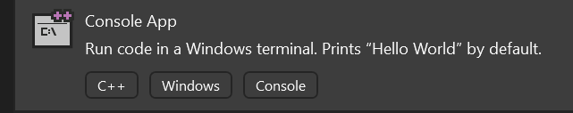
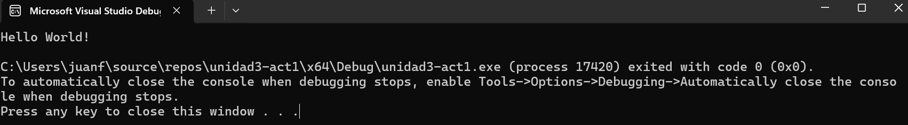
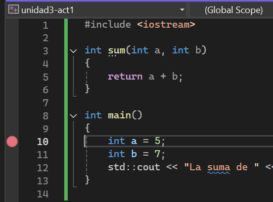
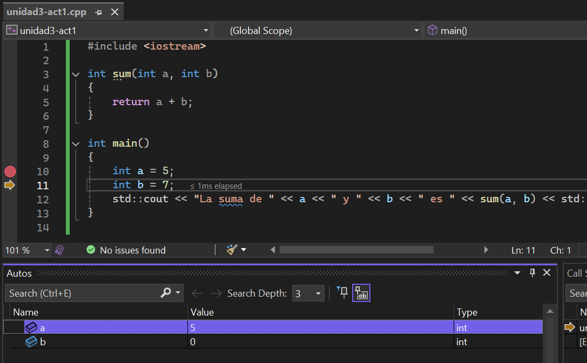

import { Aside } from '@astrojs/starlight/components';

## Introducción 📜

En las unidades anteriores exploraste la programación de computadores desde una perspectiva de bajo 
nivel mediante el lenguaje ensamblador. Luego comenzaste a conectar el lenguaje ensamblador con algunas 
expresiones de alto nivel. En esta unidad, vas a revisar algunos conceptos de la programación en 
alto nivel, en particular el manejo de la memoria.

Es muy importante que dediques tiempo de calidad a cada una de las actividades, experimenta con los códigos, 
modifica, prueba, equivócate, aprende de tus errores. Te pediré que lances hipótesis 
acerca de lo que está ocurriendo, que observes, analices y reflexiones sobre los resultados. Este es un proceso 
de Investigación en acción en el que aprenderás a través de la experimentación y la reflexión.


## Rúbrica de evaluación de la unidad 📝

:::note[Transparencia]
Esta rúbrica se socializa antes de la sustentación. La sustentación se 
basa en lo presentado en la aplicación y lo documentado en la bitácora.
:::

### Requisito de salida (condición necesaria)

:::caution[Para poder cerrar la evaluación y registrar la nota]
La **bitácora de reflexión** debe estar diligenciada antes de terminar 
la sesión y debe ser enseñada al profesor antes de abandonar el aula. La 
presentación de la bitácora de reflexión es un requisito indispensable 
para montar la nota final en la plataforma académica. Si no se cumple 
este requisito, la nota final de la unidad será 0.0.
:::

---

### Rúbrica analítica

:::tip[Evidencias evaluadas]

1) Funcionamiento de la aplicación + documentación en bitácora.
2) Sustentación a partir de la app y la bitácora

:::

| Criterio (peso) | Cumple plenamente (5.0) | Se cumple medianamente (4.0)| Problemas importantes (3.0)| Falta comprensión básica (2.0) | No hay evidencia (0.0)
|---|---|---|---|---|---|
| **1. Aplicación + bitácora (40%)** | La app se ejecuta sin fallos en el entorno acordado. Evidencia completa y verificable en bitácora. Todo consistente con lo mostrado en la demo. | La app funciona y cumple lo esencial. La bitácora permite verificar, pero hay **1–2 vacíos menores**| La app funciona parcialmente o depende de condiciones no declaradas. Bitácora con **vacíos importantes** o incompleta. | La app no corre o no demuestra lo requerido. La bitácora no permite verificación de la app.| No se entregaron evidencias o no se puede acceder a ellas |
|Evaluación||||||
| **2. Sustentación (60%)** | Responde a las preguntas con precisión, conectando: **(a) lo que se ve**, **(b) cómo está hecho**, y **(c) por qué**. Usa su bitácora para justificar decisiones. Reconoce límites/errores y propone cómo probar/mejorar. | Respuestas correctas pero con **imprecisiones menores** o justificación superficial. Usa parcialmente la bitácora para sustentar. | Responde solo “qué hizo” pero le cuesta explicar “cómo” o “por qué”. Necesita guía para conectar con su propia evidencia/bitácora. | No logra responder de forma coherente o responde sin relación con lo presentado/documentado. Evidencia falta de comprensión básica del trabajo entregado. | No se entregaron evidencias o no se puede acceder a ellas |
|Evaluación||||||
---

:::tip[Cálculo de la nota]

$$
Nota = C_1*0.4  + C_2*0.6
$$

:::

---

## Set: ¿Qué aprenderás en esta unidad? 💡

Entramos directamente a la fase de investigación. En esta fase comenzarás la exploración de uno de los lenguajes de 
programación más importantes en la industria del entretenimiento digital: C++. Sin embargo, nuestro objetivo no es 
aprender C++, no es el fin, C++ será el medio a través del cual explorarás algunos conceptos básicos que ya has 
usado (C#), pero que ahora analizarás más a fondo.

## Seek: Investigación 🔎

### Actividad 01

#### Hola mundo

Vas a familiarizarte con el entorno de desarrollo y comenzarás 
a explorar algunos conceptos básicos de programación en C++.

- Abre Visual Studio (no lo confundas con Visual Studio Code).
- Crea un nuevo proyecto de consola en C++. ¿Cómo se hace esto? 
Simplemente selecciona la opción crear un nuevo proyecto. Selecciona el lenguaje C++ y la plataforma 
Windows. Luego selecciona la plantilla de aplicación de consola de Windows.



Una vez crees el proyecto abre el archivo .cpp que contiene la función main. 
(En el menú View selecciona Solution Explorer y luego haz doble clic en el archivo .cpp).

Deberías ver algo así:

```cpp

#include <iostream>

int main()
{
    std::cout << "Hello World!\n";
}
```

Ejecuta el código presionando F5. Deberías ver algo así:



Ahora, modifica el código para que imprima el resultado de la suma de dos números enteros. 
Dicha suma la realizará una función que se llamará `sum`. La función `sum` recibirá dos
parámetros enteros y devolverá la suma de los dos números. 

```cpp
#include <iostream>

int sum(int a, int b)
{
    return a + b;
}

int main()
{
    int a = 5;
    int b = 7;
    std::cout << "La suma de " << a << " y " << b << " es " << sum(a, b) << "\n";
}
```

Ejecuta el código y verifica que el resultado sea correcto.

Por último te pediré que ejecutes paso a paso el código. Para hacer esto, coloca 
un breakpoint en la línea que contiene la definición de la variable `a`, así:



Presiona F5 y luego F10 para ejecutar paso a paso el código. Observa cómo 
cambian las variables en la pestaña Autos (podrás ver esta pestaña en la parte inferior, 
la puedes activar en el menú Debug -> Windows -> Autos) así:



En la esquina superior derecha podrás ver las opciones de depuración:


Familiarízate con estas opciones, te serán de mucha utilidad en el futuro.

Reflexión final de esta actividad:

1. ¿Para qué sirven los breakpoints?
2. ¿Para qué se usa la ventana de depuración Autos?


:::caution[📤 Bitácora] 
:::

### Actividad 02

#### Paso por valor y paso por referencia

Analizaremos el concepto de paso de parámetros en C++ y cómo se comporta el 
paso por valor, por referencia y por puntero.

``` cpp
#include <iostream>

using namespace std;

// Función que modifica el parámetro pasado por valor
void modificarPorValor(int n) {
    cout << "Dentro de modificarPorValor, valor inicial: " << n << endl;
    n += 5;
    cout << "Dentro de modificarPorValor, valor modificado: " << n << endl;
}

// Función que modifica el parámetro pasado por referencia
void modificarPorReferencia(int &n) {
    cout << "Dentro de modificarPorReferencia, valor inicial: " << n << endl;
    n += 5;
    cout << "Dentro de modificarPorReferencia, valor modificado: " << n << endl;
}

// Función que modifica el parámetro utilizando punteros
void modificarPorPuntero(int *n) {
    cout << "Dentro de modificarPorPuntero, valor inicial: " << *n << endl;
    *n += 5;
    cout << "Dentro de modificarPorPuntero, valor modificado: " << *n << endl;
}

int main() {
    int a = 10;
    int b = 10;
    int c = 10;

    cout << "Valor inicial de a (paso por valor): " << a << endl;
    cout << "Valor inicial de b (paso por referencia): " << b << endl;
    cout << "Valor inicial de c (paso por puntero): " << c << endl;

    cout << "\nLlamando a modificarPorValor(a)..." << endl;
    modificarPorValor(a);
    cout << "Después de modificarPorValor, valor de a: " << a << endl;

    cout << "\nLlamando a modificarPorReferencia(b)..." << endl;
    modificarPorReferencia(b);
    cout << "Después de modificarPorReferencia, valor de b: " << b << endl;

    cout << "\nLlamando a modificarPorPuntero(&c)..." << endl;
    modificarPorPuntero(&c);
    cout << "Después de modificarPorPuntero, valor de c: " << c << endl;

    return 0;
}
```

- Predicción: antes de ejecutar el programa, predice la salida de cada función y explica el resultado.
- ¿Qué diferencias observas en el comportamiento de a, b y c tras cada llamada?
- ¿Por qué ocurre esta diferencia?

Analicemos el código línea por línea y expliquemos en detalle qué sucede en cada función y cómo se comporta el paso de parámetros de diferentes maneras.

1. Inclusión de librerías y uso del espacio de nombres:

``` cpp
#include <iostream>
using namespace std;
```

- iostream: es la librería estándar de C++ para poder usar cout y otras funcionalidades de entrada/salida.  
- using namespace std;: permite usar los elementos del espacio de nombres std directamente, 
sin tener que escribir std:: cada vez como en la actividad anterior.  

2. Función modificarPorValor

``` cpp	
void modificarPorValor(int n) {
    cout << "Dentro de modificarPorValor, valor inicial: " << n << endl;
    n += 5;
    cout << "Dentro de modificarPorValor, valor modificado: " << n << endl;
}

```

Paso por Valor:

- Parámetro: la función recibe n por valor. Esto significa que se hace una copia del valor de la variable que se pasa desde main().  
- Efecto: las modificaciones que se realizan en n dentro de la función no afectan a la variable original, ya que se trabaja sobre una copia.  
- Salida: dentro de la función se imprimen dos mensajes: uno antes y otro después de sumar 5 a n. Sin embargo, fuera de la función, la variable original permanece igual.  

3. Función modificarPorReferencia

``` cpp
void modificarPorReferencia(int &n) {
    cout << "Dentro de modificarPorReferencia, valor inicial: " << n << endl;
    n += 5;
    cout << "Dentro de modificarPorReferencia, valor modificado: " << n << endl;
}
```

Paso por Referencia (con Referencias):

- Parámetro: se declara int &n, lo que significa que n es una referencia a la variable original.  
- Efecto: la variable n en la función es un alias de la variable pasada. Cualquier cambio realizado en n afecta directamente a la variable original.  
- Salida: la suma de 5 a n dentro de la función modifica la variable original, y esto se refleja fuera de la función.  

4. Función modificarPorPuntero

``` cpp
void modificarPorPuntero(int *n) {
    cout << "Dentro de modificarPorPuntero, valor inicial: " << *n << endl;
    *n += 5;
    cout << "Dentro de modificarPorPuntero, valor modificado: " << *n << endl;
}
```	

Paso por Puntero:

- Parámetro: la función recibe un puntero int *n, que contiene la dirección de memoria de una variable.  
- Acceso al Valor: para acceder y modificar el valor apuntado, se utiliza el operador de indirección (*).  
- Efecto: al modificar *n, se está cambiando el valor de la variable original a la que apunta el puntero.  
- Salida: al igual que en el caso de la referencia, el cambio (suma de 5) afecta directamente a la variable original.  

5. Función main

``` cpp	
int main() {
    int a = 10;
    int b = 10;
    int c = 10;
```

Se declaran y definen tres variables enteras a, b y c, todas inicializadas en 10. Cada una se utilizará para evaluar uno de los métodos de paso de parámetros.

``` cpp	
cout << "Valor inicial de a (paso por valor): " << a << endl;
cout << "Valor inicial de b (paso por referencia): " << b << endl;
cout << "Valor inicial de c (paso por puntero): " << c << endl;
```	

Se imprime el valor inicial de cada variable antes de cualquier modificación.

Llamada a modificarPorValor

``` cpp
cout << "\nLlamando a modificarPorValor(a)..." << endl;
modificarPorValor(a);
cout << "Después de modificarPorValor, valor de a: " << a << endl;
```

¿Qué ocurre?

- Se llama a modificarPorValor(a). Dentro de la función, a se pasa por valor, lo que genera 
una copia de a.  
- Dentro de la función, se suma 5 a la copia y se imprimen los valores modificados.
- Al regresar a main(), la variable a no ha cambiado, ya que la copia modificada no afecta a la original.  

Resultado Esperado:

- Dentro de la función: valor inicial: 10 y valor modificado: 15.  
- Fuera de la función: a sigue siendo 10.  

Llamada a modificarPorReferencia

``` cpp
cout << "\nLlamando a modificarPorReferencia(b)..." << endl;
modificarPorReferencia(b);
cout << "Después de modificarPorReferencia, valor de b: " << b << endl;
```

¿Qué ocurre?

- Se llama a modificarPorReferencia(b). Aquí, b se pasa por referencia, lo que significa que no se hace una copia: n es simplemente otro nombre para b.  
- Al sumar 5 a n dentro de la función, b se modifica directamente.

Resultado Esperado:

- Dentro de la función: valor inicial: 10 y valor modificado: 15.  
- Fuera de la función: b es 15, reflejando la modificación.  

Llamada a modificarPorPuntero

``` cpp	
cout << "\nLlamando a modificarPorPuntero(&c)..." << endl;
modificarPorPuntero(&c);
cout << "Después de modificarPorPuntero, valor de c: " << c << endl;
```

¿Qué ocurre?

- Se llama a modificarPorPuntero(&c), pasando la dirección de c.  
- Dentro de la función, n es un puntero a c. Usando *n, accedemos al valor de c.  
- Al sumar 5 a *n, se modifica el valor almacenado en c.  

Resultado Esperado:

- Dentro de la función: valor inicial: 10 y valor modificado: 15.
- Fuera de la función: c es 15, ya que se ha modificado directamente mediante el puntero.

6. Conclusión

Paso por Valor:

La función recibe una copia del valor. Las modificaciones realizadas dentro de la función no afectan a la variable original. En este ejemplo, a sigue siendo 10 después de la llamada a modificarPorValor.

Paso por Referencia (con referencias):

La función recibe una referencia (alias) a la variable original. Las modificaciones realizadas dentro de la función afectan a la variable original. En el ejemplo, b se convierte en 15 después de la llamada a modificarPorReferencia.

Paso por Puntero:

La función recibe la dirección de la variable original. Accediendo al valor mediante la indirección (*), se puede modificar el contenido de la variable original. Así, c se convierte en 15 después de la llamada a modificarPorPuntero.

Reflexión final para esta actividad:

Implementa tres versiones de una función para intercambiar (swap) los valores 
de dos variables enteras, utilizando:

- Paso por valor.  
- Paso por referencia (usando referencias).  
- Paso por puntero.  

Crea un proyecto de consola en Visual Studio. Implementa las siguientes funciones:

``` cpp	
swapPorValor(int a, int b)
```	

Esta función debe intentar intercambiar los valores de a y b pasándolos por valor.
Nota: Se espera que el intercambio no afecte a las variables originales en main().

``` cpp
swapPorReferencia(int &a, int &b)
``` 

Esta función debe intercambiar los valores de a y b utilizando paso por referencia con referencias.

``` cpp
swapPorPuntero(int *a, int *b)
```	

Esta función debe intercambiar los valores de a y b utilizando punteros. Recuerda acceder a los valores con el operador de indirección (*).

1. Muestra el código con la implementación de las funciones de swap.
2. Muestra los resultados de las pruebas realizadas en la función main().

### Actividad 03

#### Mapa de memoria de un programa escrito en C++

Un programa en C++ (ya sea en Windows o en otros sistemas operativos) se organiza en diferentes secciones o segmentos de memoria. 
Aunque la implementación exacta puede variar según el compilador y el sistema operativo, la estructura general del mapa de memoria es similar.

Piensa en el mapa de memoria como un gran arreglo donde cada sección tiene un propósito específico. 


``` bash
+-------------------------------+
|       Segmento de código      |
|   (instrucciones, funciones)  |
+-------------------------------+
| Variables globales y estáticas|
+-------------------------------+
|           Heap                | <--- Asignación dinámica (new/malloc)
|                               |
|                               |
+-------------------------------+
|           Stack               | <--- Variables locales
+-------------------------------+

``` 

A continuación, te describiré los segmentos de memoria más comunes en un programa C++:


1. Segmento de código (o Text). Es la zona de memoria donde se encuentra el código ejecutable del programa, es decir, las instrucciones compiladas. Se caracteriza porque es de solo lectura en muchos sistemas para prevenir modificaciones accidentales o maliciosas. Contiene todas las funciones, incluyendo main(), y cualquier otra función definida en el programa.

2. Variables globales y estáticas: aquí se almacenan las variables globales y estáticas que han sido inicializadas explícitamente y 
también las que no han sido inicializadas.

3. Heap: es el área de memoria utilizada para la asignación dinámica de memoria en tiempo de ejecución. Se gestiona manualmente mediante funciones como new y delete en C++.

4. Stack: es la región de memoria donde se almacenan las variables locales y la información de control de las funciones (como direcciones de retorno, parámetros y variables locales). La asignación y liberación de memoria en el stack se hace de manera automática al entrar y salir de las funciones. Su tamaño es limitado y, en caso de usar demasiada memoria local, puede 
producirse un stack overflow. Las variables definidas en el stack tienen un tiempo de vida limitado al alcance de la función 
o bloque en que se definen.

Ahora te mostraré un ejemplo donde trataré de ejemplificar el uso de cada uno de estos segmentos de memoria. 

```cpp
#include <iostream>
#include <cstdlib>

using namespace std;

// Variables globales
int global_inicializada = 42;      
int global_no_inicializada;        

// Constante global
const char* const mensaje_ro = "Hola, memoria de solo lectura";

// Función de ejemplo que muestra la dirección de su variable local estática
void funcionConStatic() {
    static int var_estatica = 100;
    cout << "Dirección de var_estatica (static): " << &var_estatica << endl;
}

// Función que asigna memoria dinámica (heap)
int* crearArrayHeap(int tam) {
    int* arr = new int[tam];
    for (int i = 0; i < tam; i++) {
        arr[i] = i;
    }
    return arr;
}

// Una función simple para representar el código (se encontrará en la región de código)
int suma(int a, int b) {
    int c = a + b; // "c" es una variable local (stack)
    return c;
}

int main() {
    // Variable local (stack)
    int a = 10;
    int b = 20;
    int c = suma(a, b);

    cout << "Resultado de suma(a, b): " << c << endl;
    cout << "Dirección de variable local 'a': " << &a << endl;
    cout << "Dirección de variable local 'b': " << &b << endl;
    cout << "Dirección de la variable local 'c' (resultado): " << &c << endl;

    // Variables globales
    cout << "Dirección de 'global_inicializada': " << &global_inicializada << endl;
    cout << "Dirección de 'global_no_inicializada': " << &global_no_inicializada << endl;

    // Constante global (solo lectura)
    cout << "Dirección de 'mensaje_ro' (zona de solo lectura): " << static_cast<const void*>(mensaje_ro) << endl;

    // Llamada a función que tiene variable estática
    funcionConStatic();

    // Uso del Heap: asignación dinámica
    int tamArray = 10;
    int* arrayHeap = crearArrayHeap(tamArray);
    cout << "Dirección del primer elemento del array asignado en Heap: " << arrayHeap << endl;
    for (int i = 0; i < tamArray; i++) {
        cout << "arrayHeap[" << i << "] = " << arrayHeap[i]
            << " en " << (arrayHeap + i) << endl;
    }
    delete[] arrayHeap; // Liberamos la memoria dinámica

    return 0;
}
```

Reflexión final para esta actividad:

Revisa de nuevo el programa anterior y construye tu propio mapa de memoria indicando en qué parte del 
mapa se ubican las variables y constantes globales, locales, estáticas y de la memoria dinámica y en 
qué parte del mapa se encuentran las funciones y el mensaje de solo lectura.

### Actividad 04 

#### Experimentos

Vas a realizar múltiples experimentos con el código de la actividad anterior para comprender cómo se comportan 
los segmentos de memoria en un programa C++.

Experimento 1: modificar el segmento de texto:

``` cpp
#include <iostream>
#include <cstdlib>

using namespace std;


int main() {
    // Variable local (stack)
    int a = 10;
    int b = 20;

    /**********************************************************
        EXPERIMENTO 1
    ***********************************************************/

    void* ptr = reinterpret_cast<void*>(&main);
    cout << "Voy a modificar la memoria en la dirección: " << ptr << endl;
    *reinterpret_cast<int*>(ptr) = 0;

    /********************************************************/

    return 0;
}
```

- ¿Qué ocurre? ¿Por qué?

Experimento 2: modificar el segmento de datos (constante global):

``` cpp
#include <iostream>
#include <cstdlib>

using namespace std;

// Constante global
const char* const mensaje_ro = "Hola, memoria de solo lectura";


int main() {
    // Variable local (stack)
    int a = 10;
    int b = 20;


    /**********************************************************
        EXPERIMENTO 2
    ***********************************************************/

    char* ptr = (char*)&mensaje_ro;
    cout << "Voy a modificar la memoria en la dirección: " << ptr << endl;
    *ptr = 0;

    /********************************************************/

    return 0;
}
```

- ¿Qué ocurre? ¿Por qué?

Experimento 3: modificar el segmento de datos (variables globales):

``` cpp
#include <iostream>
#include <cstdlib>

using namespace std;

// Variables globales
int global_inicializada = 42;
int global_no_inicializada;


int main() {
    // Variable local (stack)
    int a = 10;
    int b = 20;

    /**********************************************************
        EXPERIMENTO 3
    ***********************************************************/

    cout << "global_inicializada: " << global_inicializada << endl;
    cout << "global_no_inicializada: " << global_no_inicializada << endl;


    global_inicializada = 69;
    global_no_inicializada = 666;

    cout << "global_inicializada: " << global_inicializada << endl;
    cout << "global_no_inicializada: " << global_no_inicializada << endl;

    /********************************************************/

    return 0;
}

```

- ¿Qué ocurre? ¿Por qué?

Experimento 4: modificar la variable local estática de una función por fuera de ella:

``` cpp
#include <iostream>
#include <cstdlib>

using namespace std;

// Función de ejemplo que muestra la dirección de su variable local estática
void funcionConStatic() {
    static int var_estatica = 100;
    cout << "Dirección de var_estatica (static): " << &var_estatica << endl;
}


int main() {
    // Variable local (stack)
    int a = 10;
    int b = 20;

    /**********************************************************
        EXPERIMENTO 4
    ***********************************************************/

    var_estatica = 42;

    cout << "var_estatica: " << var_estatica << endl;

    /********************************************************/
    return 0;
}
``` 

- ¿Qué ocurre? ¿Por qué?
- ¿Qué pasa con las variables cada que entras y sales de la función?
- En relación a la pregunta anterior ¿Qué pasa con las variables locales estáticas?

Experimento 5: variables locales estática vs no estática:

``` cpp
#include <iostream>
#include <cstdlib>

using namespace std;

// Función de ejemplo que muestra la dirección de su variable local estática
void funcionConStatic() {
    static int var_estatica = 100;
    cout << "var_estatica: " << var_estatica << endl;
    var_estatica++;
}

void funcionSinStatic() {
    int var_no_estatica = 100;
    cout << "var_no_estatica: " << var_no_estatica << endl;
    var_no_estatica++;
}


int main() {
    // Variable local (stack)
    int a = 10;
    int b = 20;

    /**********************************************************
        EXPERIMENTO 5
    ***********************************************************/

    for (int i = 0; i < 5; i++) {
        cout << "Iteración " << i << endl;
        funcionSinStatic();
        funcionConStatic();
    }

    /********************************************************/

    return 0;
}

```

- ¿Qué ocurre? ¿Por qué?
- Ves alguna diferencia entre las variables locales estáticas y no estáticas?
- ¿Qué pasa con las variables cada que entras y sales de la función?

Experimento 6: modificar el segmento de heap:


``` cpp	
#include <iostream>
using namespace std;

int main() {
    // Tamaño del arreglo dinámico
    int tam = 5;

    // Asignar memoria en el Heap para un arreglo de enteros
    int* arrayHeap = new int[tam];

    // Inicializar y mostrar los valores y direcciones de memoria
    for (int i = 0; i < tam; i++) {
        arrayHeap[i] = (i + 1) * 10;
        cout << "arrayHeap[" << i << "] = " << arrayHeap[i]
            << " en dirección " << (arrayHeap + i) << endl;
    }

    // Liberar la memoria asignada en el Heap
    delete[] arrayHeap;

    /**********************************************************
        EXPERIMENTO 6
    ***********************************************************/

    cout << arrayHeap[0] << endl;


    /********************************************************/


    return 0;
}

```

- ¿Qué ocurre? ¿Por qué? 
- Comenta la línea de genera el error y analiza las siguientes preguntas:

    - ¿Qué diferencias notas entre el comportamiento y la gestión del Heap en comparación con el Stack?
    - ¿Qué consecuencias tendría no liberar la memoria reservada con new?
    - ¿Por qué es importante usar delete[] al liberar memoria asignada para un arreglo?


### Actividad 05

#### Copia de objetos y su ubicación en memoria

Implementa un experimento para observar lo que ocurre al copiar un objeto. Ejecuta el programa y 
observa el comportamiento en el depurador para que puedas concluir.

Modifica la clase Punto:

``` cpp
#include <iostream>
#include <string>
using namespace std;

class Punto {
public:
	string name;
    int x;
    int y;

    // Constructor
    Punto(string _name, int _x, int _y) : name(_name),x(_x), y(_y) {
        cout << "Constructor: Punto "<< name <<" (" << x << ", " << y << ") creado." << endl;
    }

    // Destructor
    ~Punto() {
        cout << "Destructor: Punto " << name << "(" << x << ", " << y << ") destruido." << endl;
    }

    // Método para imprimir valores
    void imprimir() {
        cout << "Punto "<< name << "(" << x << ", " << y << ")" << endl;
    }
};


int main() {
    // Objeto original
    Punto original("original",70, 80);
    original.imprimir();
    Punto* p = &original;

    // Copia del objeto
    Punto copia = original;
    copia.name = "copia";
    copia.x = 100;
    copia.y = 200;
    copia.imprimir();
    original.imprimir();

    p->name = "p";
    p->x = 300;
    p->y = 400;
    p->imprimir();
    original.imprimir();
    
    return 0;
}
```

Compara con C# (puedes crear un nuevo proyecto de consola C# en una nueva ventana de Visual Studio):

``` csharp
using System;

public class Punto
{
    public int x;
    public int y;
    public string name;

    // Constructor
    public Punto(string _name, int _x, int _y)
    {
        name = _name;
        x = _x;
        y = _y;
        Console.WriteLine($"Constructor: Punto {name}({x}, {y}) creado.");
    }

    // Método para imprimir valores
    public void Imprimir()
    {
        Console.WriteLine($"Punto {name}({x}, {y})");
    }
}

class Program
{
    static void Main(string[] args)
    {
        // Objeto original
        Punto original = new Punto("original",70, 80);
        original.Imprimir();

        Punto copia = original;
        copia.name = "copia";
        copia.x = 100;
        copia.y = 200;
        copia.Imprimir();
        original.Imprimir();

        // Coloca breakpoints en la creación de 'original' y en la línea de la copia.
        // Observa que 'copia' es una copia independiente de 'original'.
    }
}
```

Ejecuta los programas en modo depuración y detente en los breakpoints para comparar. 

**Reflexión final para esta actividad**

1. Explica qué ocurre al copiar un objeto en C++ y en C#. ¿Qué diferencias encuentras?
2. ¿Qué es `copia` en C++ y en C#? ¿Es una copia independiente de `original`?

### Actividad integradora de investigación

:::caution[📤 Bitácora - Actividad integradora de investigación]

**Objetivo**: analizar un programa integral, predecir su comportamiento en memoria y verificar tus hipótesis utilizando el depurador de Visual Studio.

**Instrucciones**:

Considera el siguiente programa que combina varios de los conceptos 
que exploraste en las Actividades 01-05.

```cpp
#include <iostream>

int contador_global = 100;

void ejecutarContador() {
    static int contador_estatico = 0;
    contador_estatico++;
    std::cout << "  -> Llamada a ejecutarContador. Valor de contador_estatico: " << contador_estatico << std::endl;
}

void sumaPorValor(int a) {
    a = a + 10;
    std::cout << "  -> Dentro de sumaPorValor, 'a' ahora es: " << a << std::endl;
}

void sumaPorReferencia(int& a) {
    a = a + 10;
    std::cout << "  -> Dentro de sumaPorReferencia, 'a' ahora es: " << a << std::endl;
}

void sumaPorPuntero(int* a) {
    *a = *a + 10;
    std::cout << "  -> Dentro de sumaPorPuntero, '*a' ahora es: " << *a << std::endl;
}

int main() {
    int val_A = 20;
    int val_B = 20;
    int val_C = 20;

    std::cout << "--- Experimento con paso de parámetros ---" << std::endl;
    std::cout << "Valor inicial de val_A: " << val_A << std::endl;
    sumaPorValor(val_A);
    std::cout << "Valor final de val_A: " << val_A << std::endl << std::endl;

    std::cout << "Valor inicial de val_B: " << val_B << std::endl;
    sumaPorReferencia(val_B);
    std::cout << "Valor final de val_B: " << val_B << std::endl << std::endl;

    std::cout << "Valor inicial de val_C: " << val_C << std::endl;
    sumaPorPuntero(&val_C);
    std::cout << "Valor final de val_C: " << val_C << std::endl << std::endl;

    std::cout << "--- Experimento con variables estáticas ---" << std::endl;
    ejecutarContador();
    ejecutarContador();
    ejecutarContador();

    return 0;
}
```

**Tu Tarea**:

A. Predicción (sin ejecutar el código):

1. ¿Cuál será la salida final en la consola de este programa? 
2. Escribe la salida completa que esperas.
3. Dibuja un mapa de memoria conceptual de este programa justo 
antes de que main finalice. Debes indicar en qué segmento de 
memoria (Stack, Heap, Datos Globales/Estáticos, Código) se encontraría cada 
una de las siguientes variables: contador_global, contador_estatico, val_A, 
val_B, val_C (dentro de main), el parámetro a de la función sumaPorValor, la función main misma.


B. Verificación y análisis (usando el depurador):

Ejecuta el programa paso a paso (F10) con un breakpoint al inicio de main.

4. Compara la salida real con tu predicción. Si hubo diferencias, explica 
por qué ocurrieron. Evidencia clave: capturas de pantalla antes y después 
de los puntos de interés (¿Cuáles son esos puntos? -> tu tarea analizarlo). 

5. Describe qué demuestran estas capturas sobre la diferencia entre los 
diferentes tipos de paso por parámetros analizados.

6. Explica con tus propias palabras el comportamiento de 
contador_estatico. ¿Por qué "recuerda" su valor entre llamadas a la función 
ejecutarContador? ¿En qué se diferencia de una variable local normal?

:::


:::caution[📤 Bitácora] 
:::


## Apply: Aplicación 🛠

### Actividad 06

#### Hola Objeto: creación de un objeto en el stack

Este experimento es fundamental porque conecta el concepto fundamental de POO (objetos) con este curso. 

Vas a crear una clase sencilla llamada Punto que represente un punto en el espacio con dos coordenadas (x e y). 
Luego, crearás un objeto de esta clase en el stack y utilizarás el depurador para inspeccionar su contenido y dirección de memoria.

Pasos:

- Abre Visual Studio y crea un nuevo proyecto de consola en C++.
- Define la siguiente clase en un archivo .cpp (puedes incluir todo en main.cpp):

``` cpp
#include <iostream>
using namespace std;

class Punto {
public:
    int x;
    int y;

    // Constructor
    Punto(int _x, int _y) : x(_x), y(_y) {
        cout << "Constructor: Punto(" << x << ", " << y << ") creado." << endl;
    }

    // Destructor
    ~Punto() {
        cout << "Destructor: Punto(" << x << ", " << y << ") destruido." << endl;
    }

    // Método para imprimir valores
    void imprimir() {
        cout << "Punto(" << x << ", " << y << ")" << endl;
    }
};

int main() {
    // Coloca un breakpoint en la siguiente línea
    Punto p(10, 20);

    // Muestra el contenido del objeto
    p.imprimir();

    // Utiliza el depurador para inspeccionar 'p', observa la dirección de memoria y el valor de x e y.
    return 0;
}
```

- Vas a analizar el programa anterior con su equivalente en C# (puedes crear un nuevo proyecto de consola C# en 
una nueva ventana de Visual Studio):

``` csharp
using System;

public class Punto
{
    public int x;
    public int y;

    public Punto(int _x, int _y)
    {
        x = _x;
        y = _y;
        Console.WriteLine($"Constructor: Punto({x}, {y}) creado.");
    }

    ~Punto()
    {
        Console.WriteLine($"Destructor: Punto({x}, {y}) destruido.");
    }

    public void Imprimir()
    {
        Console.WriteLine($"Punto({x}, {y})");
    }
}

class Program
{
    static void Main(string[] args)
    {
        Punto p = new Punto(10, 20);
        p.Imprimir();
    }
}
```

- Ejecuta el programa en C++ en modo depuración (F5) y coloca un breakpoint en la línea donde se declara Punto p(10, 20);.
- Paso a paso (F10), observa en la ventana de variables (Autos/Locals) los valores de x y y. En el menú Debug, 
selecciona Windows > Memory > Memory 1 y observa la dirección de memoria de `p`. Escribe en la entrada de texto de Memory 1 la dirección de 
memoria de `p` así `&p` y presiona Enter. Observa la dirección de memoria de `p`. Observa el contenido de la memoria, deberías ver algunos números en hexadecimal, tales como 0a 00 00 00 14 00 00 00.
- Abre la calculadora de Windows y selecciona el modo de programador. Cambia a modo hexadecimal. Escribe 0a ¿Qué valor en decimal obtienes? 
Escribe 14 ¿Qué valor en decimal obtienes? ¿Qué observas?
- Nota el orden en el que están almacenados los bytes en la memoria. Observa que el byte de menor peso (menos significativo) está almacenado primero, es decir, 
en una dirección de memoria menor. A esto se le conocen como arquitecturas little-endian. Otro tipo de arquitectura es big-endian, donde el byte de mayor peso (más significativo) se 
almacena primero. La mayoría de las arquitecturas modernas son little-endian. Si la arquitectura de tu computador fuera big-endian, ¿Cómo quedarían almacenados los bytes en la memoria de `p`?

**Reflexiona sobre las siguientes cuestiones**:

1. ¿Cuál es la diferencia entre un constructor y un destructor en C++?
2. ¿Cuál es la diferencia entre un objeto y una clase en C++?
3. ¿Qué diferencia notas entre el objeto Punto en C++ y C#? 
4. ¿Qué es `p` en C++ y qué es `p` en C#? (en uno de ellos `p` es un objeto y 
en el otro es una referencia a un objeto).
5. ¿En qué parte de memoria se almacena `p` en C++ y en C#?
6. ¿Qué observaste con el depurador acerca de `p`? Según lo que observaste 
¿Qué es un objeto en C++?

### Actividad 07

#### Objetos en el heap: creación y observación

Modifica el programa anterior para crear un objeto de la clase Punto de manera dinámica (en el heap) utilizando new. 
Luego, inspecciona con el depurador la dirección del objeto y compárala con la del objeto en el stack.

``` cpp
#include <iostream>
using namespace std;

class Punto {
public:
    int x;
    int y;

    // Constructor
    Punto(int _x, int _y) : x(_x), y(_y) {
        cout << "Constructor: Punto(" << x << ", " << y << ") creado." << endl;
    }

    // Destructor
    ~Punto() {
        cout << "Destructor: Punto(" << x << ", " << y << ") destruido." << endl;
    }

    // Método para imprimir valores
    void imprimir() {
        cout << "Punto(" << x << ", " << y << ")" << endl;
    }
};

int main() {
    // Objeto en el stack
    Punto pStack(30, 40);
    pStack.imprimir();

    // Objeto en el heap
    Punto* pHeap = new Punto(50, 60);
    pHeap->imprimir();

    // Coloca breakpoints en la creación de pStack y pHeap
    // Inspecciona las direcciones de memoria de ambos objetos:
    // - pStack: dirección obtenida directamente.
    // - pHeap: la variable pHeap es un puntero que contiene la dirección del objeto en el heap.

    // Recuerda liberar la memoria del heap
    delete pHeap;

    return 0;
}
```

Ejecuta el programa en modo depuración y detente en los breakpoints para comparar:

- La dirección de pStack (ubicado en el stack).
- El valor de pHeap (la dirección del objeto en el heap).

**Reflexiona sobre lo siguiente**:

1. Explicación de la diferencia entre objetos creados en el stack y en el heap.
2. `pStack` ¿Es un objeto o una referencia a un objeto?
3. `pHeap` ¿Es un objeto o una referencia a un objeto? Si es una referencia, ¿A qué objeto hace referencia?
4. Observa en Memory1 (Debug->Windows->Memory->Memory1) el contenido de la dirección de memoria de `pHeap`, recuerda escribir en la entrada de texto de Memory1 
la dirección de memoria de `&pHeap` y presionar Enter. Compara el contenido de memoria con el contenido 
de `pHeap` en la pestaña de Locals (Debug->Windows->Locals). ¿Qué observas? ¿Qué significa esto?

### Actividad 08

#### Funciones y objetos en C++

Analiza, ejecuta, depura y experimenta con el siguiente código en C++.

``` cpp
#include <iostream>
#include <string>
using namespace std;

class Punto {
public:
	string name;
    int x;
    int y;

    // Constructor
    Punto(string _name, int _x, int _y) : name(_name),x(_x), y(_y) {
        cout << "Constructor: Punto "<< name <<" (" << x << ", " << y << ") creado." << endl;
    }

    // Destructor
    ~Punto() {
        cout << "Destructor: Punto " << name << "(" << x << ", " << y << ") destruido." << endl;
    }

    // Método para imprimir valores
    void imprimir() {
        cout << "Punto "<< name << "(" << x << ", " << y << ")" << endl;
    }
};

void cambiarNombre(Punto p, string nuevoNombre) {
	p.name = nuevoNombre;
}

int main() {
    // Objeto original
    Punto original("original",70, 80);
    original.imprimir();
    cambiarNombre(original, "cambiado");
    original.imprimir();
    return 0;
}

```

**Reflexiona sobre lo siguiente**:

1. ¿Qué ocurre después de llamar a la función `cambiarNombre`? ¿Por qué aparece el mensaje `Destructor: Punto cambiado(70, 80) destruido.`? 
2. ¿Por qué `original` sigue existiendo luego de llamar `cambiarNombre`?
3. ¿En qué parte del mapa de memoria se encuentra `original` y en qué parte se encuentra `p`? ¿Son el mismo objeto? (recuerda 
usar siempre el depurador para responder estas preguntas).

Modifica la función `cambiarNombre`:

``` cpp
void cambiarNombre(Punto& p, string nuevoNombre) {
	p.name = nuevoNombre;
}
```

4. ¿Qué ocurre ahora? ¿Por qué?

Modifica ahora a `cambiarNombre` y a `main` de la siguiente manera:

``` cpp
void cambiarNombre(Punto* p, string nuevoNombre) {
	p->name = nuevoNombre;
}

int main() {
    // Objeto original
    Punto original("original",70, 80);
    original.imprimir();
    
    cambiarNombre(&original, "cambiado");
    original.imprimir();
    
    return 0;
}
```

5. ¿Qué ocurre ahora? ¿Por qué?
6. En este caso ¿Cuál es la diferencia entre pasar un objeto por valor, por referencia y por puntero? 

### Actividad 09

#### Objetos con miembros estáticos y variables de instancia

Vas a analizar una clase llamada Contador que tiene:

- Un miembro de instancia, `valor`, que se incremente cada vez que se llame a un método `incrementar()`.  
- Un miembro estático, `total`, que cuente cuántos objetos de la clase se han creado.  

Vas a explorar cómo se gestionan estas variables (estáticas vs. no estáticas) en la memoria, y a utilizar el depurador para inspeccionar sus valores y direcciones.  

Pasos:

Define la clase Contador de la siguiente manera:

``` cpp
#include <iostream>
using namespace std;

class Contador {
public:
    int valor;
    static int total;

    // Constructor
    Contador(int v = 0) : valor(v) {
        total++;
        cout << "Contador creado. total de Contadores = " << total << endl;
    }

    // Destructor
    ~Contador() {
        cout << "Contador destruido. valor = " << valor << endl;
    }

    // Método para incrementar el contador de instancia
    void incrementar() {
        valor++;
    }
};

// Definición e inicialización del miembro estático
int Contador::total = 0;

int main() {
    // Crea varios objetos en el stack
    Contador c1(5);
    Contador c2(10);

    // Inspecciona con el depurador las direcciones de c1 y c2.
    // Observa que 'total' es compartido entre todos los objetos.

    c1.incrementar();
    c2.incrementar();

    cout << "c1.valor = " << c1.valor << endl;
    cout << "c2.valor = " << c2.valor << endl;
    cout << "Contador::total = " << Contador::total << endl;

    // Puedes también crear un objeto dinámico para comparar:
    Contador* c3 = new Contador(15);
    c3->incrementar();
    cout << "c3->valor = " << c3->valor << endl;

    // Coloca breakpoints en la creación de cada objeto y en las llamadas a 'incrementar()'
    // Observa cómo el miembro estático 'total' se comparte y no se almacena en el stack de cada objeto.

    delete c3;
    return 0;
}
```

- Ejecuta el programa en modo depuración e inspecciona los valores y direcciones de c1, c2, c3.
- Observa el contenido de los objetos en memoria (Debug->Windows->Memory->Memory 1). Recuerda escribir la dirección de memoria de cada objeto como `&c1` por ejemplo. ¿Puedes observar el valor de los miembros `valor` y `total`?
- ¿En dónde está almacenado el miembro `valor` y el miembro `total` de la clase Contador?
- Selecciona `Contador::total` y presiona click derecho, luego selecciona "Add Watch". Esto te permite inspeccionar 
variables globales y puede ser de utilidad cuando investigues en los experimentos del curso.


**Reflexiona sobre lo siguiente**:

1. ¿Qué puedes concluir de los miembros estáticos y de instancia de una clase en C++? ¿Cómo se gestionan en memoria? 
¿Qué ventajas y desventajas tienen? ¿Cuándo es útil utilizarlos?
2. En el programa, en qué segmento de memoria se están almacenando c1, c2, c3 y Contador::total? Ten especial cuidado con la 
respuesta que das para el caso de c3, piensa de nuevo, qué es c3 y qué está almacenando. Ahora, responde de nuevo, en qué 
segmento de la memoria se está almacenando c3 y en qué segmento de la memoria se está almacenando el objeto al que apunta c3.

### Actividad 10

#### Explorando el ciclo de vida de un objeto

Realiza un experimento en el que crees un objeto dentro de un bloque de código y observa qué ocurre al salir del bloque (uso del stack) en comparación con un objeto creado dinámicamente que persiste hasta que lo liberas.

``` cpp
#include <iostream>
using namespace std;

class Punto {
public:
    int x;
    int y;

    // Constructor
    Punto(int _x, int _y) : x(_x), y(_y) {
        cout << "Constructor: Punto(" << x << ", " << y << ") creado." << endl;
    }

    // Destructor
    ~Punto() {
        cout << "Destructor: Punto(" << x << ", " << y << ") destruido." << endl;
    }

    // Método para imprimir valores
    void imprimir() {
        cout << "Punto(" << x << ", " << y << ")" << endl;
    }
};

int main() {
    {
        cout << "Inicio del bloque" << endl;
        Punto pBloque(100, 200);
        // Coloca un breakpoint aquí para ver 'pBloque' en el stack.
        pBloque.imprimir();
    }
    // Al salir del bloque, el destructor de 'pBloque' se invoca.
    cout << "Fuera del bloque" << endl;

    // Creación dinámica:
    Punto* pDinamico = new Punto(300, 400);
    pDinamico->imprimir();
    // 'pDinamico' sigue existiendo hasta que se libere manualmente.
    // Coloca un breakpoint aquí y observa la dirección de memoria.
    delete pDinamico;
    // Después de 'delete', el destructor se llama y la memoria se libera.

    return 0;
}
```

Ten presente que un bloque es un conjunto de instrucciones encerradas entre llaves `{}`.

- Ejecuta el programa en depuración paso a paso. No olvides colocar un breakpoint en la línea 
`cout << "Inicio del bloque" << endl;`. 
- Inspecciona el ciclo de vida de pBloque (observa el constructor y el destructor al entrar y salir del bloque).
- Observa que el objeto creado dinámicamente no se destruye automáticamente al salir del bloque, sino cuando se llama a delete.

**Reflexiona sobre lo siguiente**:

1. Explica el ciclo de vida de un objeto en el stack versus uno en el heap.

Ahora realiza la siguiente modificación:

``` cpp
#include <iostream>
using namespace std;

class Punto {
public:
    int x;
    int y;

    // Constructor
    Punto(int _x, int _y) : x(_x), y(_y) {
        cout << "Constructor: Punto(" << x << ", " << y << ") creado." << endl;
    }

    // Destructor
    ~Punto() {
        cout << "Destructor: Punto(" << x << ", " << y << ") destruido." << endl;
    }

    // Método para imprimir valores
    void imprimir() {
        cout << "Punto(" << x << ", " << y << ")" << endl;
    }
};

int main() {
    {
        cout << "Inicio del bloque" << endl;
        Punto pBloque(100, 200);
        pBloque.imprimir();
        // Coloca un breakpoint aquí para ver 'pBloque' en el stack.
    }
    // Al salir del bloque, el destructor de 'pBloque' se invoca.
    cout << "Fuera del bloque" << endl;
    // Creación dinámica:
    Punto* pDinamico = new Punto(300, 400);
    pDinamico->imprimir();
    // 'pDinamico' sigue existiendo hasta que se libere manualmente.
    // Coloca un breakpoint aquí y observa la dirección de memoria.
    delete pDinamico;
    // Después de 'delete', el destructor se llama y la memoria se libera.

	{
		cout << "Inicio del bloque 2" << endl;
		Punto* pBloque2 = new Punto(500, 600);
		pBloque2->imprimir();
    }
    pBloque2->imprimir();
    delete pBloque2;

    return 0;
}

```

2. ¿Compila? ¿Por qué ocurre esto? 
3. Modifica el programa para declarar `pBloque2` por fuera del bloque, pero inicializarlo dentro del bloque. ¿Qué ocurre? ¿Por qué?

- En este caso:

``` cpp
#include <iostream>
using namespace std;

class Punto {
public:
    int x;
    int y;

    // Constructor
    Punto(int _x, int _y) : x(_x), y(_y) {
        cout << "Constructor: Punto(" << x << ", " << y << ") creado." << endl;
    }

    // Destructor
    ~Punto() {
        cout << "Destructor: Punto(" << x << ", " << y << ") destruido." << endl;
    }

    // Método para imprimir valores
    void imprimir() {
        cout << "Punto(" << x << ", " << y << ")" << endl;
    }
};

int main() {
    {
        cout << "Inicio del bloque" << endl;
        Punto pBloque(100, 200);
        // Coloca un breakpoint aquí para ver 'pBloque' en el stack.
        pBloque.imprimir();
    }

    Punto* pBloque2 = nullptr;
    {
        cout << "Inicio del bloque 2" << endl;
        pBloque2 = new Punto(500, 600);
        pBloque2->imprimir();
    }
    pBloque2->imprimir();
    delete pBloque2;

    return 0;
}

```

4. ¿Por qué el objeto pBloque se destruye al salir del bloque y pBloque2 no?  
Recuerda de nuevo, pBloque2 es un objeto o es una referencia a un objeto?  
5. ¿En qué parte de la memoria se almacena pBloque2?  
6. ¿En qué parte de la memoria se almacena el objeto al que apunta pBloque2?

### Actividad integradora de aplicación

:::caution[📤 Bitácora - Actividad de transferencia y resolución de problemas]

**Contexto:**

Eres parte de un equipo de desarrollo de un motor para videojuegos. Un 
colega ha implementado una clase `Personaje` para gestionar los datos 
básicos de los NPCs (Non-Playable Characters) en el juego, pero el programa 
está fallando de formas impredecibles (crashes) y parece haber fugas de 
memoria (el juego consume cada vez más RAM).

Se te ha encargado auditar la clase `Personaje`, identificar los problemas de 
gestión de memoria y refactorizarla para que sea robusta y segura.

**Código problemático:**

```cpp
#include <iostream>
#include <string>

class Personaje {
public:
    std::string nombre;
    int* estadisticas; 

    Personaje(std::string n, int vida, int ataque, int defensa) {
        nombre = n;
        estadisticas = new int[3];
        estadisticas[0] = vida;
        estadisticas[1] = ataque;
        estadisticas[2] = defensa;
        std::cout << "Constructor: nace " << nombre << std::endl;
    }

    void imprimir() {
        std::cout << "Personaje " << nombre
            << " [Vida: " << estadisticas[0]
            << ", ATK: " << estadisticas[1]
            << ", DEF: " << estadisticas[2]
            << "]" << std::endl;
    }
};

void simularEncuentro() {
    std::cout << "\n--- Iniciando encuentro ---" << std::endl;
    Personaje heroe("Aragorn", 100, 20, 15);
    
    Personaje copiaHeroe = heroe;
    copiaHeroe.nombre = "Copia de Aragorn";

    std::cout << "Saliendo del encuentro..." << std::endl;
}

int main() {
    simularEncuentro();
    std::cout << "\nSimulación terminada." << std::endl;
    return 0;
}
```

**Tu tarea:**

1.  **Diagnóstico del problema (análisis):**

    *   Compila y ejecuta el código.
    *   Identifica y explica con detalle al menos **dos errores críticos** 
    de gestión de memoria en la clase `Personaje` y su uso en 
    `simularEncuentro`.
    *   Para cada error, describe:
        
        * ¿Cuál es el error?   
        * ¿Por qué ocurre? Explica el mecanismo a nivel de memoria 
        (stack, heap, punteros)
        * ¿Cuál es su consecuencia?

2.  Solución y refactorización (síntesis y creación):

    * Re-escribe la clase `Personaje` para que sea segura en cuanto a memoria. 
    Debes utilizar los conocimientos adquiridos en esta unidad y por tanto 
    tu solución no debería usar la **Regla de los tres** que probablemente 
    sea la solución que te ofrezca una IA. 
    * Presenta el código completo de tu clase `Personaje` corregida.

3.  **Justificación de la Solución:**

Explica por qué cada uno de los cambios que añadiste resuelven 
los problemas que diagnosticaste. 
:::


:::caution[📤 Bitácora]
:::

## Reflect: Consolidación y metacognición 🤔

### Actividad 11

#### Autoevaluación

El objetivo de esta actividad es que recuperes de tu memoria los conceptos fundamentales sobre manejo de 
memoria en C++ que exploraste en esta unidad. Al forzarte a recordar sin ver tus notas o buscar información 
(práctica de recuperación), estás fortaleciendo las conexiones neuronales de ese conocimiento. Además, 
aplicarás estos conceptos a una situación nueva para evaluar tu capacidad de transferencia.

Ten presente que esta actividad la debes realizar máximo en 1 hora 30 minutos, es decir, también tendrás 
restricciones de tiempo.

:::caution[📤 Bitácora]

**IMPORTANTE**: Responde todas las preguntas sin consultar tus apuntes, código previo, internet o herramientas de 
IA. La meta es el esfuerzo por recordar y aplicar, no la perfección.

**Parte 1: recuperación de conocimiento (Retrieval Practice)**

1. Explica con tus propias palabras qué es el stack y qué es el heap en C++.

2. Describe las tres formas de pasar parámetros a una función en C++ (valor, referencia y puntero). Para cada una, 
explica qué sucede en memoria y cuándo usarías cada método.

3. ¿Qué diferencia hay entre una variable local, una variable global y una variable local estática? ¿En qué 
segmento del mapa de memoria se almacena cada una?

4. Explica qué es un objeto en C++ desde la perspectiva de memoria. ¿Dónde se almacenan los miembros de 
instancia y dónde los miembros estáticos?

**Parte 2: transferencia y análisis de situación nueva**

Imagina que trabajas en un equipo de desarrollo de videojuegos y tu compañero te muestra este código 
problemático que está causando crashes en el juego:

```cpp
#include <iostream>
using namespace std;

class Enemigo {
public:
    static int totalEnemigos;
    int vida;
    int* armas;
    
    Enemigo(int v) : vida(v) {
        totalEnemigos++;
        armas = new int[3];
        armas[0] = 10; armas[1] = 15; armas[2] = 20;
    }
};

int Enemigo::totalEnemigos = 0;

void crearEscuadron() {
    for(int i = 0; i < 5; i++) {
        Enemigo soldado(100);
        soldado.vida -= 10;
    }
    cout << "Escuadrón creado. Total enemigos: " << Enemigo::totalEnemigos << endl;
}

int main() {
    crearEscuadron();
    crearEscuadron();
    return 0;
}
```

5. **Análisis de problemas**: identifica al menos dos problemas serios en este código relacionados con el manejo 
de memoria. Explica por qué cada uno es problemático.

6. **Predicción de comportamiento**: ¿Qué valor mostrará `totalEnemigos` después de ejecutar el programa? ¿Por qué ocurre esto?

7. **Propuesta de solución**: escribe una versión corregida de la clase `Enemigo` que solucione los problemas identificados. 
Explica brevemente cada cambio que hiciste.

**Parte 3: reflexión metacognitiva**

8. De todos los conceptos que exploraste en esta unidad (stack vs heap, paso de parámetros, ciclo de vida de objetos, etc.), 
¿Cuál consideras que es el más crítico para evitar errores en programas reales? ¿Por qué?

9. ¿Cómo cambió tu comprensión sobre lo que realmente es un "objeto" después de comparar C++ con C#? ¿Qué implicaciones 
prácticas tiene esta diferencia?

10. Si tuvieras que explicar a un compañero de semestres anteriores por qué es importante entender la gestión de memoria 
en programación, ¿Qué le dirías en máximo 3 oraciones?
:::

