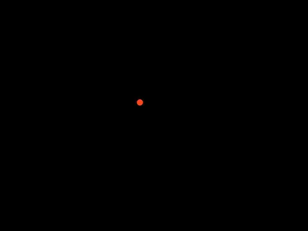
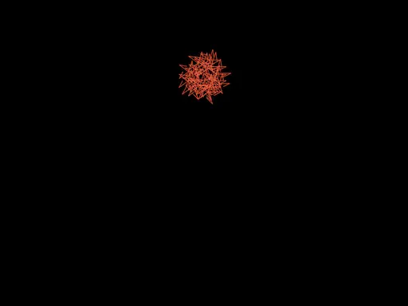
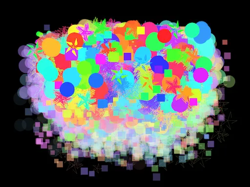
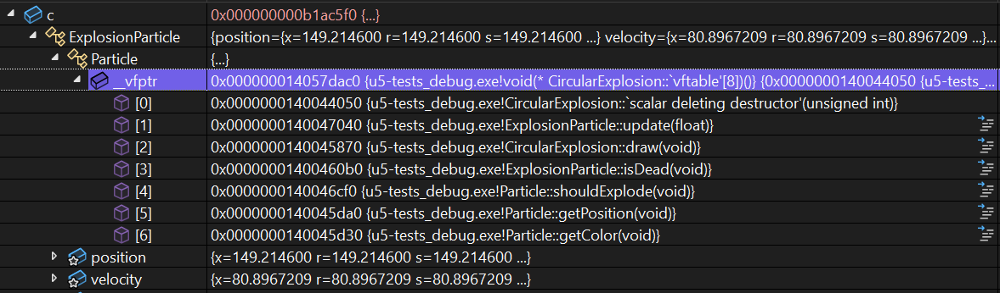

import { Aside } from '@astrojs/starlight/components';

## Introducción 📜

En esta unidad vas a profundizar en los principios fundamentales de la
Programación Orientada a Objetos (OOP) usando C++. El objetivo es profundo:
no solo usarás la herencia, el polimorfismo y el encapsulamiento en C++, sino
que entenderás cómo funcionan por dentro, **"bajo el capó"**. Usaremos un caso
de estudio de fuegos artificiales construido con openFrameworks para observar
en vivo, con el depurador, cómo se organizan los objetos en memoria, cómo se
implementa la tabla de funciones virtuales (_vtable_) y cómo se despacha
dinámicamente el polimorfismo en tiempo de ejecución.

## Rúbrica de evaluación de la unidad 📝

:::note[Transparencia]
Esta rúbrica se socializa antes de la sustentación. La sustentación se
basa en lo presentado en la aplicación y lo documentado en la bitácora.
:::

### Requisito de salida (condición necesaria)

:::caution[Para poder cerrar la evaluación y registrar la nota]
La **bitácora de reflexión** debe estar diligenciada antes de terminar
la sesión y debe ser enseñada al profesor antes de abandonar el aula. La
presentación de la bitácora de reflexión es un requisito indispensable
para montar la nota final en la plataforma académica. Si no se cumple
este requisito, la nota final de la unidad será 0.0.
:::

---

### Rúbrica analítica

:::tip[Evidencias evaluadas]

1) Evidencias de análisis y depuración en bitácora (capturas del depurador +
elección del punto de inspección + explicación + justificación).  
2) Sustentación a partir de la app y la bitácora.

:::

| Criterio (peso) | Cumple plenamente (5.0) | Se cumple medianamente (4.0) | Problemas importantes (3.0) | Falta comprensión básica (2.0) | No hay evidencia (0.0) |
|---|---|---|---|---|---|
| **1. Evidencias de análisis y depuración (40%)** | Presenta todas las capturas del **depurador** solicitadas. El **punto de inspección elegido** es pertinente y revelador (muestra criterio para decidir dónde detener la ejecución). Cada captura incluye una explicación precisa de **qué se está observando** y una justificación clara de **por qué** constituye evidencia de comprensión del patrón OOP correspondiente. | Capturas presentes pero hay **1–2 vacíos menores** (ej. la elección del breakpoint es adecuada pero no se justifica, o la justificación de por qué es una evidencia es superficial). | Faltan capturas clave o hay **vacíos importantes** en el análisis. Los puntos de inspección elegidos no son informativos o no corresponden a lo que se intenta demostrar. | Las imágenes presentadas no son del depurador, no corresponden a lo solicitado, o carecen totalmente de explicación y justificación. No hay prueba de que el estudiante haya analizado el código. | No se entregaron evidencias o no se puede acceder a ellas. |
|Evaluación||||||
| **2. Sustentación (60%)** | Responde a las preguntas con precisión, conectando: **(a) lo que se ve**, **(b) cómo está hecho**, y **(c) por qué**. Usa su bitácora para justificar decisiones. Reconoce límites/errores y propone cómo probar/mejorar. | Respuestas correctas pero con **imprecisiones menores** o justificación superficial. Usa parcialmente la bitácora para sustentar. | Responde solo "qué hizo" pero le cuesta explicar "cómo" o "por qué". Necesita guía para conectar con su propia evidencia/bitácora. | No logra responder de forma coherente o responde sin relación con lo presentado/documentado. Evidencia falta de comprensión básica del trabajo entregado. | No se entregaron evidencias o no se puede acceder a ellas. |
|Evaluación||||||

---

:::tip[Cálculo de la nota]

$$
Nota = C_1*0.4  + C_2*0.6
$$

:::

---

## Set: ¿Qué aprenderás en esta unidad? 💡

Aprenderás cómo funcionan por dentro los tres pilares de la OOP en C++:
encapsulamiento, herencia y polimorfismo. Usarás el depurador como microscopio
para observar cómo se organizan los objetos en memoria, qué es la _vtable_ y
cómo el programa decide en tiempo de ejecución qué versión de un método ejecutar.
Al final, construirás tus propias extensiones al caso de estudio y demostrarás,
con evidencias del depurador, que comprendes y eres responsable del código
que pones en producción.

## Seek: Investigación 🔎

### Actividad 01

#### Diagnóstico: recordando la OOP desde C#

Esta actividad es un punto de partida formativo. No es una prueba; es un
espejo que te ayuda a ver qué conceptos manejas bien y cuáles son áreas de
oportunidad, para que el aprendizaje que viene tenga un ancla en lo que ya sabes.

**Parte 1: recordando los conceptos (en C#)**

En tus cursos anteriores has trabajado principalmente con C#. Basándote en
esa experiencia, responde con tus propias palabras:

1. ¿Qué es el encapsulamiento para ti? Describe una situación en la que te
haya sido útil o donde hayas visto su importancia.
2. ¿Qué es la herencia? ¿Por qué un programador decidiría usarla? Da un
ejemplo simple.
3. ¿Qué es el polimorfismo? Describe con tus palabras qué significa que un
código sea "polimórfico".

**Parte 2: análisis de código (en C#)**

```csharp
using System;
using System.Collections.Generic;

public abstract class Figura
{
    private string nombre;

    public string Nombre
    {
        get { return nombre; }
        protected set { nombre = value; }
    }

    public Figura(string nombre)
    {
        this.Nombre = nombre;
    }

    public abstract void Dibujar();
}

public class Circulo : Figura
{
    public double Radio { get; private set; }

    public Circulo(double radio) : base("Círculo")
    {
        this.Radio = radio;
    }

    public override void Dibujar()
    {
        Console.WriteLine($"Dibujando un {Nombre} de radio {Radio}.");
    }
}

public class Rectangulo : Figura
{
    public double Base { get; private set; }
    public double Altura { get; private set; }

    public Rectangulo(double b, double h) : base("Rectángulo")
    {
        this.Base = b;
        this.Altura = h;
    }

    public override void Dibujar()
    {
        Console.WriteLine($"Dibujando un {Nombre} de {Base}x{Altura}.");
    }
}

public class Programa
{
    public static void Main()
    {
        List<Figura> misFiguras = new List<Figura>();

        misFiguras.Add(new Circulo(5.0));
        misFiguras.Add(new Rectangulo(4.0, 6.0));
        misFiguras.Add(new Circulo(10.0));

        foreach (Figura fig in misFiguras)
        {
            fig.Dibujar();
        }
    }
}
```

Responde estas preguntas sobre el código:

**Encapsulamiento:**
- Señala una línea de código que sea un ejemplo claro de encapsulamiento y
explica por qué lo es.
- ¿Por qué crees que el campo `nombre` es `private` pero la propiedad
`Nombre` es `public`? ¿Qué problema se evita con esto?

**Herencia:**
- ¿Cómo se evidencia la herencia en la clase `Circulo`?
- Un objeto de tipo `Circulo`, además de `Radio`, ¿Qué otros datos almacena
en su interior gracias a la herencia?

**Polimorfismo:**
- Observa el bucle `foreach`. La variable `fig` es de tipo `Figura`, pero a
veces contiene un `Circulo` y otras un `Rectangulo`. Cuando se llama a
`fig.Dibujar()`, el programa ejecuta la versión correcta. En tu opinión,
¿cómo crees que funciona esto "por debajo"? No necesitas saber la respuesta
correcta; solo quiero que intentes razonar cómo podría ser.

**Parte 3: hipótesis sobre la implementación**

Imagina que eres un diseñador de lenguajes de programación. Tienes que
decidir cómo implementar estos conceptos en la memoria y en el procesador.
No hay respuestas incorrectas, solo ideas. Dibuja si te ayuda.

1. **Memoria y herencia**: cuando creas un objeto `Rectangulo`, este tiene
`Base`, `Altura` y también `Nombre`. ¿Cómo te imaginas que se organizan
esos tres datos en la memoria del computador para formar un solo objeto?
2. **El mecanismo del polimorfismo**: pensemos de nuevo en la llamada
`fig.Dibujar()`. El compilador solo sabe que `fig` es una `Figura`.
¿Cómo decide el programa, mientras se está ejecutando, si debe llamar al
`Dibujar` del `Circulo` o al del `Rectangulo`? Lanza algunas ideas o
hipótesis.
3. **La barrera del encapsulamiento**: ¿Cómo crees que el compilador logra
que no puedas acceder a un miembro `private` desde fuera de la clase?
¿Es algo que se revisa cuando escribes el código, o es una protección que
existe mientras el programa se ejecuta? ¿Por qué piensas eso?

**Parte 4: reflexión y preparación**

Has completado el diagnóstico. Reflexiona: ¿En qué conceptos te sientes
más seguro y cuáles te generan más preguntas? Anota tus dudas y tus hipótesis
en la bitácora; serán tu brújula para las actividades que siguen.

:::caution[📤 Bitácora]
Documenta tus respuestas, hipótesis y reflexiones de las cuatro partes
anteriores en tu bitácora de aprendizaje.
:::

---

### Actividad 02

#### Caso de estudio: fuegos artificiales con openFrameworks

En esta actividad te mostraré una aplicación que usa los conceptos que
estudiarás en esta unidad. Obsérvala, ejecútala y analízala **sin usar IA
generativa**.

Crea un proyecto en openFrameworks y agrega el siguiente código.

`ofApp.h`:

```cpp
#pragma once
#include "ofMain.h"
#include <vector>

// -------------------------------------------------
// Clase base abstracta: Particle
// -------------------------------------------------
class Particle {
public:
    virtual ~Particle() {}
    virtual void update(float dt) = 0;
    virtual void draw() = 0;
    virtual bool isDead() const = 0;
    virtual bool shouldExplode() const { return false; }
    virtual glm::vec2 getPosition() const { return glm::vec2(0, 0); }
    virtual ofColor getColor() const { return ofColor(255); }
};

// -------------------------------------------------
// RisingParticle: Partícula que nace en la parte inferior y sube
// -------------------------------------------------
class RisingParticle : public Particle {
protected:
    glm::vec2 position;
    glm::vec2 velocity;
    ofColor color;
    float lifetime;
    float age;
    bool exploded;
public:
    RisingParticle(const glm::vec2& pos, const glm::vec2& vel,
                   const ofColor& col, float life)
        : position(pos), velocity(vel), color(col),
          lifetime(life), age(0), exploded(false) {}

    void update(float dt) override {
        position += velocity * dt;
        age += dt;
        velocity.y += 9.8f * dt * 8;
        float explosionThreshold = ofGetHeight() * 0.15f + ofRandom(-30, 30);
        if (position.y <= explosionThreshold || age >= lifetime) {
            exploded = true;
        }
    }

    void draw() override {
        ofSetColor(color);
        ofDrawCircle(position, 10);
    }

    bool isDead() const override { return exploded; }
    bool shouldExplode() const override { return exploded; }
    glm::vec2 getPosition() const override { return position; }
    ofColor getColor() const override { return color; }
};

// -------------------------------------------------
// Clase base para explosiones: ExplosionParticle
// -------------------------------------------------
class ExplosionParticle : public Particle {
protected:
    glm::vec2 position;
    glm::vec2 velocity;
    ofColor color;
    float age;
    float lifetime;
    float size;
public:
    ExplosionParticle(const glm::vec2& pos, const glm::vec2& vel,
                      const ofColor& col, float life, float sz)
        : position(pos), velocity(vel), color(col),
          age(0), lifetime(life), size(sz) {}

    void update(float dt) override {
        position += velocity * dt;
        age += dt;
        float alpha = ofMap(age, 0, lifetime, 255, 0, true);
        color.a = alpha;
    }

    bool isDead() const override { return age >= lifetime; }
};

// -------------------------------------------------
// CircularExplosion: Explosión en patrón circular
// -------------------------------------------------
class CircularExplosion : public ExplosionParticle {
public:
    CircularExplosion(const glm::vec2& pos, const ofColor& col)
        : ExplosionParticle(pos, glm::vec2(0, 0), col, 1.2f, ofRandom(16, 32)) {
        float angle = ofRandom(0, TWO_PI);
        float speed = ofRandom(80, 200);
        velocity = glm::vec2(cos(angle), sin(angle)) * speed;
    }

    void draw() override {
        ofSetColor(color);
        ofDrawCircle(position, size);
    }
};

// -------------------------------------------------
// RandomExplosion: Explosión con direcciones aleatorias
// -------------------------------------------------
class RandomExplosion : public ExplosionParticle {
public:
    RandomExplosion(const glm::vec2& pos, const ofColor& col)
        : ExplosionParticle(pos, glm::vec2(0, 0), col, 1.5f, ofRandom(16, 32)) {
        velocity = glm::vec2(ofRandom(-200, 200), ofRandom(-200, 200));
    }

    void draw() override {
        ofSetColor(color);
        ofDrawRectangle(position.x, position.y, size, size);
    }
};

// -------------------------------------------------
// StarExplosion: Explosión en forma de estrella
// -------------------------------------------------
class StarExplosion : public ExplosionParticle {
public:
    StarExplosion(const glm::vec2& pos, const ofColor& col)
        : ExplosionParticle(pos, glm::vec2(0, 0), col, 1.3f, ofRandom(20, 40)) {
        float angle = ofRandom(0, TWO_PI);
        float speed = ofRandom(90, 180);
        velocity = glm::vec2(cos(angle), sin(angle)) * speed;
    }

    void draw() override {
        ofSetColor(color);
        int rays = 5;
        float outerRadius = size;
        float innerRadius = size * 0.5f;
        ofPushMatrix();
        ofTranslate(position);
        for (int i = 0; i < rays; i++) {
            float theta = ofMap(i, 0, rays, 0, TWO_PI);
            float xOuter = cos(theta) * outerRadius;
            float yOuter = sin(theta) * outerRadius;
            float xInner = cos(theta + PI / rays) * innerRadius;
            float yInner = sin(theta + PI / rays) * innerRadius;
            ofDrawLine(0, 0, xOuter, yOuter);
            ofDrawLine(xOuter, yOuter, xInner, yInner);
        }
        ofPopMatrix();
    }
};

// -------------------------------------------------
// ofApp: Manejo de la escena y eventos
// -------------------------------------------------
class ofApp : public ofBaseApp {
public:
    void setup();
    void update();
    void draw();
    void mousePressed(int x, int y, int button);
    void keyPressed(int key);

    std::vector<Particle*> particles;
    ~ofApp();

private:
    void createRisingParticle();
};
```

`ofApp.cpp`:

```cpp
#include "ofApp.h"

// --------------------------------------------------------------
void ofApp::setup() {
    ofSetFrameRate(60);
    ofBackground(0);
}

// --------------------------------------------------------------
void ofApp::update() {
    float dt = ofGetLastFrameTime();

    for (int i = 0; i < particles.size(); i++) {
        particles[i]->update(dt);
    }

    for (int i = particles.size() - 1; i >= 0; i--) {
        if (particles[i]->shouldExplode()) {
            int explosionType = (int)ofRandom(3);
            int numParticles = (int)ofRandom(20, 30);
            for (int j = 0; j < numParticles; j++) {
                if (explosionType == 0) {
                    particles.push_back(new CircularExplosion(
                        particles[i]->getPosition(), particles[i]->getColor()));
                } else if (explosionType == 1) {
                    particles.push_back(new RandomExplosion(
                        particles[i]->getPosition(), particles[i]->getColor()));
                } else {
                    particles.push_back(new StarExplosion(
                        particles[i]->getPosition(), particles[i]->getColor()));
                }
            }
            delete particles[i];
            particles.erase(particles.begin() + i);
        } else if (particles[i]->isDead()) {
            delete particles[i];
            particles.erase(particles.begin() + i);
        }
    }
}

// --------------------------------------------------------------
void ofApp::draw() {
    for (int i = 0; i < particles.size(); i++) {
        particles[i]->draw();
    }
}

// --------------------------------------------------------------
void ofApp::createRisingParticle() {
    float minX = ofGetWidth() * 0.35f;
    float maxX = ofGetWidth() * 0.65f;
    float spawnX = ofRandom(minX, maxX);
    glm::vec2 pos(spawnX, ofGetHeight());
    glm::vec2 target(ofGetWidth() / 2.0f + ofRandom(-300, 300),
                     ofGetHeight() * 0.10f + ofRandom(-30, 30));
    glm::vec2 direction = glm::normalize(target - pos);
    glm::vec2 vel = direction * ofRandom(250, 350);
    ofColor col;
    col.setHsb(ofRandom(255), 220, 255);
    float lifetime = ofRandom(1.5f, 3.5f);
    particles.push_back(new RisingParticle(pos, vel, col, lifetime));
}

// --------------------------------------------------------------
void ofApp::mousePressed(int x, int y, int button) {
    createRisingParticle();
}

// --------------------------------------------------------------
void ofApp::keyPressed(int key) {
    if (key == ' ') {
        for (int i = 0; i < 1000; i++) {
            createRisingParticle();
        }
    }
    if (key == 's') {
        ofSaveScreen("screenshot_" + ofToString(ofGetFrameNum()) + ".png");
    }
}

// --------------------------------------------------------------
ofApp::~ofApp() {
    for (int i = 0; i < particles.size(); i++) {
        delete particles[i];
    }
    particles.clear();
}
```

🧐🧪✍️ Analiza el código de la aplicación y trata de explicar en tus propias
palabras qué está haciendo. **No uses IA generativa**. Captura pantallas de
la aplicación funcionando y añádelas a la bitácora.

Cuando ejecutes la aplicación deberías ver algo como esto:








:::caution[📤 Bitácora]
Documenta en tu bitácora de aprendizaje el análisis del código y las
capturas de pantalla de la aplicación funcionando.
:::

---

### Actividad 03

#### Objetos en memoria y la _vtable_

Ahora te guiaré en el análisis del caso de estudio. Vamos a redescubrir
los conceptos de OOP desde la experimentación y el depurador.

**Concepto de objeto**: en la OOP, un objeto es una instancia de una clase.
Pero ¿Cómo se ve un objeto en la memoria?

Usa el depurador para encontrar la instancia de la clase `ofApp`. Recuerda
que el objeto solo estará en memoria mientras la aplicación esté corriendo.

Observa la clase `ofApp`:

```cpp
class ofApp : public ofBaseApp {
public:
    void setup();
    void update();
    void draw();
    void mousePressed(int x, int y, int button);
    void keyPressed(int key);

    std::vector<Particle*> particles;
    ~ofApp();

private:
    void createRisingParticle();
};
```

🧐🧪✍️ Antes de ejecutar el experimento: ¿Qué esperas ver en memoria
(hipótesis)? Ejecuta el código, abre el depurador y captura el objeto
`ofApp` en memoria. ¿Qué puedes observar? ¿Qué información te proporciona
el depurador? ¿Qué puedes concluir?

🧐🧪✍️ Usa de nuevo el depurador para capturar un objeto de tipo
`CircularExplosion`. Es posible que debas hacer modificaciones mínimas en
el código para poder capturarlo más fácilmente. Abre las ventanas **Auto**
o **Locals** y **Memory 1** en el depurador. Trata de encontrar en memoria
todas las partes que componen al objeto `CircularExplosion`. Recuerda tener
a mano toda la jerarquía de clases para identificar cada parte en memoria.
¿Qué puedes observar? ¿Qué puedes concluir?

**Concepto de los métodos virtuales**: observa de nuevo en memoria un objeto
de tipo `CircularExplosion`. Nota que el primer campo en memoria del objeto
es un `ExplosionParticle`. Abre `ExplosionParticle` y observa que el primer
campo es un `Particle`. Abre `Particle` y observa que el primer campo es
`_vtable`. Ese es un puntero a la tabla de funciones virtuales.

🧐🧪✍️ Captura la `_vtable` de un objeto `CircularExplosion` y pégala en
tu bitácora. Observa detenidamente la tabla de funciones. ¿Qué puedes
observar?

Este es un ejemplo de cómo se puede ver la tabla de funciones:



🧐🧪✍️ Ahora captura la `_vtable` de un objeto `StarExplosion` y pégala
en tu bitácora.

Este es un ejemplo de cómo se puede ver la tabla de funciones:


🧐🧪✍️ Observa ambas tablas y compáralas. ¿Qué puedes ver? ¿Qué relación
existe entre la tabla de funciones y los métodos virtuales? ¿Para qué crees
que pueda servir una tabla de funciones virtuales? Para responder, trata
de pensar en el polimorfismo con interfaces y clases abstractas que viste
en C#:

```csharp
using System;

interface IAnimal
{
    void HacerSonido();
}

class Perro : IAnimal
{
    public void HacerSonido()
    {
        Console.WriteLine("El perro ladra: ¡Guau, guau!");
    }
}

class Gato : IAnimal
{
    public void HacerSonido()
    {
        Console.WriteLine("El gato maúlla: ¡Miau, miau!");
    }
}

class Program
{
    static void Main()
    {
        IAnimal[] animales = new IAnimal[]
        {
            new Perro(),
            new Gato()
        };

        foreach (IAnimal animal in animales)
        {
            animal.HacerSonido();
        }
    }
}
```

Nota que `HacerSonido` se llama una vez para el perro y otra para el gato.
¿Cómo sabe la función sobre cuál objeto debe actuar?

:::caution[📤 Bitácora]
Documenta todos los experimentos, hipótesis, capturas y conclusiones de
esta actividad en tu bitácora.
:::

---

### Actividad 04

#### Encapsulamiento

**Concepto de encapsulamiento**: el encapsulamiento en C++ se logra mediante
los modificadores de acceso. Crea un proyecto de consola de C++ en Visual
Studio y experimenta con el siguiente código:

```cpp
class AccessControl {
private:
    int privateVar;

protected:
    int protectedVar;

public:
    int publicVar;
    AccessControl() : privateVar(1), protectedVar(2), publicVar(3) {}
};

int main() {
    AccessControl ac;
    ac.publicVar = 10;       // Válido
    // ac.protectedVar = 20; // Error de compilación
    // ac.privateVar = 30;   // Error de compilación
    return 0;
}
```

Ejecuta este código. Luego, descomenta las líneas comentadas y vuelve a
compilar. ¿Qué sucede? ¿Por qué? ¿Qué puedes concluir?

Ahora nota algo importante: el encapsulamiento solo se garantiza en **tiempo
de compilación**. Sin embargo, en tiempo de ejecución es posible acceder a
los campos privados. Analiza el siguiente programa:

```cpp
#include <iostream>

class MyClass {
private:
    int secret1;
    float secret2;
    char secret3;

public:
    MyClass(int s1, float s2, char s3) : secret1(s1), secret2(s2), secret3(s3) {}

    void printMembers() const {
        std::cout << "secret1: " << secret1 << "\n";
        std::cout << "secret2: " << secret2 << "\n";
        std::cout << "secret3: " << secret3 << "\n";
    }
};

int main() {
    MyClass obj(42, 3.14f, 'A');
    // Esta línea causará un error de compilación:
    std::cout << obj.secret1 << std::endl;

    obj.printMembers();
    return 0;
}
```

🧐🧪✍️ Compila el programa. ¿Qué pasa?

Ahora prueba con este programa:

```cpp
#include <iostream>

class MyClass {
private:
    int secret1;
    float secret2;
    char secret3;

public:
    MyClass(int s1, float s2, char s3) : secret1(s1), secret2(s2), secret3(s3) {}

    void printMembers() const {
        std::cout << "secret1: " << secret1 << "\n";
        std::cout << "secret2: " << secret2 << "\n";
        std::cout << "secret3: " << secret3 << "\n";
    }
};

int main() {
    MyClass obj(42, 3.14f, 'A');

    // Usando reinterpret_cast para violar el encapsulamiento
    int* ptrInt = reinterpret_cast<int*>(&obj);
    float* ptrFloat = reinterpret_cast<float*>(ptrInt + 1);
    char* ptrChar = reinterpret_cast<char*>(ptrFloat + 1);

    std::cout << "Accediendo directamente a los miembros privados:\n";
    std::cout << "secret1: " << *ptrInt << "\n";
    std::cout << "secret2: " << *ptrFloat << "\n";
    std::cout << "secret3: " << *ptrChar << "\n";

    return 0;
}
```

🧐🧪✍️ Compila y ejecuta. ¿Qué puedes concluir?

🧐🧪✍️ En tus palabras, ¿qué es el encapsulamiento? ¿Por qué es importante?
¿Es una protección en tiempo de compilación o en tiempo de ejecución?

:::caution[📤 Bitácora]
Documenta los experimentos, resultados y conclusiones sobre encapsulamiento
en tu bitácora.
:::

---

### Actividad 05

#### Herencia y Polimorfismo

**Concepto de herencia**: la herencia es otro pilar fundamental de la OOP.
Vuelve al caso de estudio y observa la clase `CircularExplosion`. Esta clase
hereda de `ExplosionParticle`, que a su vez hereda de `Particle`.

🧐🧪✍️ Captura de nuevo la memoria que ocupa un objeto `CircularExplosion`
y compara la jerarquía de clases con los campos en memoria. ¿Qué puedes
observar? ¿Cómo se implementa la herencia en C++?

🧐🧪✍️ C++ permite algo que C# no: **herencia múltiple**. Diseña un
experimento en un proyecto de consola que te permita ver en el depurador
cómo se organiza en memoria un objeto cuya clase base tiene herencia múltiple.
Captura el resultado y explica qué observas.

**Concepto de polimorfismo**: recuerdas que ya analizaste los métodos
virtuales y la tabla de funciones virtuales. Ahora conecta eso con el
polimorfismo.

Observa en `ofApp.cpp` el método `update()`:

```cpp
// Actualiza todas las partículas
for (int i = 0; i < particles.size(); i++) {
    particles[i]->update(dt);
}
```

El método `update` de la clase `Particle` es virtual. Usa el depurador para
analizar cómo se comporta en tiempo de ejecución. Verifica el comportamiento
cuando `particles` contiene objetos de diferentes tipos.

🧐🧪✍️ Observa que `update` se comporta de manera diferente para cada tipo
de partícula. A esto se le llama **polimorfismo en tiempo de ejecución**.
Realiza un dibujo en el que expliques cómo se implementa este mecanismo
usando el concepto de métodos virtuales y la `_vtable`. ¿Qué puedes concluir?

🧐🧪✍️ ¿Qué relación existe entre los métodos virtuales, la `_vtable` y el
polimorfismo?

:::caution[📤 Bitácora]
Documenta los experimentos de herencia y polimorfismo, incluyendo capturas
del depurador y el dibujo explicativo del mecanismo de despacho dinámico.
:::

---

## Apply: Aplicación 🛠

### Actividad 06

#### Reto integrador: extender el sistema de fuegos artificiales

En esta actividad aplicarás todo lo aprendido extendiendo el caso de estudio
y demostrando tu comprensión con evidencias del depurador.

---

**Fase 1 — Requisito de entrada: la aplicación funcional**

:::caution[La aplicación funcional es el boleto de entrada, no la evidencia evaluada]
Antes de presentar las evidencias, debes tener una aplicación que funcione
con las siguientes extensiones:

1. Agrega **dos nuevos tipos de `Particle`** distintos a `RisingParticle`
(puedes inspirarte en los tipos de explosión existentes o crear algo
completamente diferente).
2. Implementa **un nuevo modo de explosión** adicional a los tres existentes.

Puedes usar IA generativa para ayudarte a generar el código. Sin embargo,
recuerda la premisa de esta unidad: **construir implica responsabilidad**.
Haber generado el código no es suficiente; debes haberlo revisado,
comprendido, editado y probado de manera que puedas asumir la responsabilidad
de su funcionamiento.

La aplicación funcional no se evalúa directamente. Es la base sobre la cual
demostrarás tu comprensión en la Fase 2.
:::

:::tip[Código de la aplicación funcional]
Debes copiar el código de tu aplicación funcional en tu bitácora SIN COMENTARIOS. Solo el código. 
Deberías incluir el código de ofApp.h y ofApp.cpp que permiten reproducir tu aplicación con las extensiones solicitadas.
:::

---

**Fase 2 — Evidencias de comprensión con el depurador**

:::tip[Cómo presentar cada evidencia]
Para cada una de las evidencias a continuación, incluye **cuatro componentes**
en tu bitácora:

1. **Elección del punto de inspección**: ¿En qué parte del código detuviste
la ejecución y por qué elegiste ese punto? La elección del breakpoint es
parte del pensamiento crítico y se evalúa.
2. **Captura de pantalla del depurador**: la imagen de lo que se observa.
3. **Explicación**: ¿Qué variables, valores o estructuras se están observando
en la imagen?
4. **Justificación**: ¿Cómo demuestra esta captura comprensión del concepto
o patrón solicitado?
:::

---

**Evidencias para RAE 1 — Patrones y estrategias OOP**

**Evidencia 1 — Herencia en memoria**

Demuestra con el depurador que comprendes cómo la herencia organiza los
datos en memoria para uno de tus nuevos tipos de partícula. Debes poder
mostrar la jerarquía completa de objetos anidados en el objeto inspeccionado
y explicar qué campo pertenece a qué clase de la jerarquía.

**Evidencia 2 — La _vtable de tu nuevo tipo**

Demuestra con el depurador que comprendes cómo se implementa el polimorfismo
a nivel de la `_vtable`. Compara la tabla de funciones de tu nuevo tipo con
la de otro tipo existente (p. ej., `CircularExplosion`). Explica qué entradas
son iguales y cuáles son diferentes, y por qué.

**Evidencia 3 — Polimorfismo en tiempo de ejecución**

Demuestra que el polimorfismo en tiempo de ejecución funciona para tu nuevo
tipo: el despacho dinámico ejecuta **tu** versión del método virtual cuando
corresponde. Debes mostrar que el programa tomó el camino correcto y no
el de otro tipo.

**Evidencia 4 — Encapsulamiento en el contexto de herencia**

Demuestra con el depurador que comprendes el encapsulamiento en el contexto
de tu jerarquía de herencia: ¿Qué campos son visibles desde la subclase
(protegidos/públicos) y cuáles no (privados)? ¿Cómo se refleja esto en la
vista del depurador?

---

**Evidencias para RAE 2 — Pruebas y depuración**

**Evidencia 5 — Ciclo de vida completo de tu partícula**

Demuestra el ciclo de vida completo de uno de tus nuevos tipos: desde su
creación (el objeto entra al vector), su estado durante `update`, hasta su
eliminación (el objeto se retira del vector y se libera la memoria). Explica
qué observas en cada etapa.

**Evidencia 6 — Sin fugas de memoria**

Demuestra que no hay fuga de memoria: tu partícula se elimina correctamente
del vector cuando muere y la memoria se libera. Explica qué pasa en el
`delete` y cómo verificas que el puntero se retira del vector.

**Evidencia 7 — Prueba de condición límite**

Diseña y ejecuta un **escenario de prueba deliberado** para verificar una
condición límite de tu implementación. Por ejemplo: ¿Qué pasa cuando el
vector de partículas se vacía completamente? ¿O cuando se crean muchas
partículas al mismo tiempo? Tú decides qué condición quieres probar y por qué
es relevante. Explica tu diseño del escenario de prueba, captura el depurador
en el momento clave y justifica qué verificaste.

:::caution[📤 Bitácora]
Documenta las dos fases en tu bitácora: el código yuna descripción breve de las
extensiones implementadas (Fase 1) y las siete evidencias completas con
sus cuatro componentes cada una (Fase 2).
:::

---

## Reflect: Consolidación y metacognición 🤔

### Actividad 07

:::caution[📤 Bitácora — Revisión de la unidad]

Vas a explicar con capturas de pantalla de **gráficos hechos en
[excalidraw](https://excalidraw.com/)** los conceptos clave de esta unidad.
Debes ilustrar con gráficos:

1. **Jerarquía de clases del caso de estudio con tus extensiones**: muestra
el diagrama de clases completo, incluyendo los dos nuevos tipos de partícula
que agregaste. Indica qué hereda de qué y qué métodos virtuales hay en cada
nivel.

2. **Objeto en memoria con herencia y _vtable_**: dibuja cómo se ve en
memoria un objeto de uno de tus nuevos tipos. Muestra los campos de cada
clase de la jerarquía (base y derivada) y el puntero `_vtable` apuntando
a la tabla de funciones. Anota qué dirección apunta a qué función.

3. **Mecanismo de despacho dinámico (polimorfismo en runtime)**: dibuja el
mecanismo completo: desde la llamada polimórfica (p. ej.,
`particles[i]->update(dt)`) hasta la ejecución de la función correcta,
pasando por el puntero `_vtable` y la tabla de funciones. Muestra por qué
se ejecuta una versión diferente del método dependiendo del tipo real del
objeto.

:::

