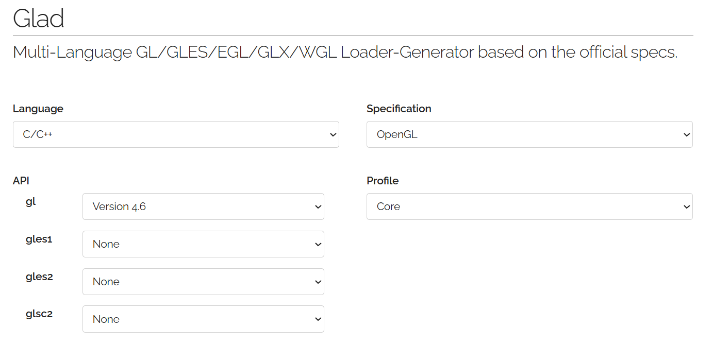
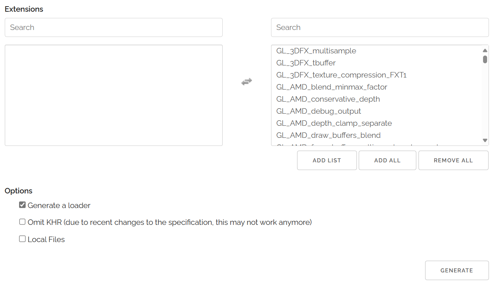
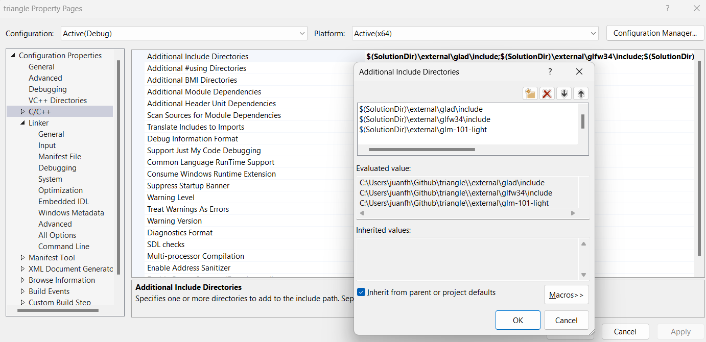
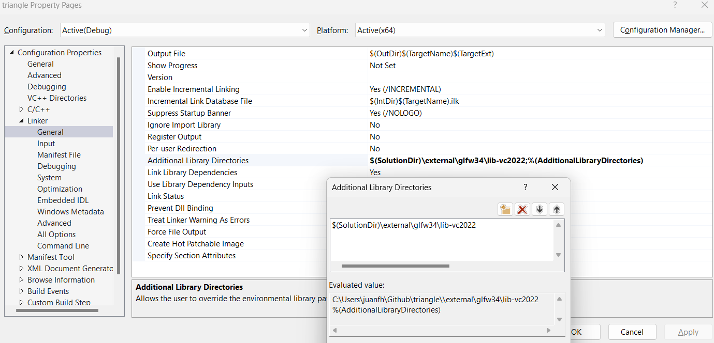
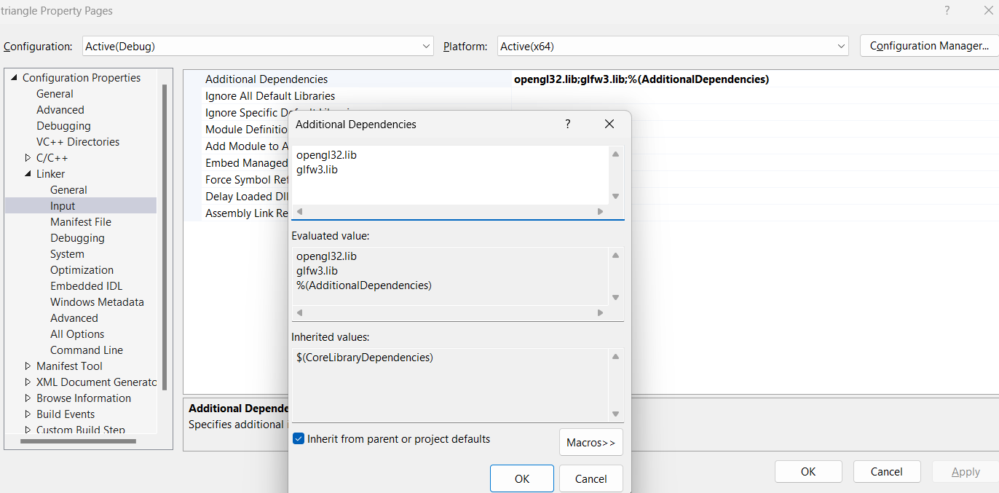
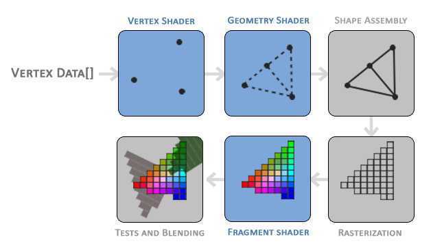
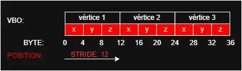
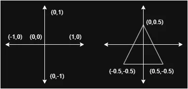
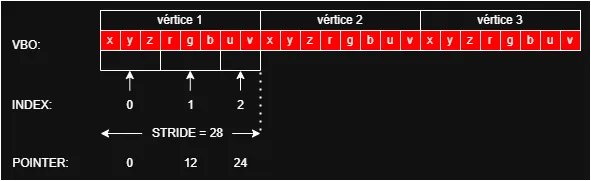

import { Aside } from '@astrojs/starlight/components';

## Introducción 📜

En esta unidad harás una introducción práctica a la programación gráfica
moderna con OpenGL. Usaremos como caso de estudio el ejemplo del **triángulo
simple** para entrar al pipeline programable, entender cómo fluye la
información desde el CPU hasta la GPU y observar cómo shaders, buffers y estado
gráfico colaboran para producir una imagen.

En la Unidad 6 trabajaste una idea central: **ser responsable del diseño**.
Aquí aparece una nueva versión de esa misma idea: **ser responsable del
pipeline**. No basta con lograr que aparezca un triángulo en pantalla; debes
poder explicar qué datos entran, qué programa corre en la GPU, qué estado
configuraste y por qué el resultado visual ocurre como ocurre.

## Rúbrica de evaluación de la unidad 📝

:::note[Transparencia]
Esta rúbrica se socializa antes de la sustentación. La sustentación se basa en
lo presentado en la aplicación y lo documentado en la bitácora.
:::

### Requisito de salida (condición necesaria)

:::caution[Para poder cerrar la evaluación y registrar la nota]
La **bitácora de reflexión** debe estar diligenciada antes de terminar la
sesión y debe ser enseñada al profesor antes de abandonar el aula. La
presentación de la bitácora de reflexión es un requisito indispensable para
montar la nota final en la plataforma académica. Si no se cumple este
requisito, la nota final de la unidad será 0.0.
:::

---

### Rúbrica analítica

:::tip[Evidencias evaluadas]
1) Evidencias de análisis en bitácora: capturas, puntos de inspección,
explicación y justificación técnica del comportamiento observado.  
2) Sustentación a partir de la app y la bitácora.
:::

| Criterio (peso) | Cumple plenamente (5.0) | Se cumple medianamente (4.0) | Problemas importantes (3.0) | Falta comprensión básica (2.0) | No hay evidencia (0.0) |
|---|---|---|---|---|---|
| **1. Evidencias de análisis del pipeline (40%)** | Presenta todas las evidencias solicitadas. El punto de inspección elegido es pertinente y revela comprensión del flujo CPU→GPU, shaders, atributos y uniforms. Cada evidencia explica con precisión qué se observa y por qué constituye prueba de comprensión. | Evidencias presentes con vacíos menores en justificación, precisión o elección del punto de inspección. | Faltan evidencias clave o el análisis se limita a describir “qué hizo” sin mostrar comprensión del pipeline. | Las capturas o pruebas no corresponden a lo solicitado o carecen de explicación y justificación. | No se entregaron evidencias o no se puede acceder a ellas. |
| Evaluación |||||| 
| **2. Sustentación (60%)** | Responde con precisión conectando lo que se ve en pantalla, lo que ocurre en el código C++, lo que ejecuta el shader y la razón técnica del resultado. Reconoce límites, errores y posibles mejoras. | Respuestas correctas con algunas imprecisiones o justificación superficial. | Responde parcialmente y le cuesta conectar C++, shader y resultado visual. | No logra explicar de forma coherente cómo funciona el pipeline en su solución. | No se entregaron evidencias o no se puede acceder a ellas. |
| Evaluación |||||| 

---

:::tip[Cálculo de la nota]

$$
Nota = C_1*0.4 + C_2*0.6
$$

:::

---

## Set: ¿Qué aprenderás en esta unidad? 💡

Aprenderás a:

1. Entender la estructura mínima de una app OpenGL moderna.
2. Explicar qué papel cumplen GLFW, `opengl32.lib`, GLAD, GLM y los drivers.
3. Analizar cómo viajan los datos de vértices hacia el vertex shader mediante
   VBOs, VAOs y atributos.
4. Usar `uniforms` para enviar información dinámica desde C++ al shader.
5. Justificar técnicamente por qué un resultado visual ocurre en pantalla.

## Seek: Investigación 🔎

### Actividad 01

#### Orientación y primer vistazo al entorno gráfico

:::note[Enunciado]
En esta actividad vas a descargar y ejecutar un ejemplo básico introductorio a
OpenGL. Por ahora el objetivo no es entender cada línea, sino **observar el
programa, hacer preguntas y formular hipótesis**.
:::

**Ejemplo simple de un triángulo en OpenGL** que puedes clonar de 
[este enlace](https://github.com/juanferfranco/triangle.git):

1. Abre y explora el programa.
2. Compila y ejecuta el ejemplo.
3. Observa la estructura general del proyecto.

:::caution[📤 Bitácora]
Incluye:
1. Una captura de pantalla del triángulo funcionando en tu máquina.
2. Al menos tres preguntas que te surjan al ver el código.
3. Una primera hipótesis: ¿Qué crees que necesita el programa para dibujar
   ese triángulo?
:::

---
### Actividad 02

#### ¿Cómo se crea un proyecto OpenGL en Windows?

:::note[🎯 Enunciado]
En esta actividad vas a entender que necesitas para que un programa OpenGL funcione en Windows.
No olvides agregar al proyecto el archivo triangle.cpp de la actividad 
anterior para que puedas ver el ejemplo del triángulo simple funcionando 
en el proyecto que creaste una vez esté configurado correctamente.
:::

**¿Cómo se crea un proyecto OpenGL en Windows?**

En la actividad anterior te entregué un ejemplo que vamos a analizar en esta fase de investigación. 
El ejemplo ya estaba previamente configurado y listo para compilar y ejecutar. Sin embargo, en esta actividad 
te voy a explicar cómo se crea un proyecto OpenGL desde cero porque hay algunos conceptos fundamentales 
del proceso de creación de un proyecto OpenGL que es importante que entiendas. Trata de reproducir el proceso 
en tu máquina. Si no lo logras, no te preocupes, en la fase de investigación vamos a profundizar en el tema.

Lo primero que necesitas es crear un proyecto vacío (Empty project) en C++ en Visual Studio. 
Luego, necesitas agregar las librerías de OpenGL, GLFW y GLAD. En el ejemplo del triángulo simple de la actividad 
anterior ya están incluidas las librerías y los archivos de encabezado necesarios. Además te incluí una biblioteca 
adicional llamada GLM, que es una biblioteca de matemáticas para gráficos 3D. De todas formas, esta biblioteca 
no es estrictamente necesaria para crear un proyecto OpenGL, pero es muy útil para trabajar con matrices y vectores.

Volvamos pues a la pregunta inicial: **¿Cómo se crea un proyecto OpenGL en Windows?** Una vez que tienes 
el proyecto vacío creado, lo vas a buscar en el explorador de archivos de Windows. Vas a crear una carpeta 
llamada **external** (observa en el ejemplo del triángulo simple esta carpeta y su contenido). Dentro de esa carpeta 
guardarás las dependencias de tu proyecto. Para hacer esto, crea estas carpetas, que son las que contienen 
las dependencias de tu proyecto:

```bash
glfw34
glad
glm-101-light
```

¿Qué dependencias necesitas y por qué? Comencemos con **GLFW**. Esta es una biblioteca que te permite crear ventanas 
y manejar eventos de entrada (teclado, ratón, etc.). [GLFW](https://www.glfw.org/) es una biblioteca multiplataforma, lo que 
significa que puedes usarla en Windows, Linux y MacOS. Para conseguir la biblioteca, lo que necesitas es ir al repositorio en 
Github y descargar el archivo glfw-3.4.bin.WIN64.zip que está en la sección de releases. Descomprime el archivo y guarda 
las siguientes carpetas en glfw34:

```bash
include
lib-vc2022
LICENSE.md
README.md
```

La carpeta include contiene los archivos de encabezado de la biblioteca. La carpeta lib-vc2022 contiene las bibliotecas compiladas para Visual Studio 2022.

Ahora sigamos con **GLAD**. Esta es una biblioteca que te permite cargar las funciones de OpenGL. [GLAD](https://glad.dav1d.de/) es un cargador de funciones de 
OpenGL que te permite acceder a las funciones de OpenGL en tiempo de ejecución. Para conseguir la biblioteca, lo que haces es ir al sitio web de GLAD y generar 
el código fuente para OpenGL 4.6 y el perfil Core. Luego descarga el archivo zip y guarda los directorios src e include en la carpeta glad que habíamos creado antes en external.

Te voy a mostrar unas capturas de pantalla para que veas cómo configurar las opciones en el sitio de GLAD:




Aquí tengo varias cosas interesantes para contarte. La primera es la versión de API de OpenGL. Nota que elegí la versión 4.6. 
Esto es porque es la versión más reciente de OpenGL y es la que vamos a usar en esta unidad. La segunda cosa interesante es el perfil. Elegí el perfil **Core** porque es el perfil más moderno de OpenGL. El perfil Compatibility es el perfil más antiguo de OpenGL y no lo vamos a usar en esta unidad.

Nos falta otra dependencia, ¿Verdad? Se trata de GLM. En este caso descargué el archivo glm-1.0.1-light.zip del repositorio de [GLM en Github](https://github.com/g-truc/glm/releases/tag/1.0.1). Nota que la versión descargada es la 1.0.1. Por eso en la carpeta 
externals se crea la carpeta glm-101-light. Allí guardas completa la carpeta glm que resulta de descomprimir el archivo zip.

Paremos aquí un momento. Yo se que estás pensando que esto es muy complicado, aburrido y que no tiene nada que ver con OpenGL, pero 
es importante que entiendas cómo funciona el proceso de creación de un proyecto OpenGL. Porque este mismo proceso lo podrás 
usar para crear otro tipo de proyectos con otras bibliotecas. Por ejemplo, si quieres crear un proyecto con [SDL](https://www.libsdl.org/) o [SFML](https://www.sfml-dev.org/), el proceso es el mismo.

¿Entonces ya terminamos? La verdad no. Hasta ahora solo hemos descargado las dependencias y las hemos organizado. Ahora 
falta configurar el proyecto en Visual Studio. Para hacer esto, lo que tienes que hacer es abrir el proyecto en Visual Studio y
agregar las rutas de las dependencias a las propiedades del proyecto. Para no aburrirte, te voy a mostrar las capturas de pantalla de cómo lo hice.

Para poder usar las bibliotecas, le digo a Visual Studio dónde están los archivos de cabecera:



Luego le indico a Visual Studio dónde están las bibliotecas .lib. En este caso solo hay una, que es la de GLFW. Las demás 
dependencias no tienen bibliotecas .lib porque son archivos de código fuente.



Ahora le digo a Visual Studio qué .lib específicas quiero usar. En este caso solo la de GLFW y una más (ya te digo cuál es).



Es posible que hayas notado una librería adicional llamada opengl32.lib. Esta biblioteca viene incluida con Windows y cumple un papel 
importante: permite enlazar contra la API base de OpenGL en Windows y acceder a las funciones básicas de la versión 1.1. Sin embargo, en nuestros 
ejemplos usaremos funciones más avanzadas (por ejemplo, de OpenGL 3.3 o 4.6), que no están en opengl32.lib, sino en los drivers de la 
tarjeta gráfica que tengas instalada. Esos drivers implementan las versiones modernas de OpenGL.

Como esas funciones no se pueden usar directamente, necesitamos una herramienta como GLAD, que se encarga de cargarlas dinámicamente en 
tiempo de ejecución. GLAD consulta al sistema operativo y a los drivers para obtener las direcciones de memoria de esas funciones, y 
así podemos usarlas como si fueran funciones normales en nuestro código.

¿Ya terminamos? Aún no, pero no te desanimes. Nos falta un paso importante: agregar el archivo de código fuente de GLAD al proyecto.

Esto se hace muy fácilmente: solo debes añadir (ojo, click derecho al proyecto en Visual Studio y seleccionas Add/New item) el archivo 
glad.c que se encuentra en la carpeta glad/src a tu proyecto. Este archivo contiene la implementación que permite cargar las funciones 
modernas de OpenGL en tiempo de ejecución.

¿Y ahora sí? ¡Ya casi! Solo falta un detalle final: debes asegurarte de que el archivo glfw3.dll esté en el directorio principal del 
proyecto. Este archivo lo puedes encontrar en la carpeta lib-vc2022 dentro del directorio glfw34 que descargaste previamente.

¿Por qué es necesario este archivo .dll? Porque glfw3.dll es una biblioteca dinámica que contiene el código que implementa las 
funciones de GLFW. Cuando ejecutas tu programa, el sistema necesita encontrar este archivo para poder acceder a esas funciones. Si 
el archivo no está presente, el programa compilará sin errores (porque usaste la versión .lib al enlazar), pero fallará al ejecutarse. 

¿Y entonces para qué sirve el archivo .lib? La biblioteca .lib es utilizada durante la compilación y el enlace. Le dice al compilador 
y al enlazador que existen ciertas funciones (como glfwInit() o glfwCreateWindow()), y que esas funciones estarán disponibles en 
tiempo de ejecución. Pero el código real está en el .dll, que se necesita cuando el programa se ejecuta.

En resumen:

.lib → usado en tiempo de compilación para enlazar el programa.

.dll → usado en tiempo de ejecución para que el programa funcione.

Por eso es crucial que copies glfw3.dll. Con eso, ahora sí... ¡Tenemos todo listo!

**¿Qué necesitas para que un programa OpenGL funcione en Windows?**

Al desarrollar con OpenGL en Windows, intervienen varias bibliotecas y archivos que cumplen roles distintos. Aquí te explico **qué hace cada uno y por qué es necesario**:

---

`opengl32.lib` (de Windows)

- Es una **biblioteca de enlace estático** incluida con Windows.
- Permite enlazar contra la API base de OpenGL en Windows y usar funciones básicas de **OpenGL 1.1**.
- Es necesaria para enlazar el uso básico de OpenGL en Windows, aunque las funciones modernas las implementen los drivers.

:::note
**Dónde están las funciones:** solo hasta OpenGL 1.1.  
**Cuándo se usa:** durante la **compilación y el enlace** para acceder a la API base de OpenGL provista por Windows.
:::

---

GLFW

- Biblioteca multiplataforma para **crear ventanas**, manejar el **teclado**, el **mouse** y gestionar el contexto OpenGL.
- Requiere dos archivos:
  - `glfw3.lib`: le dice al compilador dónde están las funciones de GLFW.
  - `glfw3.dll`: contiene el **código real** que se usa en tiempo de ejecución.

:::note
**Dónde están las funciones:** en el archivo `glfw3.dll`  
**Cuándo se usa:**  
- `.lib`: en **compilación y enlace**.  
- `.dll`: en **ejecución**.  
Si no colocas `glfw3.dll` en el directorio de tu ejecutable, el programa compila pero **no corre**.
:::

---

GLAD

- Es un **cargador de funciones de OpenGL**.
- Las funciones modernas de OpenGL (3.3, 4.6) **no están en `opengl32.lib`**: están implementadas por los **drivers de la GPU**.
- GLAD obtiene esas funciones desde el driver usando `wglGetProcAddress` y las hace disponibles en tu código.

:::note
**Dónde están las funciones:** en los **drivers** de tu tarjeta gráfica.  
**Cuándo se usa:** en **tiempo de ejecución**, cuando cargas GLAD usando el loader apropiado del contexto activo (por ejemplo, con GLFW).  
Necesitas agregar al proyecto el archivo `glad.c` y sus encabezados (`include/glad/glad.h`).
:::

---

GLM (opcional)

- Biblioteca de matemáticas para gráficos: vectores, matrices, transformaciones.
- Es solo código fuente (`.hpp`), no requiere `.lib` ni `.dll`.

:::note
**Dónde están las funciones:** en los archivos `.hpp` de GLM.  
**Cuándo se usa:** solo en **tiempo de compilación**  
No es obligatoria para usar OpenGL, pero es muy útil.
:::

---

Conexión entre todos

1. **GLFW** crea la ventana y el contexto.
2. **opengl32.lib** permite enlazar contra la API base de OpenGL en Windows.
3. **GLAD** carga las funciones modernas del driver de tu GPU.
4. **GLM** te ayuda a hacer matemáticas para animaciones o transformaciones.

:::note[🧐🧪✍️ Reporta en tu bitácora]
Necesito que hagas digestión de esta información y que la entiendas. Para ello te voy a pedir 
un resumen en tus propias palabras de lo que acabas de leer. En tu resumen debes tratar de 
conectar GLFW, opengl32.lib, GLAD, GLM y los drivers de la GPU. ¿Qué rol cumple cada uno? ¿Cómo se relacionan entre sí? 
Mira, trata de hacer esto de memoria y como si estuvieras contándole a un amigo que quiere aprender OpenGL. Cuando 
haces el proceso de memoria tu cerebro hace un esfuerzo adicional y eso te ayuda a aprender. Además, si no recuerdas 
algo quiere decir que no lo entendiste bien y eso es una buena señal para que vuelvas a leerlo.
:::


## Seek: Investigación 🔎

En esta fase vas a explorar los conceptos fundamentales de OpenGL y su pipeline programable. 
Vas a investigar cómo funcionan los shaders y cómo se comunican con el código C++. 
Vas a realizar una serie de actividades que te ayudarán a entender cómo funcionan los gráficos 
acelerados por hardware y cómo puedes manipularlos.

### Actividad 03

#### Análisis del ejemplo del triángulo simple parte 1

:::note[🎯 Enunciado]
En esta actividad, nos centraremos en el ejemplo más simple, el del triángulo. Tu estarás pensando que estoy loco 
cuando te digo que es el ejemplo simple, pero es así. Este es el hola mundo de OpenGL.
Vas a analizar el código del triángulo simple y vas a entender cómo funciona.
Vas a observar cómo se crea la ventana, cómo funciona el ciclo principal (game loop) y cómo se realiza el dibujo más básico.
No te distraigas, en la fase de aplicación te pediré que hagas algunas modificaciones, pero no ahora. Nuestro objetivo 
es entender cómo funciona el código y cómo se estructura, luego harás las modificaciones.
:::

**¿Qué es el contexto OpenGL?**

Cuando queremos dibujar gráficos con OpenGL, no basta con escribir llamadas a funciones de OpenGL. Esas funciones necesitan 
un entorno de ejecución que gestione todo lo relacionado con OpenGL en tu computador. Ese entorno se llama **contexto OpenGL**.

Un contexto OpenGL es una estructura de datos interna que contiene:

- El estado actual de OpenGL (colores, shaders, buffers, matrices, etc.).
- Los recursos que vas a usar (texturas, VBOs, VAOs, etc.).
- La conexión con la ventana donde se dibujarán los gráficos.
- La versión de OpenGL que estás usando (por ejemplo, 4.6 Core).

Es como si cada contexto fuera un **espacio de trabajo** de OpenGL.

¿Por qué es necesario? OpenGL no funciona por sí solo: necesita saber dónde dibujar y qué recursos están disponibles.
Esto se logra asociando un contexto OpenGL a una **ventana**, y asegurándote de que ese contexto esté activo en el hilo que va a dibujar 
(esto del hilo es un tema que no hemos visto, pero no te preocupes, no es necesario para esta unidad. Lo entenderás en la unidad que sigue. 
Por ahora piensa que **un hilo es el flujo de las instrucciones de tu programa**). En otras palabras, el contexto OpenGL es el intermediario entre tu código y la GPU.

¿Quién crea el contexto? OpenGL no crea contextos por sí solo. Tú necesitas una biblioteca que lo haga por ti.
En este caso vamos a usar **GLFW**. GLFW es una biblioteca que te permite crear ventanas y contextos OpenGL de manera sencilla. 
Cada sistema operativo tiene su propia forma de crear ventanas y contextos, y GLFW se encarga de abstraer esas diferencias para que tú no 
tengas que preocuparte por ellas. Con GLFW, puedes crear una ventana y un contexto OpenGL de manera portable y sencilla, sin importar si estás en Windows, Linux o MacOS.

Te propongo una analogía para entenderlo mejor: imagina que OpenGL es un artista que necesita un estudio (el contexto) para trabajar. GLFW es 
el arquitecto que construye ese estudio y le da las herramientas necesarias para crear su obra maestra (los gráficos). Sin el estudio, el artista no puede hacer nada.
GLFW se encarga de crear el contexto OpenGL y asociarlo a una ventana. Luego, tú puedes usar OpenGL para dibujar en esa ventana.

Observa la primera parte de la función `main` del ejemplo del triángulo simple:

```cpp
if (!glfwInit()) { ... }
```

Esta línea inicializa GLFW, la biblioteca que usaremos para crear la ventana y manejar eventos (como teclado, mouse o cambios de tamaño). 
Si la inicialización falla, se imprime un mensaje de error y el programa se termina.  

Importante: GLFW debe inicializarse antes de usar cualquiera de sus funciones.

```cpp
glfwWindowHint(GLFW_CONTEXT_VERSION_MAJOR, 4);
glfwWindowHint(GLFW_CONTEXT_VERSION_MINOR, 6);
glfwWindowHint(GLFW_OPENGL_PROFILE, GLFW_OPENGL_CORE_PROFILE);
```

Estas líneas configuran el contexto OpenGL que queremos crear:

- Especificamos la versión 4.6 de OpenGL.
- Usamos el perfil Core, que excluye funciones obsoletas (como glBegin, glEnd).

¿Recuerdas qué es el contexto de OpenGL? **Cierra los ojos e intenta recuperar de memoria** la analogía del artista y el estudio.

Contexto OpenGL: es el entorno donde OpenGL guarda todo el estado gráfico (shaders, texturas, buffers, etc.).
Lo necesitas para que las funciones de OpenGL tengan efecto.

```cpp
GLFWwindow* mainWindow = glfwCreateWindow(SCR_WIDTH, SCR_HEIGHT, "Ventana", NULL, NULL);
``` 

Esta línea crea una ventana de 800x600 píxeles y le asocia un contexto OpenGL. Si la creación falla, se imprime un error y el programa 
se termina. Este contexto será el que usaremos para dibujar con OpenGL.

```cpp
int bufferWidth, bufferHeight;
glfwGetFramebufferSize(mainWindow, &bufferWidth, &bufferHeight);
```

Esta línea obtiene el tamaño del framebuffer de la ventana. **¿Qué es el framebuffer?** El framebuffer 
es una porción de memoria donde OpenGL dibuja los píxeles antes de enviarlos a la pantalla.
Podemos imaginarlo como una “hoja invisible” donde OpenGL pinta cada imagen cuadro a cuadro.

Este tamaño puede ser diferente al tamaño de la ventana en píxeles, especialmente en pantallas 
con escalado (como pantallas retina). ¿Por qué? En pantallas Hi‑DPI (Retina) cada “píxel lógico” de la ventana se representa con varios 
píxeles físicos; por ello el framebuffer, que usa los píxeles físicos reales, puede tener dimensiones mayores que las reportadas para la ventana.

Aquí te estarás preguntando, cuando se dice que OpenGL dibuja en el framebuffer, ¿Qué significa eso? 
¿No se supone que quien dibuja es la GPU? Entonces **¿Quién dibuja: la GPU o OpenGL?** La respuesta corta es:

> La GPU es quien realmente dibuja, y OpenGL es la API que le dice a la GPU qué y cómo dibujar.

Entonces repasemos un poco: 

**¿Qué es OpenGL?** OpenGL es una interfaz (API): un conjunto de funciones que tú como programador usas para 
enviar instrucciones a la GPU. OpenGL no dibuja directamente. En cambio, traduce tus comandos en operaciones que la GPU ejecuta.

**¿Y qué hace la GPU?** 

- Toma los datos de entrada que le pasas (vértices, texturas, shaders…). 
- Ejecuta los shaders: pequeños programas que definen cómo transformar esos datos en píxeles.
- Dibuja en el framebuffer, que es memoria de video (RAM de la GPU).

En otras palabras:

- Tú escribes código OpenGL en C++.
- OpenGL lo convierte en instrucciones que la GPU entiende.
- La GPU hace el trabajo pesado en paralelo, pintando los píxeles en el framebuffer.

**¿Por qué se dice entonces que “OpenGL dibuja”?** Porque es una simplificación útil cuando 
estás empezando. OpenGL es el lenguaje de control, pero el artista es la GPU. Decir "OpenGL dibuja 
en el framebuffer" es como decir que Photoshop hace el diseño: en realidad, lo haces tú usando 
la herramienta.

Como analogía final considera lo siguiente:

- Tú (el programador) -> Diseñas la escena, es decir, lo qué se va a dibujar y cómo.
- OpenGL -> El lenguaje que usas para dar instrucciones.
- GPU -> El artista que ejecuta todo el trabajo gráfico.
- Framebuffer -> La hoja donde el artista (GPU) pinta.
- Pantalla / La galería donde muestras el resultado final.

```cpp
glfwMakeContextCurrent(mainWindow);
```
Aquí hacemos que el contexto OpenGL asociado a mainWindow sea el contexto actual.
Esto es fundamental: cualquier función de OpenGL que llamemos a partir de ahora afectará a este contexto.

```cpp
glfwSetFramebufferSizeCallback(mainWindow, framebuffer_size_callback);
```

Esta línea registra una función de callback que se ejecutará cada vez que la ventana cambie de tamaño.

En este caso, la función framebuffer_size_callback hará lo siguiente:

```cpp	
glViewport(0, 0, width, height);
```

**¿Qué es el viewport?** El viewport define qué parte del framebuffer se usará para dibujar.
Se mide en píxeles y normalmente coincide con el tamaño completo del framebuffer.

Si el viewport no se ajusta correctamente al tamaño del framebuffer, lo que dibujas podría 
aparecer estirado, recortado o mal posicionado.

:::note[🧐🧪✍️ Reporta en tu bitácora]
Qué tal si ensayas. Prueba con esta línea 
```cpp
// 9) Configura el viewport
glViewport(0, 0, bufferWidth, bufferHeight);
```
¿Qué pasa si?

```cpp	
glViewport(0, bufferHeight/2, bufferWidth/2, bufferHeight/2);
```
Cambia los valores de bufferWidth y bufferHeight: divide por 2, por 4, multiplica por 2, por 4, etc.
¿Qué pasa? ¿Qué observas? ¿Qué crees que está pasando?
:::


<Aside type="tip" title="Resumen hasta aquí">

| Concepto        | ¿Qué es?                                               | ¿Por qué es importante?                                            |
|-----------------|--------------------------------------------------------|--------------------------------------------------------------------|
| **GLFW**        | Biblioteca para crear la ventana y manejar eventos.    | Nos evita programar código específico de cada sistema operativo.   |
| **Contexto OpenGL** | Entorno donde OpenGL guarda todo su estado.        | Sin él, no se pueden ejecutar funciones de OpenGL.                 |
| **Framebuffer** | Memoria donde OpenGL dibuja cada cuadro.               | Es lo que finalmente se muestra en pantalla.                       |
| **Viewport**    | Área del framebuffer donde se dibuja.                  | Define el espacio visible. Debe ajustarse al tamaño del framebuffer. |

</Aside>


:::note[🧐🧪✍️ Reporta en tu bitácora]
Ya llevas un rato leyendo y no has hecho **digestión**. Para favorecer tu aprendizaje, es necesario que 
te detengas un momento y **ELABORES** lo que has visto hasta ahora. Mira, quiero contarte algo. 
Lo que he venido haciendo de manera implícita en el curso es enseñarte a **aprender a aprender**. 
¿Te has dado cuenta? Te voy exponiendo a conceptos y luego te pido que experimentes, que los pongas en práctica, que los 
reflexiones. Entonces, no te quedes largos periodos de tiempo leyendo, viendo tutoriales o escuchando. Cada cierta cantidad 
de tiempo, puede ser cada 30 minutos o cada hora, haz una pausa y reflexiona sobre lo que has aprendido.

¿Cómo lo haces? Realiza un resumen de lo que has aprendido hasta ahora, haciendo un diagrama conceptual o un mapa mental. 
Experimentando. ¿Cómo? Haciendo la pregunta mágica: ¿Qué pasaría si? ¿Qué pasaría si cambio el tamaño de la ventana? ¿Qué pasaría si cambio el tamaño del viewport?

Entonces hagamos "digestión": en tu bitácora, escribe un resumen de lo que has aprendido hasta ahora y piensa en un experimento del tipo ¿Qué pasaría si?
:::

```cpp
gladLoadGLLoader((GLADloadproc)glfwGetProcAddress)
```

Esta línea carga las funciones de OpenGL en el contexto actual. GLAD es una biblioteca que se encarga de cargar las funciones de OpenGL y hacerlas 
accesibles en tu programa. Sin esta línea, no podrías usar las funciones de OpenGL.

```cpp
glfwSwapInterval(1);
```
Esta línea activa la sincronización vertical (VSync), que limita la tasa de refresco de la ventana al mismo valor que la tasa de refresco del monitor. 
Esto evita el **tearing** y hace que el movimiento sea más suave.

```cpp
shaderProg = buildShaderProgram();
```

Esta línea llama a la función buildShaderProgram(), que compila y enlaza los shaders (vertex y fragment) que usaremos para dibujar el triángulo.
Esta función es fundamental porque los shaders son los programas que OpenGL ejecuta en la GPU para procesar los vértices y fragmentos (píxeles) 
de la escena. Sin shaders, OpenGL no sabe cómo dibujar nada.

```cpp	
setupTriangle();
```
Esta línea llama a la función setupTriangle(), que configura los datos del triángulo (posición de los vértices) y los carga en la GPU. Esta 
función es fundamental porque define cómo se verá el triángulo en pantalla.
Esta función es la que se encarga de crear el VBO y el VAO del triángulo (más sobre los shaders, VBOs y VAOs en un rato).

```cpp	
glViewport(0, 0, bufferWidth, bufferHeight);
```

Esta línea define el viewport, que es el área del framebuffer donde OpenGL dibujará. En este caso, se ajusta al tamaño del framebuffer de la ventana. 
Ya lo habíamos discutido antes, pero es importante que lo repases. Te dejo esta simulación 
para que entiendas mejor cómo funciona el viewport: [viewport simulation](https://editor.p5js.org/juanferfranco/sketches/-BE4VgV1h).

```cpp	
while (!glfwWindowShouldClose(mainWindow))
{
    // 11) Manejo de eventos
    glfwPollEvents();


    // 12) Procesa la entrada
    processInput(mainWindow);

    // 13) Configura el color de fondo y limpia el framebuffer
    glClearColor(0.2f, 0.3f, 0.3f, 1.0f);
    glClear(GL_COLOR_BUFFER_BIT);
    
    // 14) Indica a OpenGL que use el shader program
    glUseProgram(shaderProg);

    // 15) Activa el VAO y dibuja el triángulo
    glBindVertexArray(VAO);
    glDrawArrays(GL_TRIANGLES, 0, 3);

    // 16) Intercambia buffers y muestra el contenido
    glfwSwapBuffers(mainWindow);
}
```

Esta es la parte más importante del ciclo principal (game loop) de OpenGL. Aquí es donde ocurre la magia.
Vamos a desglosar cada línea:

```cpp
while (!glfwWindowShouldClose(mainWindow))
```

Este es el bucle principal del programa. Se ejecuta mientras la ventana no esté cerrada.
Dentro de este bucle, se procesan los eventos, se actualiza la lógica del programa y se dibuja la escena. 
La función glfwWindowShouldClose(mainWindow) devuelve true si el usuario ha cerrado la ventana (por ejemplo, haciendo clic en la X).

```cpp
glfwPollEvents();
```

Esta función procesa todos los eventos pendientes de la ventana. Esto incluye eventos de teclado, mouse y cambios de tamaño.
Es importante llamar a esta función en cada iteración del bucle principal para que la ventana responda a las entradas del usuario.

```cpp
processInput(mainWindow);
```

Esta función procesa la entrada del teclado. En este caso, se encarga de cerrar la ventana si el usuario presiona la tecla ESC.

```cpp
glClearColor(0.2f, 0.3f, 0.3f, 1.0f);
```

Esta línea establece el color de fondo de la ventana. El primer parámetro es el rojo, el segundo el verde, el tercero el azul y el cuarto 
la opacidad (alpha). En este caso, se establece un color azul claro.

```cpp
glClear(GL_COLOR_BUFFER_BIT);
```

Esta línea limpia el framebuffer, es decir, borra el contenido anterior y lo prepara para dibujar la nueva escena.

```cpp
glUseProgram(shaderProg);
```
Esta línea indica a OpenGL que use el shader program que hemos creado anteriormente (shaderProg).
Esto es fundamental porque los shaders son los que definen cómo se procesan los vértices y fragmentos (píxeles) de la escena. Sin 
esta línea, OpenGL no sabría qué shader usar para dibujar.

```cpp
glBindVertexArray(VAO);
```

Esta línea activa el Vertex Array Object (VAO) que hemos creado anteriormente. El VAO es un objeto que encapsula todos los estados de 
los buffers y atributos de vértices necesarios para dibujar el triángulo. Al activar el VAO, le decimos a OpenGL que use los datos de vértices que hemos configurado previamente.

```cpp
glDrawArrays(GL_TRIANGLES, 0, 3);
```
Esta línea le dice a OpenGL que dibuje el triángulo. GL_TRIANGLES indica que queremos dibujar un triángulo, 0 es el índice de inicio 
y 3 es el número de vértices a dibujar (un triángulo necesita tres vértices o puntos).

:::note[🧐🧪✍️ Reporta en tu bitácora]
¿Qué pasa si cambias el primer parámetro de glDrawArrays a GL_LINES? ¿Qué pasa si lo cambias a GL_POINTS? ¿Qué pasa si cambias el 
tercer parámetro a 2? ¿Qué pasa si lo cambias a 4?

En esta unidad no profundizaremos en los tipos de primitivas, pero es importante que entiendas que OpenGL puede dibujar diferentes tipos de primitivas (triángulos, líneas, puntos, etc.).
:::


```cpp
glfwSwapBuffers(mainWindow);
```

Esta línea muestra en pantalla el contenido del framebuffer que OpenGL acaba de renderizar.
Internamente, intercambia (por eso la palabra **Swap**) el buffer trasero (donde dibujas) con el buffer delantero (que se ve en pantalla), 
una técnica llamada **doble buffering** que evita parpadeos y asegura una imagen fluida.

```cpp	
// 17) Limpieza
glfwMakeContextCurrent(mainWindow);
glDeleteVertexArrays(1, &VAO);
glDeleteBuffers(1, &VBO);
glDeleteProgram(shaderProg);

glfwDestroyWindow(mainWindow);
glfwTerminate();
```

Esta parte del código se encarga de limpiar los recursos utilizados por OpenGL y GLFW antes de cerrar el programa. Es importante liberar 
la memoria y los recursos que ya no se necesitan para evitar fugas de memoria y otros problemas. Claro que en este caso 
el programa se termina inmediatamente, pero es una buena práctica hacerlo.


:::note[🧐🧪✍️ Reporta en tu bitácora]
Vamos a terminar esta actividad con un nuevo momento de consolidación parcial. Hay algunos conceptos 
relacionados con los shaders y el pipeline de OpenGL que no hemos visto en detalle, pero no te preocupes, 
los vamos a trabajar en la siguiente actividad. Por ahora, quiero que te concentres en lo que has aprendido hasta aquí.
Explica con tus propias palabras los siguientes conceptos. Puedes usar ejemplos, analogías o diagramas para 
ilustrar tus respuestas. Es importante que intentes responder estos conceptos sin ver inicialmente tus notas. Trata 
de ejercitar tu memoria y tu comprensión. Luego, puedes revisar tus notas para completar o corregir lo que hayas escrito.

1.  ¿Qué es el contexto OpenGL?
2. ¿Cuál es el rol de la biblioteca GLFW y qué ventaja tiene usarla?
3. ¿Por qué crees que OpenGL necesita un contexto (recuerda la analogía del taller de arte)?
4. ¿En últimas qué será el framebuffer y a qué te recuerda de las dos primeras unidades del curso?
5. ¿Qué relación entre en el viewport y el framebuffer?
6. ¿En todo la analizado hasta ahora qué rol juega los drivers de la GPU y la GPU misma?
7. ¿Por qué crees que sea necesario activar el VSync? ¿Si no lo activas y la imagen es estática qué crees que pase, y si es dinámica?
8. En esta unidad estamos usando OpenGL moderno, pero ¿Qué es OpenGL Legacy? ¿Qué diferencias hay entre ambos?
9. ¿Qué es el shader program? ¿Por qué es importante en OpenGL moderno?
10. Trata de revisar el código setupTriangle(), intuitivamente ¿Qué crees que hace? ¿Qué crees que es el VAO y el VBO?
11. En el ciclo principal (game loop) de OpenGL, notaste que en cada frame (cuadro) le decimos a openGL que use el shader program y 
el VAO. Si le indicas esto antes del game loop ¿Será necesario seguirlo haciendo en cada loop? Si no es necesario ¿En qué casos 
crees que esto puede ser útil?
12. Finalmente, recuerda lo que hace glfwSwapBuffers(mainWindow); ¿Por qué crees que es importante? ¿Qué pasaría si no lo llamas? 
¿Cómo explicas lo que pasa si no lo llamas? (experimenta)
:::


### Actividad 04

#### Análisis del ejemplo del triángulo simple parte 2

:::note[🎯 Enunciado]
En la actividad anterior dejamos de lado algunos conceptos fundamentales de OpenGL. En esta actividad vamos a analizar el código del 
ejemplo del triángulo simple y a entender cómo funciona el pipeline de OpenGL. Vamos a ver cómo se comunican los shaders con el 
código C++ y cómo se envían los datos a la GPU.
:::

**¿Cuál es la diferencia entre una CPU y una GPU** para responder esta pregunta te pediré que veas el siguiente 
video de NVIDIA. No te asustes, es muy entretenido. [Mythbusters Demo GPU versus CPU](https://youtu.be/Ge-g3xZ5bb8?si=9ed9dNlnVljpAOVn).

:::note[🧐✍️ Reporta en tu bitácora]
Luego de estudiar las unidades 1 y 2 de este curso y ver el video, escribe con tus propias palabras ¿Cuál es la diferencia 
entre una CPU y una GPU? 
:::

**¿Cómo funcionan las gráficas en un computador?** De nuevo te voy a proponer que veas un video hermoso. La animación 
es increíble y la explicación es muy clara. [How Graphics Work](https://youtu.be/C8YtdC8mxTU?si=t41oXWfbK2Q3TSzf), eso si, 
reconozco que es mucha información. Si te hace falta, puedes pausar el video y volver a ver partes que no entendiste.

:::note[🧐✍️ Reporta en tu bitácora]
Es momento de practicar la técnica de **aprender a aprender** que te he venido mostrando de manera insistente a lo largo 
del curso. Te voy a proponer una serie de preguntas para que reflexiones y escribas en tu bitácora. Trata de responder 
de memoria a cada pregunta. No busques la respuesta en el video. Trata de recordar lo que viste. De todas maneras 
si no lo logras hacer, regresa al video y busca la respuesta.

1.  ¿Cuáles son los tres pasos claves del pipeline de OpenGL? Explica en tus propias palabras cuál es el objetivo 
de cada paso.
2. La gran novedad que introduce OpenGL moderno es el pipeline programable. ¿Qué significa esto? ¿Qué
diferencia hay entre el pipeline fijo y el programable? ¿Qué ventajas le ves a esto? y si el pipeline es programable, ¿Qué tengo 
que programar?
3. Si fueras a describir el proceso de **rasterización** ¿Qué dirías?
4. ¿Qué son los fragmentos? ¿Es lo mismo un fragmento que un pixel? ¿Por qué?
5. Explica qué problema resuelve el **Z-buffer** y ¿Qué es el depth test?
6. ¿Por qué se presenta el problema de la **aliasing**? ¿Qué es el anti-aliasing?
7. ¿Qué relación hay entre la iluminación y el fragment shader? Siempre es necesario tener en cuenta la iluminación 
en un fragment shader? o puedo hacer un fragment shader sin iluminación? Explica que implicaciones tiene esto.
8. ¿Qué implica para la GPU que una aplicación tenga múltiples fuentes de iluminación?
:::

Ahora que ya conoces cómo funciona el pipeline de OpenGL, vamos a analizar las partes del código del ejemplo del triángulo simple 
que dejamos pendientes en la actividad anterior. 

```cpp	
// 7) Compila y linkea shaders
shaderProg = buildShaderProgram();

// 8) Genera el contenido a mostrar
setupTriangle();
```

Antes de abordar a fondo estas líneas de código, es importante que analicemos el concepto de OBJETOS en OpenGL.
En OpenGL, los objetos son entidades que representan recursos gráficos. Estos recursos pueden incluir texturas, buffers de 
vértices, shaders y otros elementos necesarios para renderizar gráficos en la GPU. Cada objeto tiene un identificador único 
(ID) que se utiliza para referenciarlo en las llamadas a funciones de OpenGL.
Los objetos en OpenGL son gestionados por la GPU y permiten optimizar el rendimiento al reducir la cantidad de datos que 
deben ser transferidos entre la CPU y la GPU. Al crear un objeto, la asignación de un ID único permite a la GPU acceder 
rápidamente a los recursos necesarios para renderizar gráficos, de esa manera no es necesario enviar los datos de los 
objetos cada vez que se quiere renderizar una escena. En su lugar, OpenGL utiliza el ID del objeto para acceder a los datos almacenados en la GPU.

En este punto ya hemos analizado un gran objeto de OpenGL denominado el **contexto de OpenGL**. Este objeto es el que permite a 
OpenGL comunicarse con la GPU y gestionar los recursos gráficos. Dentro de este contexto, OpenGL crea y gestiona otros objetos 
como los buffers de vértices, los shaders y las texturas. Cada uno de estos objetos tiene su propio ID único que se utiliza para 
referenciarlo en las llamadas a funciones de OpenGL.

La estructura general de creación y uso de un objeto OpenGL se puede entender con el siguiente **pseudocódigo conceptual**:

```cpp
// Pseudocódigo: no son funciones reales de OpenGL
unsigned int objectId = 0;
// Genera el objeto y asigna un ID único
glGenAlgo(1, &objectId);
// Asocia el objeto a un destino específico dentro del contexto de OpenGL.
glBindAlgo(ALGUN_DESTINO, objectId);
// Establece opciones para el objeto
glSetAlgunaOpcion(ALGUN_DESTINO, OPCION_X, valorX);
glSetAlgunaOpcion(ALGUN_DESTINO, OPCION_Y, valorY);
// Hace una desactivación del objeto o un UNBINDING
glBindAlgo(ALGUN_DESTINO, 0);
``` 

Si luego se quiere usar el objeto, se hace un **binding** del objeto y todos los comandos que se envían a OpenGL 
se aplican a ese objeto. Por ejemplo, si se quiere usar un shader, se hace un binding del shader y todos los comandos que se 
envían a OpenGL se aplican a ese shader. Esto permite a OpenGL gestionar múltiples objetos de manera eficiente y optimizar el 
rendimiento al reducir la cantidad de datos que deben ser transferidos entre la CPU y la GPU.

Vamos a repasar algunas de las etapas del pipeline de OpenGL y cómo se relacionan con el código que hemos visto hasta ahora. Para 
ello vamos a tomar como referencia esta imagen tomada del curso [learnopengl.com](https://learnopengl.com/Getting-started/Hello-Triangle):



Observa en la gráfica que lo primero que se recibe son los datos de los vértices. Estos datos son
enviados a la GPU y se almacenan en un buffer de vértices (VBO). Este buffer es un objeto OpenGL que contiene los datos de los vértices 
y se utiliza para enviar estos datos a la GPU. En el código del ejemplo del triángulo simple, esto se hace en la función `setupTriangle()`.

```cpp
void setupTriangle() {
	float vertices[] = {
		-0.5f, -0.5f, 0.0f,
		 0.5f, -0.5f, 0.0f,
		 0.0f,  0.5f, 0.0f
	};

	glGenVertexArrays(1, &VAO);
	glGenBuffers(1, &VBO);

	glBindVertexArray(VAO);
	glBindBuffer(GL_ARRAY_BUFFER, VBO);
	glBufferData(GL_ARRAY_BUFFER, sizeof(vertices), vertices, GL_STATIC_DRAW);
	glVertexAttribPointer(0, 3, GL_FLOAT, GL_FALSE, 3 * sizeof(float), (void*)0);
	glEnableVertexAttribArray(0);
	glBindVertexArray(0);
}
```

Nota que lo primero que hacemos es definir los vértices del triángulo. Luego, creamos un **objeto VAO** (Vertex Array Object) y 
un **VBO** (Vertex Buffer Object). El objeto VAO es un objeto OpenGL que contiene la configuración de los atributos de los 
vértices y el objeto VBO es un objeto OpenGL que contiene los datos de los vértices. Fíjate que luego de crear los objetos para 
obtener el ID, hacemos un binding del VAO y del VBO. Esto significa que todos los comandos que se envían a OpenGL se aplican a 
estos objetos. Luego, enviamos los datos de los vértices al buffer de vértices (VBO) y configuramos los atributos de los vértices. 
Finalmente, hacemos un UNBINDING del VAO.

```cpp
glBufferData(GL_ARRAY_BUFFER, sizeof(vertices), vertices, GL_STATIC_DRAW);
```

Esta línea de código envía los datos de los vértices al buffer de vértices (VBO). El primer parámetro es el tipo de buffer, 
el segundo es el tamaño de los datos, el tercero son los datos (un puntero al primer elemento del arreglo) y el cuarto es la 
forma en que se van a usar los datos. En este caso, estamos usando `GL_STATIC_DRAW` porque los datos no van a cambiar. Si los datos de 
los vértices cambian, se puede usar `GL_DYNAMIC_DRAW` por ejemplo.

```cpp
	glVertexAttribPointer(0, 3, GL_FLOAT, GL_FALSE, 3 * sizeof(float), (void*)0);
```

Esta línea de código configura los atributos de los vértices. El primer parámetro es el índice del atributo (en este caso 0), 
el segundo es el número de componentes por vértice (en este caso 3, porque cada vértice tiene 3 coordenadas), el tercero es el 
tipo de dato (en este caso `GL_FLOAT`), el cuarto es si los datos están normalizados o no (en este caso `GL_FALSE`), el quinto 
es el tamaño del paso entre los atributos (en este caso 3 * sizeof(float)) y el sexto es un puntero al primer elemento del arreglo.

Te mostraré todo esto con un diagrama para que lo entiendas mejor:



Cada uno de los parámetros de la función `glVertexAttribPointer` se puede entender de la siguiente manera:

```cpp
glVertexAttribPointer(
    GLuint index,         // Atributo del shader (layout(location = index))
    GLint size,           // Componentes por vértice (1–4)
    GLenum type,          // Tipo de dato (GL_FLOAT, GL_INT, etc.)
    GLboolean normalized, // ¿Normalizar datos enteros?
    GLsizei stride,       // Espaciado (en bytes) entre vértices
    const void* pointer   // Desplazamiento inicial dentro del VBO
);
```

```cpp
glEnableVertexAttribArray(0);
```

Esta línea de código habilita el atributo de vértice. El parámetro es el índice del atributo (en este caso 0). 
Te estarás preguntado ¿Qué es eso de los atributos? **¿Qué es eso de los vertex attributes?**
Los atributos de vértice son propiedades que describen cada vértice en un buffer de vértices. Estos atributos pueden 
incluir información como la posición, el color, las coordenadas de textura y las normales. Cada atributo tiene un índice único 
que se utiliza para referenciarlo en el shader. En el ejemplo del triángulo simple, solo estamos usando la **posición** del 
vértice como atributo. Sin embargo, en aplicaciones más complejas, puedes tener múltiples atributos por vértice. Te prometo que voy 
a retomar esto en un momento y lo ampliaremos un poco más.

```cpp
glBindVertexArray(0);
```

Finalmente, hacemos un UNBINDING del VAO. Esto significa que todos los comandos que se envían a OpenGL no se aplican a este 
objeto. Esto es importante porque si no hacemos un UNBINDING, todos los comandos que se envían a OpenGL se aplican a este 
objeto y esto puede causar problemas.

Ahora, observa de nuevo las posiciones de los vértices:

```cpp
float vertices[] = {
	-0.5f, -0.5f, 0.0f,
	 0.5f, -0.5f, 0.0f,
	 0.0f,  0.5f, 0.0f
};
```

No te has preguntado ¿Cómo hago para definir los vértices? ¿Qué significa cada número? ¿Por qué son esos números?
En este ejemplo simple, como el vertex shader asigna `gl_Position = vec4(aPos, 1.0)` sin aplicar matrices ni perspectiva, los valores que escribes terminan coincidiendo numéricamente con el rango visible de las **coordenadas de dispositivo normalizadas** (NDC), que va de -1 a 1. En este caso, el primer vértice está en la esquina inferior izquierda (-0.5, -0.5), el 
segundo vértice está en la esquina inferior derecha (0.5, -0.5) y el tercer vértice está en la parte superior (0, 0.5). Te lo aclaro con 
una figura:



Ya con esta información, volvamos ahora a la figura del pipeline de OpenGL. Ya te hablé entonces de los datos que va 
a recibir la GPU (Vertex Data[] en la figura). Ahora te hablaré de los shaders. En OpenGL moderno es obligatorio 
usar shaders. Debes crear al menos un shader para poder usar OpenGL. En el ejemplo del triángulo simple, estamos 
usando un shader de vértices y un shader de fragmentos. Estos shaders son programas que se ejecutan en la GPU y se 
utilizan para procesar los datos de los vértices y los fragmentos. En el código del ejemplo del triángulo simple, 
la **creación del objeto que contendrá los shaders** se hace en la función `buildShaderProgram()`. Este objeto tiene 
un ID único que se utiliza para referenciarlo en las llamadas a funciones de OpenGL. Sin embargo, el shader no se 
ejecuta hasta que se hace un binding de este (lo activo). En el ejemplo del triángulo simple, esto se hace en la 
función `glUseProgram(shaderProg);`. De esta manera al llamar `glDrawArrays(GL_TRIANGLES, 0, 3);` se le dice a OpenGL 
que use el shader que hemos activado (bind) y que dibuje los vértices que hemos definido. 

Ahora, al observar el código de la función `buildShaderProgram()` verás que primero creamos un shader de vértices, lo compilamos y 
verificamos si hubo errores. Luego hacemos lo mismo con el shader de fragmentos. Finalmente, creamos un **objeto programa** y le 
asociamos los shaders. Luego, enlazamos (linkeamos) el programa y verificamos si hubo errores. Si todo sale bien, eliminamos 
los shaders porque ya no los necesitamos, pero no el objeto programa. El objeto programa es el que se usa para ejecutar 
los shaders en la GPU. **¿Cuál es el código de los shaders?**

**Vertex shader:**

``` glsl
#version 460 core
layout(location = 0) in vec3 aPos;
void main() {
	gl_Position = vec4(aPos, 1.0);
}
```

**Fragment shader:**

``` glsl
#version 460 core
out vec4 FragColor;
void main() {
	FragColor = vec4(1.0, 0.5, 0.2, 1.0);
}
```

Analicemos el código del vertex shader. Este shader se ejecuta en la GPU y recibe los datos de los vértices. En este caso, 
estamos usando un solo atributo de vértice (la posición). El shader toma la posición del vértice y la convierte en un vector 
de cuatro componentes (x, y, z, w). El componente w se establece en 1.0 porque estamos trabajando en un espacio de coordenadas 
homogéneo. Luego, el shader asigna este vector a la variable `gl_Position`, que es una variable predefinida en OpenGL que 
representa la posición del vértice en el espacio de clip. El espacio de clip (clip space) es el espacio de coordenadas justo 
antes de que OpenGL haga el clipping y la proyección en pantalla. En otras palabras: es el espacio donde deben estar las 
posiciones de los vértices antes de ser recortados por el frustum de visión (el volumen visible de la cámara) y antes de 
transformarse en coordenadas de pantalla (viewport).

Miremos ahora en detalle cada línea de código del vertex shader:

``` glsl
#version 460 core
```

Esta línea indica la versión del lenguaje GLSL (OpenGL Shading Language) que estamos utilizando. En este caso, estamos 
usando la versión 460 core, que es una de las versiones más recientes y estables.

``` glsl
layout(location = 0) in vec3 aPos;
```

Esta línea define un atributo de entrada llamado `aPos` que representa la posición del vértice. La palabra clave 
`layout(location = 0)` indica que este atributo se asigna a la ubicación 0 en el buffer de atributos. Esto es importante 
porque OpenGL utiliza estas ubicaciones para vincular los atributos de los vértices con los datos en el buffer de vértices.

``` glsl
void main() {
```
Esta línea define la función principal del shader. Esta función se ejecuta para cada vértice que se procesa en el pipeline de OpenGL.

``` glsl
gl_Position = vec4(aPos, 1.0);
```

Esta línea asigna la posición del vértice a la variable predefinida `gl_Position`. La función `vec4(aPos, 1.0)` convierte 
el vector de tres componentes `aPos` en un vector de cuatro componentes, donde el cuarto componente (w) se establece en 1.0. 
Esto es necesario porque OpenGL trabaja con coordenadas homogéneas y necesita un vector de cuatro componentes para representar 
la posición del vértice en el espacio de clip.

El shader de fragmentos se ejecuta después del vertex shader y recibe los datos de los fragmentos. En este caso, estamos 
asignando un color fijo (naranja) a la variable `FragColor`, que es una variable de salida predefinida en OpenGL que 
representa el color del fragmento. Este color se utiliza para dibujar el triángulo en la pantalla.

``` glsl
#version 460 core
out vec4 FragColor;
```

Esta línea indica la versión del lenguaje GLSL (OpenGL Shading Language) que estamos utilizando. La 
variable `FragColor` es una variable de salida que representa el color del fragmento.

``` glsl
void main() {
```
Esta línea define la función principal del shader. Esta función se ejecuta para cada fragmento que se procesa en el pipeline de OpenGL.

``` glsl
FragColor = vec4(1.0, 0.5, 0.2, 1.0);
```
Esta línea asigna un color fijo (naranja) a la variable `FragColor`. La función `vec4(1.0, 0.5, 0.2, 1.0)` crea un vector de 
cuatro componentes que representa el color en formato RGBA (rojo, verde, azul y alfa). En este caso, el color es un naranja 
claro con un valor alfa de 1.0 (completamente opaco).

:::note[🧐✍️ Reporta en tu bitácora]
Es momento de hacer digestión cognitiva. Debemos parar de nuevo en este punto y consolidar. Para ello te pediré 
que hagas lo siguiente:
1.  Escribe un resumen en tus propias palabras de lo que se necesita para dibujar un triángulo en OpenGL.
2.  Escribe un resumen en tus propias palabras de lo que necesitas para poder usar un shader en OpenGL.
:::

Volvamos al asunto del ``glVertexAttribPointer`` ¿Recuerdas? Te prometí que lo retomaríamos. Pero ahora que 
ya sabes un poco más de OpenGL, te voy a proponer algo más. Supón que vas a definir un VBO con tres atributos y 
la idea es usar un shader diferente en cada draw call. Por ejemplo, el primer shader va a usar la posición, el 
segundo shader va a usar el color y el tercer shader va a usar el offset. Es decir, en cada shader vas a usar un 
atributo diferente. En este caso, el VBO tendría tres atributos:

1.  Posición (x, y, z)
2.  Color (r, g, b)
3.  Offset (u, v)

Estos serán los vértices:

```cpp
float vertices[] = {
	//  pos         color         offset
	-1.0f, -1.0f, 0.0f,   0.0f, 0.0f, 0.0f,   0.1f, 0.5f,
		0.0f, -1.0f, 0.0f,   1.0f, 0.0f, 0.0f,   0.2f, 0.5f,
		-0.5f,  -0.5f, 0.0f,   0.5f, 0.5f, 0.0f,   0.15f, 0.75f,
};
```

Estos serían los 3 shaders:

Shader A:

``` glsl
layout(location = 0) in vec3 aPos;

void main() {
    gl_Position = vec4(aPos, 1.0);
}

```

Shader B:

``` glsl
layout(location = 1) in vec3 aColor;

void main() {
    gl_Position = vec4(aColor * 0.5, 1.0); // usar color como posición "falsa"
}

```
Shader C:

``` glsl
layout(location = 2) in vec2 aOffset;

void main() {
    gl_Position = vec4(aOffset, 0.0, 1.0);
}
```

Ahora, al momento de hacer la configuración del VAO y el VBO harías esto:

```cpp
GLuint VAO, VBO;
glGenVertexArrays(1, &VAO);
glGenBuffers(1, &VBO);

glBindVertexArray(VAO);
glBindBuffer(GL_ARRAY_BUFFER, VBO);
glBufferData(GL_ARRAY_BUFFER, sizeof(vertices), vertices, GL_STATIC_DRAW);

// Atributo 0: posición
glVertexAttribPointer(0, 3, GL_FLOAT, GL_FALSE, 8 * sizeof(float), (void*)(0));
glEnableVertexAttribArray(0);

// Atributo 1: color
glVertexAttribPointer(1, 3, GL_FLOAT, GL_FALSE, 8 * sizeof(float), (void*)(3 * sizeof(float)));
glEnableVertexAttribArray(1);

// Atributo 2: offset
glVertexAttribPointer(2, 2, GL_FLOAT, GL_FALSE, 8 * sizeof(float), (void*)(6 * sizeof(float)));
glEnableVertexAttribArray(2);

glBindVertexArray(0);
```

De nuevo, gráficamente:



Ya al momento de hacer el render harías algo como esto:

```cpp
glBindVertexArray(VAO);

// 1. Usar solo el atributo 0 (posición)
glUseProgram(shaderA);
glEnableVertexAttribArray(0);
glDisableVertexAttribArray(1);
glDisableVertexAttribArray(2);
glDrawArrays(GL_TRIANGLES, 0, 3);

// 2. Usar solo el atributo 1 (color)
glUseProgram(shaderB);
glDisableVertexAttribArray(0);
glEnableVertexAttribArray(1);
glDisableVertexAttribArray(2);
glDrawArrays(GL_TRIANGLES, 0, 3);

// 3. Usar solo el atributo 2 (offset)
glUseProgram(shaderC);
glDisableVertexAttribArray(0);
glDisableVertexAttribArray(1);
glEnableVertexAttribArray(2);
glDrawArrays(GL_TRIANGLES, 0, 3);
```

¿Pudiste notar entonces cómo se usa glEnableVertexAttribArray? Observa que en cada draw call habilitamos solo el atributo que vamos a usar. 

:::note[🧐🧪✍️ Reporta en tu bitácora]
Implementa el código anterior en tu máquina y captura pantalla del resultado. Pero antes de hacerlo 
trata de predecir qué va a pasar.
:::

### Actividad 05

#### Triángulo interactivo

:::note[🎯 Enunciado]
En esta actividad vas a modificar el ejemplo del triángulo simple para que sea interactivo.
La idea es que puedas cambiar el color del triángulo y su posición en la pantalla pasando 
información desde el código C++ a los shaders. 
:::

Lo que vamos a hacer es modificar el código C++ para que pase información a los shaders de modo 
que el triángulo cambie de color y posición dependiendo de la posición del mouse.
Vamos a usar un `uniform` para pasar la posición del mouse y otro `uniform` para el color.

**¿Qué es un uniform?**
Un `uniform` es una variable global de solo lectura dentro del shader, que puede ser establecida 
desde el código C++ antes del draw call y permanece constante durante la ejecución de un draw call. 

A diferencia de los atributos de vértices, que son específicos para cada vértice, los `uniforms` 
son globales para el **programa de shaders activo** y permanecen constantes durante un draw call. Si el mismo `uniform` existe en varias etapas enlazadas del programa, puede ser usado por esas etapas según corresponda.

Vamos a modificar los vertex y fragment shaders para que acepten estos `uniforms` y los utilicen para cambiar el color 
y la posición del triángulo:

```glsl
#version 460 core

layout(location = 0) in vec3 aPos;
uniform vec2 offset;

void main() {
    vec3 newPos = aPos;
    newPos.x += offset.x;
    newPos.y += offset.y;
    gl_Position = vec4(newPos, 1.0);
}
```

```glsl
#version 460 core

out vec4 FragColor;
uniform vec4 ourColor;

void main() {
    FragColor = ourColor;
}
```
En el vertex shader, estamos usando un `uniform` llamado `offset` para modificar la posición del triángulo.
En el fragment shader, estamos usando un `uniform` llamado `ourColor` para modificar el color del triángulo.

Ahora vamos a modificar el código C++ para que pase estos `uniforms` a los shaders. Justo antes del loop 
de renderizado, vamos a obtener la ubicación de los `uniforms` y pasarlos al shader:

```cpp
glUseProgram(shaderProg);
int offsetLocation = glGetUniformLocation(shaderProg, "offset");
int colorLocation = glGetUniformLocation(shaderProg, "ourColor");
```
Luego, dentro del loop de renderizado, vamos a actualizar los `uniforms` con la posición del mouse y el color:

```cpp
// Dibuja el triángulo
double xpos, ypos;
glfwGetCursorPos(mainWindow, &xpos, &ypos);

// Normalizo las coordenadas del mouse
float x = (float)xpos / (float)SCR_WIDTH;
x < 0 ? x = 0 : x;
x > 1 ? x = 1 : x;

float y = (float)ypos / (float)SCR_HEIGHT;
y < 0 ? y = 0 : y;
y > 1 ? y = 1 : y;

// Envio el color y la posición del triángulo
glUniform4f(colorLocation, x, y, 0.0f, 1.0f);

// Envio el offset del triángulo normalizado a NDC
glUniform2f(offsetLocation, x*2 - 1, 1 - y*2);


glBindVertexArray(VAO);
glDrawArrays(GL_TRIANGLES, 0, 3);

// Intercambia buffers y muestra el contenido
glfwSwapBuffers(mainWindow);

```
En este código, estamos obteniendo la posición del mouse y normalizándola para que esté entre 0 y 1.
Luego, estamos enviando el color y la posición del triángulo al shader usando los `uniforms` que definimos
anteriormente.
Finalmente, estamos dibujando el triángulo y actualizando la pantalla.

:::note[🧐🧪✍️ Reporta en tu bitácora]
1. Modifica el código del triángulo para que sea interactivo.
2. Incluye una captura de pantalla del triángulo interactivo funcionando en tu máquina.
3. Explica el proceso de normalización de las coordenadas del mouse y cómo se relaciona con el sistema de coordenadas de OpenGL.
4. Explica el proceso de normalización a coordenadas de dispositivo (NDC) y cómo se relaciona con el sistema de coordenadas de OpenGL.
:::


## Apply: Aplicación 🛠

### Actividad 06

#### Reto integrador: hacer visible el pipeline

**Fase 1 — Requisito de entrada: aplicación funcional**

:::caution[La aplicación funcional es el boleto de entrada, no la evidencia evaluada]
Debes tener una app que funcione con al menos estas modificaciones:
1. El color del triángulo cambia dinámicamente.
2. La posición del triángulo cambia mediante un `uniform`.
3. Al menos uno de esos cambios debe depender del tiempo o de la entrada del usuario.

Puedes usar IA generativa para apoyar la implementación, pero debes poder
defender todo el código que presentas.
:::

:::tip[Código en bitácora]
Incluye el código final de C++ y de los shaders que permite reproducir tu
solución. Solo el código.
:::

---

**Fase 2 — Evidencias de comprensión**

Entrega las siguientes **5 evidencias**, cada una con punto de inspección,
captura, explicación y justificación:

**Evidencia 1 — Contexto y carga de OpenGL**

Demuestra que comprendes la secuencia de inicialización. Explica por qué
`GLFW` debe aparecer antes de `GLAD` y qué función cumple cada uno.

**Evidencia 2 — Del arreglo al shader**

Demuestra con el depurador o con una evidencia técnica equivalente cómo el
arreglo de vértices termina alimentando el atributo del vertex shader.

**Evidencia 3 — Uniform y cambio visual**

Demuestra que un `uniform` modifica el resultado visual sin cambiar el VBO.
Explica por qué esto es posible.

**Evidencia 4 — Prueba de borde**

Diseña una prueba deliberada. Por ejemplo:
- usar un offset fuera del rango esperado,
- enviar un color extremo,
- desactivar un atributo,
- cambiar un `location` y observar qué se rompe.

Debes explicar qué esperabas que pasara, qué pasó realmente y qué concluyes.

**Evidencia 5 — Responsabilidad del pipeline**

Elige una decisión técnica que tomaste y justifícala. Por ejemplo:
- por qué un dato va como `uniform` y no como atributo,
- por qué cierto cálculo se hace en C++ y no en GLSL,
- por qué el problema visual observado se debe a un error de estado y no a un error del arreglo de vértices.

:::caution[📤 Bitácora]
Documenta ambas fases: código funcional breve (Fase 1) y las cinco evidencias
completas (Fase 2).
:::

---

## Reflect: Consolidación y metacognición 🤔

### Actividad 07

:::note[Esta sección se realiza después de la evaluación]
Esta sección se realiza después de cerrada la evaluación, como ejercicio de
consolidación. No forma parte de la rúbrica.
:::

Usando [excalidraw](https://excalidraw.com/), construye estos gráficos:

1. Un diagrama del pipeline mínimo del triángulo simple:
   CPU → VBO/VAO → Vertex Shader → Fragment Shader → Framebuffer.
2. Un diagrama comparando atributo vs `uniform`.
3. Un diagrama donde expliques por qué el sistema NDC no coincide con el
   sistema de coordenadas del mouse.

Responde también:

1. ¿Qué parte del pipeline entiendes mejor ahora?
2. ¿Qué parte aún sientes más opaca o abstracta?
3. ¿Qué error técnico te ayudó más a aprender en esta unidad?