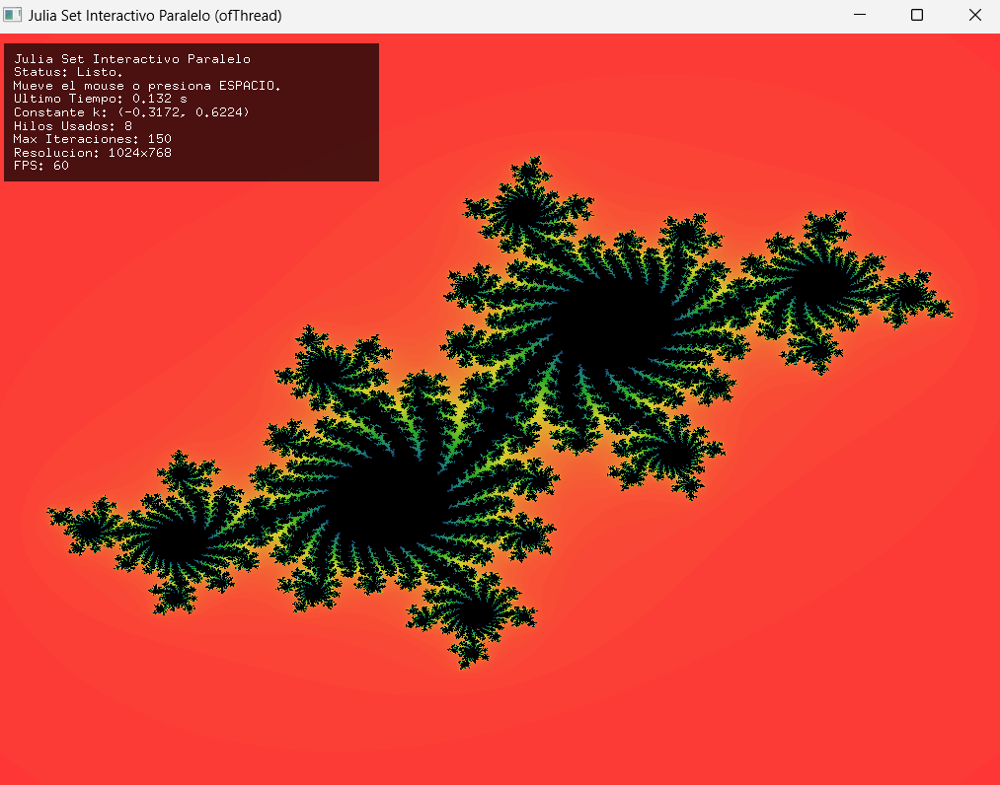

## Introducción 📜

En esta última unidad, exploraremos el mundo de la concurrencia utilizando 
**hilos** (threads). Aprenderás cómo un solo programa puede ejecutar múltiples 
secuencias de instrucciones aparentemente al mismo tiempo. Descubrirás los dos grandes 
beneficios: mantener tu aplicación **responsiva** incluso cuando realiza tareas largas 
y acelerar cálculos intensivos mediante el **paralelismo**. Sin embargo, también enfrentaremos 
el principal desafío: gestionar de forma segura los datos compartidos entre hilos para 
evitar errores. Utilizaremos proyectos ejemplo y analizaremos ejemplos 
funcionales para entender estos conceptos de forma práctica.

## Rúbrica de evaluación de la unidad 📝

:::note[Transparencia]
Esta rúbrica se socializa antes de la sustentación. La sustentación se basa en
lo presentado en la aplicación y lo documentado en la bitácora.
:::

### Requisito de salida (condición necesaria)

:::caution[Para poder cerrar la evaluación y registrar la nota]
La **bitácora de reflexión** debe estar diligenciada antes de terminar la
sesión y debe ser enseñada al profesor antes de abandonar el aula. La
presentación de la bitácora de reflexión es un requisito indispensable para
montar la nota final en la plataforma académica. Si no se cumple este
requisito, la nota final de la unidad será 0.0.
:::

---

### Rúbrica analítica

:::tip[Evidencias evaluadas]
1) Evidencias de análisis en bitácora: **elección justificada del punto de
inspección + captura + explicación + justificación**, apoyadas cuando aplique
por mediciones o pruebas comparativas.  
2) Sustentación a partir de la app y la bitácora.
:::

| Criterio (peso) | Cumple plenamente (5.0) | Se cumple medianamente (4.0) | Problemas importantes (3.0) | Falta comprensión básica (2.0) | No hay evidencia (0.0) |
|---|---|---|---|---|---|
| **1. Evidencias de análisis de concurrencia y paralelismo (40%)** | Presenta todas las evidencias solicitadas. El **punto de inspección elegido** es pertinente y revelador. Cada evidencia incluye **captura, explicación y justificación** claras, y cuando corresponde incorpora mediciones o comparaciones entre versiones. Explica con precisión qué se observa, qué riesgo de sincronización existe o qué comportamiento de rendimiento se está demostrando, y por qué eso constituye evidencia de comprensión de hilos, locks, condiciones de carrera, responsividad o speedup. | Evidencias presentes con vacíos menores en la elección del punto de inspección, en la precisión de la explicación o en la justificación de lo observado. | Faltan evidencias clave o los puntos de inspección elegidos no son informativos. El análisis se limita a describir “qué hizo” sin demostrar comprensión de concurrencia, sincronización o rendimiento. | Las capturas, pruebas o mediciones no corresponden a lo solicitado o carecen de explicación y justificación técnica. No hay prueba de análisis. | No se entregaron evidencias o no se puede acceder a ellas. |
| Evaluación |||||| 
| **2. Sustentación (60%)** | Responde con precisión conectando el comportamiento visible de la app con el reparto del trabajo entre hilos, el acceso a memoria compartida, el papel de `lock()`/`unlock()` y las decisiones tomadas en su implementación. Reconoce límites, errores y posibles mejoras. | Respuestas correctas con algunas imprecisiones o justificación superficial. | Responde parcialmente y le cuesta conectar comportamiento, sincronización y rendimiento con su solución concreta. | No logra explicar de forma coherente cómo operan los hilos o por qué su solución funciona o falla. | No se entregaron evidencias o no se puede acceder a ellas. |
| Evaluación |||||| 

---

:::tip[Cálculo de la nota]

$$
Nota = C_1*0.4 + C_2*0.6
$$

:::

---

## Set: ¿Qué aprenderás en esta unidad? 💡

* **Diferenciar conceptos:** entenderás la diferencia básica entre proceso e hilo.  
* **Identificar beneficios:** reconocerás cuándo usar hilos para mejorar la responsividad o el rendimiento (paralelismo).  
* **Analizar código concurrente:** examinarás ejemplos que usan hilos para realizar tareas en segundo plano o en paralelo.  
* **Comprender la sincronización básica:** entenderás por qué es necesario proteger datos compartidos y cómo usar mecanismos simples como `lock`/`unlock` (mutex).  
* **Medir y comparar rendimiento:** evaluarás el impacto del paralelismo en tareas computacionales.  
* **Aplicar conceptos:** modificarás un ejemplo existente para implementar una tarea paralela interactiva.  

### Actividad 01

#### Orientación y Conceptos

:::note[🎯 Enunciado]
En esta actividad introductoria, vamos a explorar de manera práctica los conceptos que aprenderás en esta unidad. 
:::

En esta unidad vamos a utilizar algunos servicios del sistema operativo que te permitirán acceder a múltiples 
recursos de procesamiento del hardware de tu computador: **los cores**. Para ello utilizarás de nuevo openFrameworks.

**¿Qué es un sistema operativo?**

En términos generales, un sistema operativo es un SOFTWARE que administra RECURSOS de hardware y software del computador 
y provee servicios mediante los cuales los programas de usuario pueden hacer uso de esos recursos.

El servicio que vamos a explorar en esta actividad es el de hilos o threads. Un hilo es una unidad de ejecución dentro de 
un proceso. Un proceso puede contener múltiples hilos, cada uno de los cuales puede ejecutar su propio código de manera 
concurrente. Los hilos comparten el mismo espacio de memoria y recursos del proceso, lo que les permite comunicarse entre sí de manera eficiente.

**¿Qué es esto de un proceso?** No es más que un programa en ejecución. Entonces en términos simples, los hilos permiten que 
un proceso (programa en ejecución) pueda ejecutar múltiples tareas al mismo tiempo.

**De nuevo ¿Qué es un hilo?** 

Hasta ahora todos los programas que has realizado tienen un **SOLO flujo de instrucciones**. ¿Y si quieres tener en el 
mismo programa VARIOS flujos de instrucciones independientes? Lo puedes hacer con los hilos. Los hilos permitirán que un 
programa pueda **HACER VARIAS COSAS AL MISMO TIEMPO**, cada cosa con un hilo independiente. Ten presente que los 
hilos compartirán recursos del proceso, entre ellos estará el HEAP; sin embargo, cada hilo tendrá su propio 
STACK (que belleza, ya podemos relacionar el stack y el heap con los hilos).

**Y en la práctica ¿Cómo sería la cosa?**

Crea un proyecto en openFrameworks y modifica el archivo `ofApp.h` para que contenga lo siguiente:

```cpp
#pragma once
#include "ofMain.h"

class ofApp : public ofBaseApp {
public:
    float x = 0;
    float speed = 3;
    float circleSize = 50;

    void setup();
    void draw();
    void mousePressed(int x, int y, int button);
    void heavyComputation();
};

```

Ahora modifica el archivo `ofApp.cpp` para que contenga lo siguiente:

```cpp
#include "ofApp.h"

void ofApp::setup() {
    ofSetFrameRate(60);
    ofSetWindowShape(400, 400);
}

void ofApp::draw() {
    ofBackground(220);
    ofSetColor(0);
    ofDrawCircle(x, ofGetHeight() / 2, circleSize);
    x = fmod(x + speed, ofGetWidth());
}

void ofApp::mousePressed(int x, int y, int button) {
    heavyComputation();
}

void ofApp::heavyComputation() {
    double result = 0;
    for (int j = 0; j < 1000000000; ++j) {
        result += sqrt(j);
    }
    circleSize = ofRandom(20, 70);
    ofLog() << "Circle size: " << circleSize;
}
```

:::note[🧐🧪✍️ Reporta en tu bitácora]
Ejecuta el programa y haz clic en la ventana. Observa lo que sucede. ¿Qué es lo que ves? ¿Qué es lo que esperabas ver? 
¿Por qué crees que sucede esto?
:::

El problema que acabas de observar es que el programa se congela cuando haces clic en la ventana. Esto sucede porque 
la función `heavyComputation()` está bloqueando el hilo principal de la aplicación, lo que impide que la interfaz gráfica se actualice.
Esto es un problema común en aplicaciones que requieren realizar cálculos intensivos o tareas de larga duración. La 
solución a este problema es mover la tarea pesada a un hilo separado, lo que permitirá que la interfaz gráfica siga siendo responsiva mientras se realiza el cálculo.

Ahora vamos a crear un hilo para la función `heavyComputation()`. Para ello, primero debes incluir la biblioteca de hilos de openFrameworks en tu archivo `ofApp.h`:

```cpp
#include "ofMain.h"
#include "ofThread.h"
```
Luego, debes crear una clase que herede de `ofThread` y que contenga la función `heavyComputation()`. Modifica el archivo `ofApp.h` para que contenga lo siguiente:

```cpp
#pragma once
#include "ofMain.h"
#include "ofThread.h"

class ofApp : public ofBaseApp, public ofThread {
public:
    float x = 0;
    float speed = 3;
    float circleSize = 50;

    void setup();
    void draw();
    void mousePressed(int x, int y, int button);
    void heavyComputation();
    void startHeavyComputation();
    void threadedFunction() override;
    void exit();
};
```

Modifica el archivo `ofApp.cpp` para que contenga lo siguiente:

```cpp
#include "ofApp.h"

void ofApp::setup() {
    ofSetFrameRate(60);
    ofSetWindowShape(400, 400);
}

void ofApp::draw() {

    ofBackground(220);
    ofSetColor(0);
    lock();
    ofDrawCircle(x, ofGetHeight() / 2, circleSize);
    unlock();
    x = fmod(x + speed, ofGetWidth());
}

void ofApp::mousePressed(int x, int y, int button) {
    if (!isThreadRunning()) {
        std::cout << "Starting heavy computation in a thread" << std::endl;
        startThread();
    }
    else {
        std::cout << "Thread is already running" << std::endl;
    }
}

void ofApp::threadedFunction() {
    heavyComputation();
    std::cout << "Thread ends" << std::endl;
}

void ofApp::heavyComputation() {
    double result = 0;
    for (int j = 0; j < 1000000000; ++j) {
        result += sqrt(j);
    }
    lock();
    ofSeedRandom();
    circleSize = ofRandom(20, 70);
    unlock();
	std::cout << "Circle size: " << circleSize << std::endl;
}

void ofApp::exit() {
    if (isThreadRunning()) {
        stopThread();
        waitForThread();
    }
}

```
:::note[🧐🧪✍️ Reporta en tu bitácora]
Ejecuta el programa y haz clic en la ventana. Observa lo que sucede. ¿Qué es lo que ves? ¿Qué es lo que esperabas 
ver? ¿Por qué crees que sucede esto?

Observa que el programa ahora no se congela, pero el círculo no cambia de tamaño inmediatamente. ¿Por qué crees 
que sucede esto? ¿Qué es lo que está pasando?
:::

Vamos a repasar de nuevo algunos conceptos importantes:

**Repaso de conceptos**
*   **Proceso:** una instancia de un programa en ejecución (tiene su propia memoria: stack, heap, etc.).
*   **Hilo (Thread):** un flujo de instrucciones *dentro* de un proceso. Un proceso puede tener múltiples hilos. En el último 
programa, ¿Puedes identificar los hilos que se están ejecutando? ¿Cuántos hilos hay en total? La cantidad de hilos cambia 
cuando ¿Haces clic en la ventana? ¿Termina el heavyComputation()?
*   **Memoria Compartida:** los hilos dentro del mismo proceso comparten la mayor parte de la memoria (como el heap y las variables globales). ¡Esto es potente pero peligroso! Cada hilo tiene su *propio* stack para variables locales y llamadas a funciones.
*   **Concurrencia:** la idea de que múltiples tareas parecen progresar al mismo tiempo (pueden estar intercalándose en un solo núcleo o corriendo en paralelo en múltiples núcleos).
*   **Paralelismo:** la ejecución *simultánea* real de múltiples tareas (requiere hardware con múltiples núcleos).

:::note[🧐🧪✍️ Reporta en tu bitácora]
En tus propias palabras, explica la diferencia entre concurrencia y paralelismo. ¿Por qué es importante entender esta diferencia al trabajar con hilos?
:::


## Seek: Investigación 🔎

### Actividad 02

#### Debes sincronizar los hilos

:::note[🎯 Enunciado]
En la actividad anterior pudiste ver cómo lograr que el hilo principal no se congele, pero esto tuvo un costo que en 
principio no es tan obvio. Cuando dos hilos comparten datos, es necesario sincronizarlos para evitar que se
produzcan condiciones de carrera. En este caso, el hilo principal y el hilo de heavyComputation() están accediendo a la
variable circleSize. Si el hilo de heavyComputation() cambia el valor de circleSize mientras el hilo principal lo está
usando, puede provocar un comportamiento inesperado.
:::

**¿Qué es una condición de carrera?**
Una condición de carrera es un error que ocurre cuando dos o más hilos acceden a un recurso compartido y al menos uno de 
ellos lo modifica. Esto puede provocar resultados inesperados, ya que el resultado final depende del orden en que se ejecutan los hilos.
Por ejemplo, si un hilo está leyendo el valor de circleSize mientras otro hilo lo está modificando, el hilo que lee puede 
obtener un valor incorrecto. Esto puede provocar que el círculo se dibuje en una posición incorrecta o que se produzcan otros errores en el programa.

Mira, este tipo de errores son difíciles de detectar y depurar, ya que pueden ocurrir en cualquier momento y no siempre se producen. 
Por eso es importante sincronizar los hilos para evitar condiciones de carrera.
Para sincronizar los hilos, puedes usar un mutex (mutual exclusion). Un mutex es un objeto que se utiliza para proteger el acceso a 
un recurso compartido. Cuando un hilo quiere acceder al recurso, debe bloquear el mutex. Si otro hilo intenta acceder al mismo 
recurso mientras el mutex está bloqueado, debe esperar hasta que el mutex se desbloquee.
Esto garantiza que solo un hilo pueda acceder al recurso a la vez, evitando así condiciones de carrera.

:::note[🧐🧪✍️ Reporta en tu bitácora]
Analiza de nuevo el código de la actividad anterior. ¿En qué partes del código se está protegiendo el acceso a la variable circleSize?

Según lo que te he venido comentando, los hilos te permiten ejecutar tareas en paralelo; sin embargo, piensa qué ocurre con 
el paralelismo cuando se sincroniza el acceso a un recurso compartido. ¿Qué ocurre con el rendimiento del programa? ¿Es posible que el rendimiento se vea afectado por el uso de mutex? ¿Por qué?
:::

Ahora quiero mostrarte un ejemplo más dramático de una condición de carrera. Para ello te pediré que modifiques el código 
de ofApp.h para que contenga lo siguiente:
```cpp
#pragma once
#include "ofMain.h"
#include "ofThread.h"

// Parámetros fijos ― modifica si quieres
const int  NUM_THREADS = 4;        
const long NUM_STEPS = 1000000;  

//--------------------------------------------------------------
class CounterThread : public ofThread {
public:
    CounterThread(long* sharedCounter,
        ofThread* sharedLocker,
        bool* lockFlag)
        : counter(sharedCounter)
        , locker(sharedLocker)
        , useLock(lockFlag)
    {
    }

    void threadedFunction() override {
        for (long i = 0; i < NUM_STEPS; ++i) {
            if (*useLock) {                 
                locker->lock();          
                ++(*counter);
                locker->unlock();
            }
            else {                        
                ++(*counter);             
            }
        }
    }
private:
    long* counter;   
    ofThread* locker;    
    bool* useLock;   
};

//--------------------------------------------------------------
class ofApp : public ofBaseApp {
public:
    void setup();
    void draw();
    void exit();
    void keyPressed(int);

private:
    // Lógica auxiliar
    void startTest();
    void stopWorkers();

    long counter = 0;           
    bool useLock = true;        

    CounterThread* workers[NUM_THREADS]; 
    ofThread       locker;
};
```

Y modifiques el código de ofApp.cpp para que contenga lo siguiente:

```cpp
#include "ofApp.h"

//--------------------------------------------------------------
void ofApp::setup() {
    ofSetFrameRate(60);
    startTest();
}

//--------------------------------------------------------------
void ofApp::startTest() {
    counter = 0;

    ofSetWindowTitle(
        std::string(useLock ? "SAFE" : "UNSAFE") +
        "  |  's' toggle lock  |  'r' restart");

    for (int i = 0; i < NUM_THREADS; ++i) {
        workers[i] = new CounterThread(&counter, &locker, &useLock);
        workers[i]->startThread();
    }
}

//--------------------------------------------------------------
void ofApp::stopWorkers() {
    for (int i = 0; i < NUM_THREADS; ++i) {
        if (workers[i]) {
            workers[i]->waitForThread(true);
            delete workers[i];
            workers[i] = nullptr;
        }
    }
}

//--------------------------------------------------------------
void ofApp::draw() {
    ofBackground(30);
    ofSetColor(255);

    long expected = NUM_THREADS * NUM_STEPS;

    ofDrawBitmapStringHighlight(
        std::string(useLock ? "Modo SEGURO - con lock()" :
            "Modo INSEGURO - sin lock()"),
        20, 40);
    ofDrawBitmapStringHighlight(
        "Contador:  " + ofToString(counter), 20, 70);
    ofDrawBitmapStringHighlight(
        "Esperado:  " + ofToString(expected), 20, 100);
    ofDrawBitmapStringHighlight(
        "Pulsa  's'  para alternar  |  'r'  para reiniciar",
        20, 130);
}

//--------------------------------------------------------------
void ofApp::keyPressed(int key) {
    if (key == 'r' || key == 'R') {     // reiniciar prueba
        stopWorkers();
        startTest();
    }
    if (key == 's' || key == 'S') {     // alternar lock / unlock
        useLock = !useLock;
        stopWorkers();
        startTest();
    }
}

//--------------------------------------------------------------
void ofApp::exit() {
    stopWorkers();                    // limpieza ordenada
}
```

:::note[🧐🧪✍️ Reporta en tu bitácora]
Ejecuta el código y observa el resultado. ¿Qué ocurre si cambias el valor de la variable 
useLock? ¿Por qué crees que ocurre esto?
:::

**¿Por qué ocurre la condición de carrera en este caso?**

La condición de carrera ocurre porque varios hilos están accediendo y modificando la misma variable `counter` al 
mismo tiempo. Cuando `useLock` es verdadero, el acceso a `counter` está protegido por un mutex, lo que evita que 
varios hilos lo modifiquen al mismo tiempo. Sin embargo, cuando `useLock` es falso, los hilos pueden modificar 
`counter` simultáneamente, lo que puede provocar resultados inesperados.

**Pero ¿Qué puede estar pasando para que esto ocurra?**

Cuando varios hilos intentan incrementar `counter` al mismo tiempo, pueden leer el mismo valor inicial de `counter`, 
incrementarlo y luego escribir el nuevo valor. Esto significa que dos hilos pueden leer el mismo valor, incrementarlo 
y escribirlo de nuevo, lo que provoca que se pierda una actualización.
Esto se debe a que la operación de incremento no es atómica, lo que significa que no se puede garantizar que un 
hilo complete la operación antes de que otro hilo comience. Por lo tanto, si dos hilos intentan incrementar `counter` 
al mismo tiempo, pueden interferir entre sí y provocar resultados inesperados.

**¿Lo puedes ver?** Te doy un poco más de ideas. Concéntrate en esta línea:

```cpp
++(*counter);
```

¿Recuerdas la unidad 1 y 2? Piensa en términos de acceso a la memoria y manejo de los registros del procesador (en la unidad 1 
nuestros registros eran A y D, ¿Recuerdas?). ¿Cómo crees que el procesador realice la línea de código anterior?

Para incrementar el valor de `counter`, el procesador debe realizar varias operaciones:
1. Leer el valor actual de `counter` desde la memoria. Ese valor se lee a un registro del procesador.
2. Incrementar el valor leído. El cálculo se realiza en el registro del procesador.
3. Escribir el nuevo valor de `counter` de nuevo en la memoria. El valor que está en el registro se escribe de nuevo en la memoria.

Esto implica que el procesador debe acceder a la memoria varias veces (¿Cuántas?) para realizar la operación de incremento. Si varios hilos intentan realizar esta operación al mismo tiempo, pueden interferir entre sí y provocar resultados inesperados.


:::note[🧐🧪✍️ Reporta en tu bitácora]
Explica en tus propias palabras ¿Cómo puede presentarse la condición de carrera en este caso? ¿Qué es lo que está pasando? 
Te pido que propongas un ejemplo.
:::

### Actividad 03

#### Hilos para el paralelismo

:::note[🎯 Enunciado]
Otro uso clave de los hilos es acelerar tareas que requieren mucho cálculo, siempre que estas tareas puedan dividirse en partes independientes. No olvides la actividad anterior por favor. Si hay datos compartidos entre los hilos, debes proteger el acceso a esos datos. En esta actividad vas a observar el rendimiento de un algoritmo para calcular un fractal de Mandelbrot. El algoritmo se puede paralelizar, ya que cada pixel del fractal se puede calcular de forma independiente. La idea será entonces que compares el rendimiento de un algoritmo secuencial y uno paralelo.
:::

**Fractal de Mandelbrot**

El fractal de Mandelbrot es un conjunto de puntos en el plano complejo que se define mediante una función iterativa. La función se basa en la siguiente fórmula:

$$
z_{n+1} = z_n^2 + c
$$

donde z es un número complejo y c es una constante compleja. 

El conjunto de Mandelbrot se forma al iterar esta función y observar si los puntos permanecen dentro de un cierto rango o "escapan" a infinito. 

El conjunto de Mandelbrot se representa visualmente asignando un color a cada punto en función del número de iteraciones que tarda en escapar a infinito. Los puntos que no escapan se consideran parte del conjunto y se les asigna un color específico (generalmente negro). Los puntos que escapan se les asigna un color en función de cuántas iteraciones tardaron en escapar. Esto crea una imagen fractal con patrones complejos y hermosos.

El algoritmo para calcular el conjunto de Mandelbrot implica iterar sobre cada píxel de la imagen y aplicar la función iterativa. Para cada píxel, se mapea a un punto en el plano complejo y se calcula cuántas iteraciones tarda en escapar a infinito. El número máximo de iteraciones se puede ajustar para obtener más o menos detalle en la imagen.

El algoritmo básico para calcular el conjunto de Mandelbrot es el siguiente:

1. Inicializar una imagen en blanco.
2. Para cada píxel de la imagen:
   1. Mapear las coordenadas del píxel a un punto en el plano complejo.
   2. Inicializar z = 0 y c = punto complejo.
   3. Iterar la función $$z = z^2 + c$$ hasta que $$|z| > 2$$ o se alcance el número máximo de iteraciones.
   4. Asignar un color al píxel en función del número de iteraciones.
5. Mostrar la imagen resultante.

El algoritmo de Mandelbrot es un ejemplo clásico de un problema que se puede paralelizar, ya que cada píxel se puede calcular de forma independiente. Esto significa que puedes dividir el trabajo entre varios hilos y calcular el conjunto de Mandelbrot más rápidamente.

El código que te propongo a continuación es un ejemplo de cómo implementar el algoritmo de Mandelbrot en openFrameworks. El código está dividido en dos versiones: una secuencial y otra paralela. La versión paralela utiliza hilos para acelerar el cálculo del conjunto de Mandelbrot.

**Versión secuencial**:

ofApp.h

```cpp
// ofApp.h
#pragma once

#include "ofMain.h"

class ofApp : public ofBaseApp {

public:
    void setup();
    void update();
    void draw();
    void keyPressed(int key);

    void startCalculation();
    int calculateMandelbrotPixel(int x, int y);
    ofColor mapIterationsToColor(int iterations);

    ofPixels pixels;      
    ofTexture texture;    

    int imgWidth;
    int imgHeight;
    int maxIterations;

    float startTime;
    float calculationTime;
    bool calculating;
    string statusMessage;
};
```

ofApp.cpp:


```cpp
// ofApp.cpp

#include "ofApp.h" 

void ofApp::setup() {
    ofSetWindowTitle("Mandelbrot Secuencial");
    ofSetFrameRate(60); 
    ofBackground(30);

    imgWidth = ofGetWidth(); 
    imgHeight = ofGetHeight();
    maxIterations = 100; 

    pixels.allocate(imgWidth, imgHeight, OF_PIXELS_RGB);
    texture.allocate(pixels);

    calculating = false;
    calculationTime = 0.0f;
    statusMessage = "Listo. \nPresiona ESPACIO para calcular.";
}

//--------------------------------------------------------------
void ofApp::startCalculation() {
    if (calculating) return; 

    calculating = true;
    statusMessage = "Calculando...";
    ofLogNotice() << statusMessage;
    startTime = ofGetElapsedTimef(); // Tiempo en segundos

    // --- Cálculo Secuencial ---
    for (int y = 0; y < imgHeight; ++y) {
        for (int x = 0; x < imgWidth; ++x) {
            int iterations = calculateMandelbrotPixel(x, y);
            pixels.setColor(x, y, mapIterationsToColor(iterations));
        }
    }
    // --- Fin Cálculo ---

    calculationTime = ofGetElapsedTimef() - startTime;
    calculating = false;
    statusMessage = "Cálculo completado. \nPresiona ESPACIO para recalcular.";
    ofLogNotice() << statusMessage << " Tiempo: " << calculationTime << " s";

    // Actualizar la textura con los nuevos píxeles
    texture.loadData(pixels);
}

//--------------------------------------------------------------
int ofApp::calculateMandelbrotPixel(int x, int y) {
    // Mapear coordenadas de píxel a plano complejo
    // Rango típico: x de -2.0 a 1.0, y de -1.5 a 1.5
    float cx = ofMap(x, 0, imgWidth, -2.0, 1.0);
    float cy = ofMap(y, 0, imgHeight, -1.5, 1.5);

    float zx = 0.0;
    float zy = 0.0;
    int iterations = 0;

    while ( (zx * zx + zy * zy) < 4.0 && iterations < maxIterations) {
        float tempX = zx * zx - zy * zy + cx;
        zy = 2.0 * zx * zy + cy;
        zx = tempX;
        iterations++;
    }
    return iterations;
}

//--------------------------------------------------------------
ofColor ofApp::mapIterationsToColor(int iterations) {
    if (iterations == maxIterations) {
        return ofColor::black; // Dentro del conjunto
    }
    else {
        float hue = ofMap(iterations, 0, maxIterations, 0, 255);
        float brightness = ofMap(iterations, 0, maxIterations, 100, 255);
        float saturation = 200; // Constante para color
        return ofColor::fromHsb(hue, saturation, brightness); // Colorido
    }
}

//--------------------------------------------------------------
void ofApp::update() {
}

//--------------------------------------------------------------
void ofApp::draw() {
    ofSetColor(255); // Dibujar textura con color blanco
    texture.draw(0, 0, ofGetWidth(), ofGetHeight());

    // --- UI de Métricas ---
    stringstream ss;
    ss << "Version: Secuencial" << endl;
    ss << "Status: " << statusMessage << endl;
    if (!calculating && calculationTime > 0.0f) {
        ss << "Ultimo Tiempo: " << ofToString(calculationTime, 3) << " s" << endl;
    }
    ss << "Max Iteraciones: " << maxIterations << endl;
    ss << "Resolucion: " << imgWidth << "x" << imgHeight << endl;
    ss << "FPS: " << ofToString(ofGetFrameRate(), 0); // Será bajo o 0 durante el cálculo

    ofSetColor(0, 180); // Fondo semi-transparente para el texto
    ofDrawRectangle(10, 10, 350, 120);
    ofSetColor(255); // Texto blanco
    ofDrawBitmapString(ss.str(), 20, 30);
}

//--------------------------------------------------------------
void ofApp::keyPressed(int key) {
    if (key == ' ') {
        maxIterations += 1;
        startCalculation();
        
    }
    if (key == 'n') {

        maxIterations = 0;
        startCalculation();
    }
}
```

**Versión paralela**:

ofApp.h

```cpp
// ofApp.h
#pragma once

#include "ofMain.h"
#include "ofThread.h" 

class MandelbrotThread : public ofThread {
public:
    MandelbrotThread(int startY, int endY, int width, int height, int maxIter, ofPixels& pixelsRef)
        : startRow(startY), endRow(endY), imgWidth(width), imgHeight(height),
        maxIterations(maxIter), pixels(pixelsRef) {
    } 

    void threadedFunction() override {
        for (int y = startRow; y < endRow && isThreadRunning(); ++y) {
            for (int x = 0; x < imgWidth; ++x) {
                int iterations = calculateMandelbrotPixel(x, y);
                pixels.setColor(x, y, mapIterationsToColor(iterations));
            }
        }
        
        ofLogVerbose("MandelbrotThread") << "Hilo para filas " << startRow << "-" << endRow << " terminado.";
    }

private:
    int startRow, endRow;
    int imgWidth, imgHeight;
    int maxIterations;
    ofPixels& pixels; 

    int calculateMandelbrotPixel(int x, int y) {
        float cx = ofMap(x, 0, imgWidth, -2.0, 1.0);
        float cy = ofMap(y, 0, imgHeight, -1.5, 1.5);
        float zx = 0.0, zy = 0.0;
        int iterations = 0;
        while (zx * zx + zy * zy < 4.0 && iterations < maxIterations) {
            float tempX = zx * zx - zy * zy + cx;
            zy = 2.0 * zx * zy + cy;
            zx = tempX;
            iterations++;
        }
        return iterations;
    }

    ofColor mapIterationsToColor(int iterations) {
        if (iterations == maxIterations) return ofColor::black;
        else {
            float hue = ofMap(iterations, 0, maxIterations, 0, 255);
            float brightness = ofMap(iterations, 0, maxIterations, 100, 255);
            float saturation = 200;
            return ofColor::fromHsb(hue, saturation, brightness);
        }
    }
};


class ofApp : public ofBaseApp {

public:
    void setup();
    void update();
    void draw();
    void exit(); 
    void keyPressed(int key);

    void startCalculation();

    ofPixels pixels;
    ofTexture texture;

    int imgWidth;
    int imgHeight;
    int maxIterations;
    int numThreads;

    vector<MandelbrotThread*> threads; 

    float startTime;
    float calculationTime;
    bool calculating;
    string statusMessage;
    int runningThreads;
};

```

ofApp.cpp

```cpp
// ofApp.cpp
#include "ofApp.h" 
#include <thread> 

//--------------------------------------------------------------
void ofApp::setup() {
    ofSetWindowTitle("Mandelbrot Paralelo (ofThread)");
    ofSetFrameRate(60);
    ofBackground(30);

    imgWidth = ofGetWidth();
    imgHeight = ofGetHeight();
    maxIterations = 100;

    numThreads = std::thread::hardware_concurrency();
    
    if (numThreads == 0) numThreads = 4; // Fallback si no se puede detectar
    ofLogNotice() << "Usando " << numThreads << " hilos.";

    pixels.allocate(imgWidth, imgHeight, OF_PIXELS_RGB);
    texture.allocate(pixels);

    calculating = false;
    calculationTime = 0.0f;
    runningThreads = 0;
    statusMessage = "Listo. \nPresiona ESPACIO para calcular.";

}

//--------------------------------------------------------------
void ofApp::startCalculation() {
    if (calculating) {
        ofLogWarning() << "Ya se está calculando, espera a que termine.";
        return;
    }
    calculating = true;
    runningThreads = 0; // Reseteamos contador antes de lanzar nuevos
    statusMessage = "Calculando con " + ofToString(numThreads) + " hilos...";

    ofLogNotice() << statusMessage;
    startTime = ofGetElapsedTimef();

    if (!threads.empty()) {
        ofLogVerbose() << "Limpiando hilos anteriores...";
        for (auto& thread : threads) {
            thread->waitForThread(true); 
            delete thread;
        }
        threads.clear();
        ofLogVerbose() << "Hilos anteriores limpiados.";
    }

    int rowsPerThread = imgHeight / numThreads;
    for (int i = 0; i < numThreads; ++i) {
        int startY = i * rowsPerThread;
        int endY = (i == numThreads - 1) ? imgHeight : (i + 1) * rowsPerThread; // Asegura que el último hilo llegue hasta el final

        MandelbrotThread* newThread = new MandelbrotThread(startY, endY, imgWidth, imgHeight, maxIterations, pixels);
        threads.push_back(newThread);
        runningThreads++;
        threads.back()->startThread(); // Inicia la ejecución de threadedFunction
        ofLogVerbose() << "Lanzado hilo " << i << " para filas " << startY << "-" << endY;
    }
    ofLogNotice() << runningThreads << " hilos lanzados.";
}

//--------------------------------------------------------------
void ofApp::update() {
    bool allThreadsFinished = true;
    if (!threads.empty()) { // Solo comprobar si hay hilos
        for (const auto& thread : threads) {
            if (thread->isThreadRunning()) {
                allThreadsFinished = false;
                break; // Si uno sigue corriendo, no necesitamos comprobar los demás
            }
        }
    }
    else {
        // Si no hay hilos en el vector, definitivamente no están corriendo
        allThreadsFinished = true;
    }

    if (allThreadsFinished && calculating) {
        calculationTime = ofGetElapsedTimef() - startTime;
        calculating = false;
        runningThreads = 0; 
        statusMessage = "Cálculo completado. \nPresiona ESPACIO para recalcular.";
        ofLogNotice() << statusMessage << " Tiempo: " << calculationTime << " s";
        texture.loadData(pixels);
    }
}

//--------------------------------------------------------------
void ofApp::draw() {
    ofSetColor(255);
    texture.draw(0, 0, ofGetWidth(), ofGetHeight());

    stringstream ss;
    ss << "Version: Paralelo (ofThread)" << endl;

    ss << "Status: " << statusMessage << endl;
    if (!calculating && calculationTime > 0.0f) {
        ss << "Ultimo Tiempo: " << ofToString(calculationTime, 3) << " s" << endl;
    }
    ss << "Hilos Usados: " << numThreads << endl;
    // ss << "Hilos Corriendo: " << runningThreads << endl; // Podría fluctuar rápido

    ss << "Max Iteraciones: " << maxIterations << endl;
    ss << "Resolucion: " << imgWidth << "x" << imgHeight << endl;
    ss << "FPS: " << ofToString(ofGetFrameRate(), 0);

    ofSetColor(0, 180);
    ofDrawRectangle(10, 10, 350, 120); // Un poco más grande
    ofSetColor(255);
    ofDrawBitmapString(ss.str(), 20, 30);
}

//--------------------------------------------------------------
void ofApp::exit() {
    ofLogNotice() << "Saliendo, esperando a los hilos...";
    for (auto& thread : threads) {
        thread->waitForThread(true); // Espera bloqueante hasta que el hilo termine
        delete thread; // Liberar memoria
    }
    threads.clear();
    ofLogNotice() << "Hilos detenidos y limpiados. Adiós.";
}

//--------------------------------------------------------------
void ofApp::keyPressed(int key) {
    if (key == ' ') {
        maxIterations += 1;
        startCalculation();
    }
	if (key == 'n') {
		maxIterations = 0;
		startCalculation();
	}
}
```

:::note[🧐🧪✍️ Reporta en tu bitácora]
- Ejecuta el código y observa el resultado. 
- Analiza el código y estudia detenidamente su funcionamiento. En la fase de aplicación tendrás que retomar 
este código para resolver un reto.
- Experimenta modificando, PERO, no olvides cómo investigamos en este curso:

    - Realiza cambios pequeños y específicos.
    - Lanza una hipótesis sobre lo que crees que va a pasar.
    - Ejecuta el código y observa lo que ocurre.
    - ¿Tu hipótesis era correcta? ¿Por qué crees que ocurre esto?

Te dejo una idea para comenzar a experimentar: ¿Qué ocurre si cambias el número de hilos? ¿Por qué crees que ocurre esto?
:::

### Actividad 04

#### El Reto del estado compartido

:::note[🎯 Enunciado]
Hemos visto que los hilos pueden mejorar la responsividad y acelerar cálculos independientes. Pero, ¿Qué pasa cuando múltiples hilos necesitan trabajar sobre la *misma estructura de datos compleja* al mismo tiempo? Analizaremos el código proporcionado para entender por qué la sincronización se vuelve esencial. **No necesitas implementar nada aquí, solo analizar.**
:::

**¿Qué es el algoritmo de Flocking?**

El algoritmo de Flocking es un modelo de comportamiento colectivo que simula el movimiento de grupos de entidades (como aves o peces) en un entorno. Se basa en tres reglas simples: separación, alineación y cohesión. Estas reglas permiten que las entidades se muevan de manera coordinada y eviten colisiones entre sí. El algoritmo se utiliza en gráficos por computadora y simulaciones para crear movimientos naturales y realistas de grupos de entidades.

El concepto de las reglas simples de separación, alineación y cohesión fue introducido por Craig Reynolds en 1986. En su trabajo, Reynolds demostró que estas reglas simples pueden dar lugar a comportamientos complejos y realistas en grupos de entidades.
El algoritmo de Flocking se basa en la idea de que cada entidad (o "boid") toma decisiones basadas en su entorno inmediato y en las posiciones y velocidades de sus vecinos. Esto permite que el grupo se mueva de manera cohesiva y evite colisiones, creando un comportamiento emergente.

La separación evita que los boids se acerquen demasiado entre sí, la alineación les permite coincidir con la dirección de sus vecinos y la cohesión les anima a moverse hacia el centro del grupo. Estas reglas simples permiten que los boids se comporten de manera natural y realista en un entorno simulado.

La separación se implementa calculando la distancia entre un boid y sus vecinos cercanos. Si la distancia es menor que un umbral predefinido, se aplica una fuerza de separación para alejar al boid de sus vecinos. La alineación se implementa calculando la dirección promedio de los vecinos cercanos y ajustando la dirección del boid para que coincida con esa dirección. La cohesión se implementa calculando el centro de masa de los vecinos cercanos y aplicando una fuerza hacia ese punto.

Ahora te mostraré un ejemplo de cómo implementar el algoritmo de Flocking en openFrameworks. El código está dividido en dos partes: una implementación sin hilos y otra con hilos.

**1. Flocking sin Hilos:**

Usa el evento `mouseDragged` para añadir nuevos boids a la simulación. Observa qué ocurre con el frame rate a medida que añades más boids.

```cpp
// ofApp.h
#pragma once

#include "ofMain.h"

class Boid {
public:
    Boid(float x, float y);
    void run(const vector<Boid>& boids);
    void applyForce(ofVec2f force);
    void flock(const vector<Boid>& boids);
    void update();
    void borders();
    ofVec2f seek(ofVec2f target);
    void draw();

    ofVec2f separate(const vector<Boid>& boids);
    ofVec2f align(const vector<Boid>& boids);
    ofVec2f cohere(const vector<Boid>& boids);

    ofVec2f position;
    ofVec2f velocity;
    ofVec2f acceleration;
    float r;
    float maxforce;
    float maxspeed;
};


class Flock {
public:
    void addBoid(float x, float y);
    void run();

    vector<Boid> boids;
};


class ofApp : public ofBaseApp {

public:
    void setup();
    void update();
    void draw();
    void mouseDragged(int x, int y, int button);

    Flock flock;
};
```

```cpp
// ofApp.cpp
#include "ofApp.h"

Boid::Boid(float x, float y) {
    acceleration.set(0, 0);
    velocity.set(ofRandom(-1, 1), ofRandom(-1, 1));
    position.set(x, y);
    r = 3.0;
    maxspeed = 3;
    maxforce = 0.05;
}

void Boid::run(const vector<Boid>& boids) {
    flock(boids);
    update();
    borders();
}

void Boid::applyForce(ofVec2f force) {
    acceleration += force;
}

void Boid::flock(const vector<Boid>& boids) {
    ofVec2f sep = separate(boids);
    ofVec2f ali = align(boids);
    ofVec2f coh = cohere(boids);
    sep *= 1.5;
    ali *= 1.0;
    coh *= 1.0;

    applyForce(sep);
    applyForce(ali);
    applyForce(coh);
}

void Boid::update() {
    velocity += acceleration;
    velocity.limit(maxspeed);
    position += velocity;
    acceleration *= 0;
}

ofVec2f Boid::seek(ofVec2f target) {
    ofVec2f desired = target - position;
    desired.normalize();
    desired *= maxspeed;
    ofVec2f steer = desired - velocity;
    steer.limit(maxforce);
    return steer;
}

void Boid::borders() {

    float width = ofGetWidth();
    float height = ofGetHeight();

    if (position.x < -r) position.x = width + r;
    if (position.y < -r) position.y = height + r;
    if (position.x > width + r) position.x = -r;
    if (position.y > height + r) position.y = -r;

}

void Boid::draw() {
    float theta = atan2(velocity.y, velocity.x) + PI / 2;
    ofSetColor(255);
    ofFill();
    ofPushMatrix();
    ofTranslate(position.x, position.y);
    ofRotate(ofRadToDeg(theta));
    ofBeginShape();
    ofVertex(0, -r * 2);
    ofVertex(-r, r * 2);
    ofVertex(r, r * 2);
    ofEndShape();
    ofPopMatrix();
}

ofVec2f Boid::separate(const vector<Boid>& boids) {
    float desiredSeparation = 25;
    ofVec2f steer(0, 0);
    int count = 0;

    for (const Boid& other : boids) {
        float d = position.distance(other.position);
        if (d > 0 && d < desiredSeparation) {
            ofVec2f diff = position - other.position;
            diff.normalize();
            diff /= d;
            steer += diff;
            count++;
        }
    }
    if (count > 0) {
        steer /= (float)count;
    }

    if (steer.length() > 0) {
        steer.normalize();
        steer *= maxspeed;
        steer -= velocity;
        steer.limit(maxforce);
    }
    return steer;
}

ofVec2f Boid::align(const vector<Boid>& boids) {
    float neighborDist = 50;
    ofVec2f sum(0, 0);
    int count = 0;

    for (const Boid& other : boids) {
        float d = position.distance(other.position);
        if (d > 0 && d < neighborDist) {
            sum += other.velocity;
            count++;
        }
    }
    if (count > 0) {
        sum /= (float)count;
        sum.normalize();
        sum *= maxspeed;
        ofVec2f steer = sum - velocity;
        steer.limit(maxforce);
        return steer;
    }
    return ofVec2f(0, 0);
}

ofVec2f Boid::cohere(const vector<Boid>& boids) {
    float neighborDist = 50;
    ofVec2f sum(0, 0);
    int count = 0;

    for (const Boid& other : boids) {
        float d = position.distance(other.position);
        if (d > 0 && d < neighborDist) {
            sum += other.position;
            count++;
        }
    }
    if (count > 0) {
        sum /= count;
        return seek(sum);
    }
    return ofVec2f(0, 0);
}

void Flock::addBoid(float x, float y) {
    boids.emplace_back(x, y);
}

void Flock::run() {
    for (Boid& b : boids) {
        b.run(boids);
    }
}


void ofApp::setup() {
    flock.boids.reserve(120);
    for (int i = 0; i < 120; i++) {
        flock.addBoid(ofGetWidth() / 2, ofGetHeight() / 2);
    }
}

void ofApp::update() {
    flock.run();
}

void ofApp::draw() {
    ofBackground(0);
    for (Boid& b : flock.boids) {
        b.draw();
    }
    ofDrawBitmapStringHighlight("FPS: " + ofToString(ofGetFrameRate()), 20, 20);
    ofDrawBitmapStringHighlight("Boids: " + ofToString(flock.boids.size()), 20, 40);

}

void ofApp::mouseDragged(int x, int y, int button) {
    flock.addBoid(x, y);
}
```

**2. Flocking con Hilos:**

```cpp
// ofApp.h
#pragma once

#include "ofMain.h"
#include "ofThread.h"

class Boid {
public:
    Boid(float x, float y);
    void run(const vector<Boid>& boids);
    void applyForce(ofVec2f force);
    void flock(const vector<Boid>& boids);
    void update();
    void borders();
    ofVec2f seek(ofVec2f target);
    void draw();

    ofVec2f separate(const vector<Boid>& boids);
    ofVec2f align(const vector<Boid>& boids);
    ofVec2f cohere(const vector<Boid>& boids);

    ofVec2f position;
    ofVec2f velocity;
    ofVec2f acceleration;
    float r;
    float maxforce;
    float maxspeed;
};


class Flock : public ofThread {
public:
    void addBoid(int x, int y);
    void run();
    void threadedFunction();

    std::vector<Boid> boids;
};


class ofApp : public ofBaseApp {

public:
    void setup();
    void update();
    void draw();
    void exit();
    void mouseDragged(int x, int y, int button);

    Flock flock;
};
```

```cpp
// ofApp.cpp
#include "ofApp.h"

Boid::Boid(float x, float y) {
    acceleration.set(0, 0);
    velocity.set(ofRandom(-1, 1), ofRandom(-1, 1));
    position.set(x, y);
    r = 3.0;
    maxspeed = 3;
    maxforce = 0.05;
}

void Boid::run(const vector<Boid>& boids) {
    flock(boids);
    update();
    borders();
}

void Boid::applyForce(ofVec2f force) {
    acceleration += force;
}

void Boid::flock(const vector<Boid>& boids) {
    ofVec2f sep = separate(boids);
    ofVec2f ali = align(boids);
    ofVec2f coh = cohere(boids);
    sep *= 1.5;
    ali *= 1.0;
    coh *= 1.0;

    applyForce(sep);
    applyForce(ali);
    applyForce(coh);
}

void Boid::update() {
    velocity += acceleration;
    velocity.limit(maxspeed);
    position += velocity;
    acceleration *= 0;
}

ofVec2f Boid::seek(ofVec2f target) {
    ofVec2f desired = target - position;
    desired.normalize();
    desired *= maxspeed;
    ofVec2f steer = desired - velocity;
    steer.limit(maxforce);
    return steer;
}

void Boid::borders() {
    if (position.x < -r) position.x = ofGetWidth() + r;
    if (position.y < -r) position.y = ofGetHeight() + r;
    if (position.x > ofGetWidth() + r) position.x = -r;
    if (position.y > ofGetHeight() + r) position.y = -r;
}

void Boid::draw() {
    float theta = atan2(velocity.y, velocity.x) + PI / 2;
    ofSetColor(255);
    ofFill();
    ofPushMatrix();
    ofTranslate(position.x, position.y);
    ofRotate(ofRadToDeg(theta));
    ofBeginShape();
    ofVertex(0, -r * 2);
    ofVertex(-r, r * 2);
    ofVertex(r, r * 2);
    ofEndShape();
    ofPopMatrix();
}

ofVec2f Boid::separate(const vector<Boid>& boids) {
    float desiredSeparation = 25;
    ofVec2f steer(0, 0);
    int count = 0;

    for (const Boid& other : boids) {
        float d = position.distance(other.position);
        if (d > 0 && d < desiredSeparation) {
            ofVec2f diff = position - other.position;
            diff.normalize();
            diff /= d;
            steer += diff;
            count++;
        }
    }
    if (count > 0) {
        steer /= (float)count;
    }

    if (steer.length() > 0) {
        steer.normalize();
        steer *= maxspeed;
        steer -= velocity;
        steer.limit(maxforce);
    }
    return steer;
}

ofVec2f Boid::align(const vector<Boid>& boids) {
    float neighborDist = 50;
    ofVec2f sum(0, 0);
    int count = 0;

    for (const Boid& other : boids) {
        float d = position.distance(other.position);
        if (d > 0 && d < neighborDist) {
            sum += other.velocity;
            count++;
        }
    }
    if (count > 0) {
        sum /= (float)count;
        sum.normalize();
        sum *= maxspeed;
        ofVec2f steer = sum - velocity;
        steer.limit(maxforce);
        return steer;
    }
    return ofVec2f(0, 0);
}

ofVec2f Boid::cohere(const vector<Boid>& boids) {
    float neighborDist = 50;
    ofVec2f sum(0, 0);
    int count = 0;

    for (const Boid& other : boids) {
        float d = position.distance(other.position);
        if (d > 0 && d < neighborDist) {
            sum += other.position;
            count++;
        }
    }
    if (count > 0) {
        sum /= count;
        return seek(sum);
    }
    return ofVec2f(0, 0);
}

void Flock::addBoid(int x, int y) {
    lock();
    boids.emplace_back(x, y);
    unlock();
}

void Flock::run() {
    if (!isThreadRunning()) {
        startThread();
    }
}

void Flock::threadedFunction() {
    while (isThreadRunning()) {
        lock();
        for (Boid& b : boids) {
            b.run(boids);
        }
        unlock();
        sleep(5);
    }
}

void ofApp::setup() {
    // Add an initial set of boids
    for (int i = 0; i < 120; i++) {
        flock.addBoid(ofGetWidth() / 2, ofGetHeight() / 2);
    }
}

void ofApp::update() {
    flock.run();
}

void ofApp::draw() {
    ofBackground(0);

    flock.lock();
    for (Boid& b : flock.boids) {
        b.draw();
    }
    flock.unlock();

    ofDrawBitmapStringHighlight("FPS: " + ofToString(ofGetFrameRate()), 20, 20);
    ofDrawBitmapStringHighlight("Boids: " + ofToString(flock.boids.size()), 20, 40);
}

void ofApp::mouseDragged(int x, int y, int button) {
    flock.addBoid(x, y);
}

void ofApp::exit() {
    flock.stopThread();
    flock.waitForThread();
}
```

Analicemos juntos varias partes del código:

- **Flocking sin hilos**: en este enfoque, la simulación de los boids se realiza en el hilo principal. Cada boid actualiza su posición y dibuja su representación gráfica en cada frame. Esto puede llevar a una disminución del rendimiento a medida que se añaden más boids, ya que todo el trabajo se realiza en un solo hilo.
- **Flocking con hilos**: en este enfoque, la simulación de los boids se realiza en un hilo separado. Esto permite que el hilo principal se encargue de la representación gráfica, mientras que el hilo de la simulación se encarga de actualizar las posiciones de los boids. La sincronización se maneja mediante `lock()` y `unlock()` para evitar condiciones de carrera al acceder a la lista de boids.

:::note[🧐✍️ Reporta en tu bitácora]
Observa ambos códigos y responde a las siguientes preguntas:

1. ¿Cuál es la estructura de datos principal que contiene la información de todos los boids y que es accedida por múltiples hilos (el hilo principal para dibujar, el hilo trabajador para actualizar)?
2. Observa la función `Flock::threadedFunction()` donde el hilo trabajador calcula el movimiento. ¿Qué operaciones realizan sobre el vector de boids compartido? 
*   Observa la función `ofApp::draw()`. ¿Qué operación realiza sobre el vector compartido?
*   Observa `Flock::addBoid()` y `ofApp::mouseDragged()`. ¿Qué operación realizan?

3. Describe un escenario *específico* y *concreto* donde la falta de sincronización podría causar un problema. Por ejemplo:

    *   "El Hilo X está recorriendo el vector para calcular la separación (leyendo posiciones). Al mismo tiempo, el Hilo Y (llamado desde `mouseDragged`) intenta añadir un nuevo boid al final del vector. ¿Qué podría pasarle al iterador del Hilo X o al tamaño del vector que está usando?"

4. Localiza todas las llamadas a `lock()` y `unlock()` dentro de la clase `Flock` (o donde se acceda al vector compartido).

**Justificación:** para uno de los escenarios problemáticos que describiste arriba, explica cómo las llamadas a `lock()`/`unlock()` en las secciones de código relevantes *evitan* que ocurra ese problema específico.

5. Aunque los locks aseguran la correctitud, ¿Puedes intuir por qué tener muchos hilos esperando para adquirir un lock sobre el mismo vector (alta **contención**) podría limitar el beneficio de rendimiento del paralelismo en este caso? Justifica tu respuesta.
:::

En el ejemplo que te di del flocking con hilos, el hilo principal se encarga de dibujar los boids y el hilo secundario se encarga de calcular el movimiento de los boids. Sin embargo, este escenario es muy limitado porque solo hay dos hilos: el principal y el hilo trabajador que calcula el flocking, pero **realmente no se está explotando la idea de tener hilos**. **¿Es correcto esto?**

:::note[🧐✍️ Reporta en tu bitácora]
Este es un ejercicio mental y de reflexión, no tienes que implementar nada, solo pensar:

Piensa en la pregunta que te acabo de hacer. ¿Qué pasaría si tuviéramos varios hilos que calculan el movimiento de los boids? ¿Cómo podrías implementar esto? ¿Qué problemas crees que podrían surgir? ¿Cómo podrías solucionarlos? 
:::

:::note[🧐🧪✍️ Reporta en tu bitácora]
- Analiza el código del Flocking sin hilos y el Flocking con hilos. ¿Qué diferencias encuentras? ¿Por qué crees que es importante la sincronización en el segundo caso?
- ¿Por qué al añadir un nuevo boid la simulación se ralentiza? ¿Qué ocurre si añades muchos boids?
- Notaste que la versión con hilos tiene un `sleep(5)` en el hilo trabajador. ¿Por qué crees que se ha añadido? ¿Qué pasaría si lo eliminamos?
- Compara el rendimiento de ambos enfoques. ¿Cuál crees que es más eficiente? ¿Por qué?
- El uso de lock y unlock en la versión con hilos es crucial para evitar condiciones de carrera. ¿Qué pasaría si no se usaran? ¿Cómo afectaría esto al comportamiento del programa? (No olvides por favor que las condiciones de carrera son difíciles de reproducir, así que no te preocupes si no puedes verlas en acción).
:::

**Reflexión final:**

El ejemplo de flocking con hilos, aunque utiliza ofThread, no explota realmente el paralelismo para acelerar el cálculo del flocking en sí mismo.

Lo que hace esa implementación es:

- Mover el trabajo pesado: traslada el bucle principal que calcula boid.run() para todos los boids desde el hilo principal (ofApp::update) a un único hilo secundario (Flock::threadedFunction).  
- Lograr responsividad: el principal beneficio aquí es que el hilo principal (que maneja el dibujo y los eventos de UI como mouseDragged) ya no se bloquea mientras se realizan los cálculos potencialmente largos del flocking. La aplicación se siente más fluida y responde a la interacción incluso si el cálculo del flocking es intensivo. 
- Cálculo secuencial (dentro del hilo): dentro de Flock::threadedFunction, el bucle for (Boid& b : boids) sigue procesando cada boid uno tras otro, de forma secuencial. No hay múltiples hilos trabajando simultáneamente en diferentes subconjuntos de boids para calcular sus interacciones.

:::note[🧐✍️ Reporta en tu bitácora]
¿Qué ocurre si mientras el hilo trabajador está calculando el movimiento de los boids, el hilo principal intenta añadir un nuevo boid? ¿Se congelará la aplicación? ¿Por qué?
:::

En resumen, la versión de flocking con hilos mejora la responsividad al mover el trabajo pesado a un hilo secundario, pero no logra paralelismo real para acelerar el cálculo del flocking. La implementación actual sigue siendo secuencial dentro del hilo secundario.

Para explotar verdaderamente el paralelismo en el flocking, necesitarías múltiples hilos trabajadores. La idea sería crear varios hilos (no solo uno). Luego dividir el conjunto de boids o las tareas de cálculo entre esos hilos. Por ejemplo: cada hilo calcula las interacciones para un subconjunto de boids o usar un enfoque basado en tareas donde cada hilo toma un boid, calcula sus fuerzas y actualiza su estado. Sin embargo, el gran desafío aquí es que para calcular las fuerzas de flocking (separación, alineación, cohesión), un boid necesita información sobre sus vecinos. Si diferentes hilos trabajan en diferentes boids, necesitarán leer de forma segura la información (posiciones, velocidades) de boids que podrían estar siendo modificados por otros hilos. Esto requiere una sincronización mucho más cuidadosa y granular que simplemente bloquear todo el vector, o técnicas más avanzadas (como dividir el espacio, usar copias de datos, etc.), lo cual complica significativamente el código y puede introducir sus propios cuellos de botella por la sincronización.

**Conclusión** 

El ejemplo es bueno para ilustrar cómo mover una tarea completa a un hilo secundario para mejorar la responsividad, y también introduce la necesidad de lock/unlock al acceder a datos compartidos (el vector boids) desde diferentes hilos (el hilo principal para draw/addBoid y el hilo secundario para threadedFunction). Sin embargo, no es un ejemplo de paralelización del cálculo para obtener **speedup**. 


## Apply: Aplicación 🛠

### Actividad 05

#### Aplicación: Julia set interactivo

:::note[🎯 Enunciado]
Es hora de aplicar lo aprendido sobre paralelismo. Tomarás el código funcional del fractal de Mandelbrot que estudiante (¿Cierto?) y lo modificarás para calcular y visualizar el **conjunto de Julia**. Harás que la constante `k` que define el fractal de Julia dependa de la posición del mouse, creando un explorador interactivo. El cálculo seguirá siendo paralelo.
:::



**Fase 1 — Requisito de entrada: aplicación funcional**

:::caution[La aplicación funcional es el boleto de entrada, no la evidencia evaluada]
Debes tener una app funcional que calcule y visualice el conjunto de Julia en
paralelo, con una constante `k` controlada por la posición del mouse.

Puedes usar IA generativa para apoyar la implementación, pero en esta unidad lo
fundamental es que puedas **verificar, inspeccionar y explicar** lo que hace tu
programa. Haber generado código no es suficiente; debes poder defender con
evidencias cómo funciona.
:::

1. Crea un nuevo proyecto de openFrameworks y copia el código de Mandelbrot en su versión paralela.  
2. Modifica la lógica de cálculo:

* Localiza la función que calcula el valor de un píxel (ej. `calculateMandelbrotPixel`). Necesitas cambiar su lógica para calcular Julia en lugar de Mandelbrot. ¿Cuál es la diferencia?
    * **Mandelbrot:** `z = z^2 + c` (donde `c` es la coordenada del píxel, `z` empieza en 0).
    * **Julia:** `z = z^2 + k` (donde `k` es una constante fija para toda la imagen, `z` empieza en la coordenada del píxel).
* Necesitarás:
    * Una variable (probablemente global o en `ofApp` si refactorizas) para almacenar la constante compleja `k` actual (ej. `glm::vec2 juliaK;`).
    * Modificar la función de cálculo para que:
        * Reciba `k` como parámetro (o la acceda globalmente).
        * Inicialice `z` con las coordenadas complejas correspondientes al píxel `(x, y)`.
        * Itere usando `z = z * z + k;` (la multiplicación `z*z` requiere manejar números complejos o sus componentes).
        * El resto (comprobación de escape, conteo de iteraciones) es similar a Mandelbrot.

3. Integra la interacción del mouse:

* Necesitas actualizar la constante `juliaK` basándose en la posición del mouse.
* En la función `update()` o en un callback de movimiento del mouse (`mouseMoved`), mapea `mouseX` y `mouseY` a un rango adecuado para las partes real e imaginaria de `k`. Un rango común es de -1.5 a 1.5 para ambos.

    ```cpp
    // Ejemplo de mapeo dentro de update() o mouseMoved()
    // Asumiendo que tienes windowWidth y windowHeight
    juliaK.x = ofMap(mouseX, 0, windowWidth, -1.5f, 1.5f);
    juliaK.y = ofMap(mouseY, 0, windowHeight, -1.5f, 1.5f);
    // Necesitarás una bandera o mecanismo para indicar que hay que recalcular
    // si k ha cambiado.
    ```

*   **Importante:** cada vez que `juliaK` cambie, necesitarás disparar un recálculo *completo* de la imagen usando los hilos. La estructura de hilos que divide el trabajo por filas puede reutilizarse tal cual, solo necesitas asegurarte de que la función que llaman ahora calcula Julia con la `k` actualizada.

4. Reutilizar la estructura de hilos: la lógica para crear, lanzar, y esperar a los hilos que tenías en el Mandelbrot paralelo debería poder reutilizarse casi directamente. Cada hilo seguirá calculando un conjunto de filas, pero ahora llamará a tu nueva función `calculateJuliaPixel` (o como la llames) pasándole la `k` actual.

:::note[🧐🧪✍️ Reporta en tu bitácora]
1.  Pega la parte clave de tu función modificada que calcula el píxel para el conjunto de Julia. Recuerda utilizar un bloque cpp.  
2.  Muestra cómo mapeaste la posición del mouse a la constante `k`.  
3.  Describe brevemente cómo reutilizaste la estructura de hilos de la versión Mandelbrot. ¿Tuviste que cambiar mucho esa parte?  
4.  ¿Cómo te aseguraste de que la imagen se recalculara cuando el mouse se movía?  
5.  Incluye al menos dos capturas de pantalla que muestren diferentes fractales de Julia generados al mover el mouse en tu aplicación.  
6.  ¿Encontraste algún desafío particular al implementar la interacción o modificar el cálculo?  
:::

**Fase 2 — Evidencias de comprensión**

:::tip[Cómo presentar cada evidencia]
Para cada evidencia incluye los **cuatro componentes**:
1. **Elección justificada del punto de inspección**: ¿En qué línea, variable,
   estructura o momento del programa decidiste inspeccionar y por qué ese punto
   es revelador?
2. **Captura**: imagen del depurador, consola, visualización o medición donde
   se observe la evidencia.
3. **Explicación**: ¿Qué se está observando exactamente?
4. **Justificación**: ¿Por qué esa evidencia demuestra comprensión real del
   funcionamiento del programa?
:::

Entrega las siguientes **4 evidencias**, cada una con sus cuatro componentes:

**Evidencia 1 — Reparto del trabajo entre hilos**

Demuestra cómo está distribuido el cálculo de Julia entre los hilos. Tu
evidencia debe permitir ver qué parte del trabajo ejecuta cada hilo o cómo se
dividen las filas, bloques o tareas del fractal.

**Evidencia 2 — Responsividad vs cálculo pesado**

Demuestra, con un punto de inspección pertinente, por qué la aplicación puede
seguir respondiendo mientras el cálculo ocurre o por qué se recalcula sin
bloquearse como en una versión secuencial en el hilo principal.

**Evidencia 3 — Decisión de sincronización o coordinación**

Elige una decisión concreta de tu implementación relacionada con memoria
compartida, actualización de `juliaK`, escritura de resultados o coordinación
entre hilos. Demuestra qué podría salir mal y cómo tu solución lo evita o lo
controla.

**Evidencia 4 — Resultado observado y explicación técnica**

Elige un cambio visible en la app al mover el mouse y explica técnicamente cómo
viaja esa decisión desde la entrada del usuario hasta el recálculo y la imagen
final del fractal.


:::caution[La aplicación funcional sigue siendo el boleto de entrada]
En esta unidad, tener la aplicación funcionando es condición necesaria para
poder presentar la sustentación, pero **el código no es el objeto principal de
evaluación**. La evaluación se centra en la compresión de los conceptos fundamentales 
de la unidad y en la manera como estos se aplican en las actividades y en el problema 
de aplicación. En época de IA generativa la sustentación se 
basa en tu capacidad para defender, explicar, argumentar y probar.
:::

:::caution[📤 Bitácora]
Documenta las dos fases: el código funcional breve (Fase 1) y las cuatro
evidencias completas con sus cuatro componentes (Fase 2).
:::

## Reflect: Consolidación y metacognición 🤔

### Actividad 06

:::note[Esta sección se realiza después de la evaluación]
Esta sección se realiza después de cerrada la evaluación, como ejercicio de
consolidación. No forma parte de la rúbrica.
:::

Usando [excalidraw](https://excalidraw.com/), construye estos gráficos:

1. Un diagrama donde relaciones estos conceptos: proceso, hilo, memoria
   compartida, stack, heap, concurrencia, paralelismo, condición de carrera,
   mutex, contención, responsividad y speedup.
2. Un diagrama comparando dos escenarios:
   una app con trabajo pesado en el hilo principal y una app donde ese trabajo
   se mueve a un hilo secundario.
3. Un diagrama donde expliques por qué una solución puede mejorar la
   responsividad sin necesariamente producir speedup real.

Responde también:

1. ¿Qué diferencia entiendes mejor ahora: concurrencia vs paralelismo, o
   responsividad vs aceleración? Justifica.
2. ¿Qué situación de esta unidad te ayudó más a entender por qué la memoria
   compartida es peligrosa?
3. Si tuvieras que rediseñar una de tus soluciones para usar varios hilos de
   trabajo en lugar de uno solo, ¿Qué cambiarías y qué nuevos riesgos
   aparecerían?
